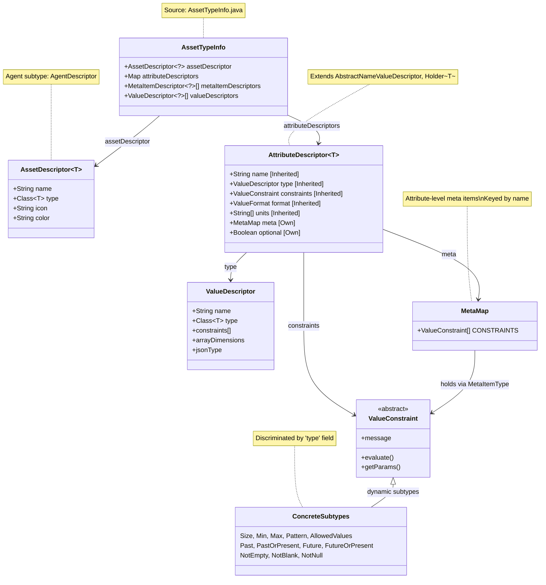

# Asset Validation

This document summarises how asset validation is performed and how it relates to the asset type model.

## AssetTypeInfo Model Structure


---

## Constraint Validation Logic in ValueUtil.validateValue()

There are four independent sources of constraints, all evaluated cumulatively. A value is valid only if it passes every constraint from every source.

```
ValueUtil.validateValue(
    attributeDescriptor,   // static descriptor (from AssetTypeInfo)
    valueDescriptor,       // the value's type descriptor
    metaHolder,            // the live attribute instance (has its own MetaMap)
    now, context, value
)
         │
         ├─── [1] ValueDescriptor.constraints[]          ← constraints on the VALUE TYPE itself
         │         e.g. ValueType.NUMBER might have Min(0)
         │         validateConstraints(arrayDimensions, constraints, ...)
         │
         ├─── [2] AttributeDescriptor.constraints[]      ← constraints on the ATTRIBUTE DESCRIPTOR
         │         e.g. a specific attribute defined with .withConstraints(new Max(100))
         │         validateConstraints(arrayDimensions, constraints, ...)
         │
         ├─── [3] AttributeDescriptor.meta               ← CONSTRAINTS meta on the DESCRIPTOR
         │         attributeDescriptor.getMeta()
         │           .get(MetaItemType.CONSTRAINTS)       // MetaItemDescriptor<ValueConstraint[]>
         │           .flatMap(ValueHolder::getValue)      // Optional<ValueConstraint[]>
         │         Each constraint → validateValueConstraint(...)
         │
         └─── [4] metaHolder.getMeta()                   ← CONSTRAINTS meta on the LIVE ATTRIBUTE
                   (the attribute instance itself, not the descriptor)
                   .get(MetaItemType.CONSTRAINTS)
                   Each constraint → validateValueConstraint(...)
```

## Array value recursion (validateConstraints)

```java
// ValueUtil.java:1043
private static boolean validateConstraints(Integer dimensions, ValueConstraint[] constraints, ..., Object value) {
    if (dimensions == null || dimensions == 0 || value == null) {
        // Leaf: evaluate each constraint directly against the value
        return Arrays.stream(constraints).map(c -> validateValueConstraint(..., c, value))
                     .anyMatch(valid -> !valid);
    } else {
        // Array: recurse into each element, decrementing dimension count
        return Arrays.stream((Object[]) value)
                     .anyMatch(v -> validateConstraints(dimensions - 1, constraints, ..., v));
    }
}
```

When valueDescriptor.arrayDimensions > 0, constraints are applied to each element, not the array itself (dimension is decremented on each recursion). Paths for error reporting are not updated during recursion, so violations always point to the attribute root.

## `validateValueConstraint` (the leaf evaluator)

```java
// ValueUtil.java:1051
public static boolean validateValueConstraint(..., ValueConstraint valueConstraint, Object value) {
    if (!valueConstraint.evaluate(value, now)) {
        // 1. Inject message parameters (min/max/pattern/etc.) into Hibernate context
        // 2. Build violation with constraint's message template key
        // 3. Apply the path provider to set the property path
        return false;   // invalid
    }
    return true;        // valid
}
```

## Constraint source summary

| Source | Where defined | Applied via |
|--------|--------------|-------------|
| ValueDescriptor.constraints[] | On the value type (e.g. ValueType.NUMBER) | validateConstraints() with array recursion |
| AttributeDescriptor.constraints[] | On the static attribute definition | validateConstraints() with array recursion |
| AttributeDescriptor.meta[CONSTRAINTS] | In the descriptor's MetaMap, key "constraints" | Direct per-constraint loop |
| metaHolder.meta[CONSTRAINTS] | On the live Attribute instance's MetaMap | Direct per-constraint loop |

The key distinction between sources 3 and 4 is that source 3 comes from the static descriptor (set by the developer defining the asset model), while source 4 comes from the live attribute (set at runtime, e.g. by a user configuring constraints via the UI or API). Both are checked with MetaItemType.CONSTRAINTS — the same MetaItemDescriptor<ValueConstraint[]>.
