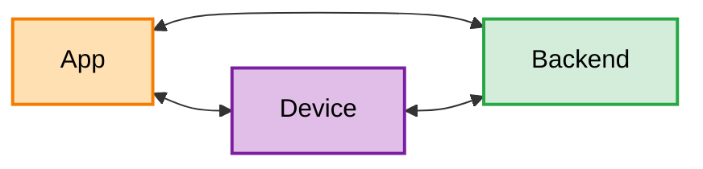
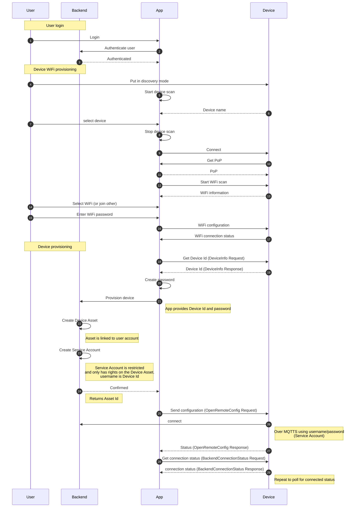

# ESP32 devices

Many IoT devices are or can be based on an ESP32 microcontroller.  
A typical setup for integrating such a device in the OpenRemote ecosystem includes 3 components:
- a firmware running on the ESP32 MCU in the device
- a mobile app to configure the device and connect to the backend
- the OpenRemote backend

We offer software elements to support the development of all 3 components.

A device is represented in the OpenRemote backend by an asset of a specific type.
The device communicates with OpenRemote over MQTTS, authenticated with a dedicated service user.

In this typical use case, the device uses Wifi for its internet connectivity.

To integrate a new device into the system, it needs to be provisioned.  
This can either be done automatically, see [User Guide Auto provisioning](/user-guide/gateways-and-devices/auto-provisioning.md)  
or through a manual process performed by the end-user.

For the latter case, the workflow is as follows

Communication between the Mobile Application and the Device is based on Espressif [Unified Provisioning](https://docs.espressif.com/projects/esp-idf/en/stable/esp32/api-reference/provisioning/provisioning.html).  
This mechanism is used to discover the device, then establish a secure communication channel over BLE.  
Communication on this channel uses Protocol Buffer payloads, in addition to the messages defined by Espressif, OpenRemote uses messages defined in the following ProtoBuf spec: [ORConfigChannelProtocol](https://github.com/openremote/console-ios-lib/blob/7212bc905c7df34c2f3d62f801f0e4df7529a2f0/ORLib/ORConfigChannelProtocol.proto)  
OpenRemote includes the [ESP Provision provider](apps-and-consoles.md#esp-provision-provider-espprovision) to support the implementation of the mobile application side.

On the backend, the project must implement a single `/rest/device` endpoint, see [Provision Device API](../provisioning-api/provisions-a-new-device-for-the-user.api.mdx) for more details.
