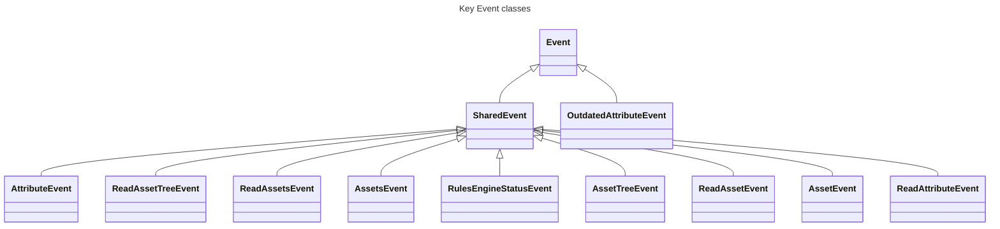

# Overall architecture

At the heart of the manager, is the [Container](https://www.javadoc.io/doc/io.openremote/openremote-container/latest/org/openremote/container/Container.html) class that manages the life cycle of all the services, including loading and starting them at launch.  
Those services are defined in [manager/src/main/resources/META-INF/services/org.openremote.model.ContainerService](https://github.com/openremote/openremote/blob/master/manager/src/main/resources/META-INF/services/org.openremote.model.ContainerService)

A service is a component whose lifecycle is managed by the Container, and that provides some functionality. All services implement the [ContainerService](https://www.javadoc.io/doc/io.openremote/openremote-model/latest/org/openremote/model/ContainerService.html) interface.

Fundamentally, OpenRemote is a context broker, storing information about [Asset](https://www.javadoc.io/doc/io.openremote/openremote-model/latest/org/openremote/model/asset/Asset.html)s in a database. Assets have a type ([AssetDescriptor](https://www.javadoc.io/doc/io.openremote/openremote-model/latest/org/openremote/model/asset/AssetDescriptor.html)) that defines their schema. The schema defines the attributes assets have, along with meta information about them.
# Event driven mechanism

The whole system is event driven. Different types of events can occur in the system, all inheriting from the root [Event](https://www.javadoc.io/doc/io.openremote/openremote-model/latest/org/openremote/model/event/Event.html) class.

Implementation note: Apache [Camel](https://camel.apache.org) is used as a basic building block of the system and used extensively in events routing.

## AttributeEvent

One very important event type is [AttributeEvent](https://www.javadoc.io/doc/io.openremote/openremote-model/latest/org/openremote/model/attribute/AttributeEvent.html), which represents the value of an asset's attribute at a given point in time. It is through this event that the "live" value of an attribute (i.e. the value in the database) is updated.

### Events ingress

Those events can enter the system through different channels.

#### From outside the system

See [Manager APIs](https://docs.openremote.io/docs/user-guide/manager-apis/) for information on the different APIs.

##### Via publishing on MQTT topics

Clients can post on `writeattributevalue` or `writeattribute` topics.
This is handled in [DefaultMQTTHandler.onPublish()](https://github.com/openremote/openremote/blob/151af17d0e502f0fa7a377cd34b8416350bc1794/manager/src/main/java/org/openremote/manager/mqtt/DefaultMQTTHandler.java#L342).

##### Via REST API

Several endpoints allow to add or update one or more attributes.

[Write to a single attribute](https://docs.openremote.io/docs/rest-api/write-attribute-value)- PUT {assetId}/attribute/{attributeName}  
[Write to a single attribute with a timestamp](https://docs.openremote.io/docs/rest-api/write-attribute-value-1) - PUT {assetId}/attribute/{attributeName}/{timestamp}  
[Update attribute values](https://docs.openremote.io/docs/rest-api/write-attribute-values) - PUT attributes  
[Update attribute values with timestamps](https://docs.openremote.io/docs/rest-api/write-attribute-events) - PUT attributes/timestamp  

All above end up being handled by [AssetResourceImpl.doAttributeWrite()](https://github.com/openremote/openremote/blob/151af17d0e502f0fa7a377cd34b8416350bc1794/manager/src/main/java/org/openremote/manager/asset/AssetResourceImpl.java#L580).

##### Via WebSocket API

[AttributeEvent](https://www.javadoc.io/doc/io.openremote/openremote-model/latest/org/openremote/model/attribute/AttributeEvent.html) arriving on WebSocket are handled by [ClientEventService](https://www.javadoc.io/doc/io.openremote/openremote-manager/latest/org/openremote/manager/event/ClientEventService.html).

#### From inside the system

[AssetProcessingService.sendAttributeEvent()](https://github.com/openremote/openremote/blob/151af17d0e502f0fa7a377cd34b8416350bc1794/manager/src/main/java/org/openremote/manager/asset/AssetProcessingService.java#L317) can be used by any component in the system to post an [AttributeEvent](https://www.javadoc.io/doc/io.openremote/openremote-model/latest/org/openremote/model/attribute/AttributeEvent.html) for processing.

### Events processing

Regardless of how events enter the system, they are handled through a Camel Direct component with URI "direct://AttributeEventProcessor".  
This is wired to the [AssetProcessingService](https://www.javadoc.io/doc/io.openremote/openremote-manager/latest/org/openremote/manager/asset/AssetProcessingService.html), that manages the processing chain all those events go through.

[AssetProcessingService.processAttributeEvent()](https://github.com/openremote/openremote/blob/151af17d0e502f0fa7a377cd34b8416350bc1794/manager/src/main/java/org/openremote/manager/asset/AssetProcessingService.java#L341) is really where all processing happens.

A lock is immediately taken on the asset (assetId based) and during this lock:
- [Asset](https://www.javadoc.io/doc/io.openremote/openremote-model/latest/org/openremote/model/asset/Asset.html) is retrieved from DB
- An enriched event is created with the attribute and the old value/timestamp
- The event is validated (based on constraints defined on the attribute)
- The event goes through a chain of interceptor ([AttributeEventInterceptor](https://www.javadoc.io/doc/io.openremote/openremote-manager/latest/org/openremote/manager/event/AttributeEventInterceptor.html)). If an interceptor intercepts the event, it does not go further in the chain and its processing is stopped here.  
  This is currently used by [Agent](https://www.javadoc.io/doc/io.openremote/openremote-model/latest/org/openremote/model/asset/agent/Agent.html)s and Gateways.
- Unless the event is outdated, it's used to update the attribute's current value (persisted in the database) and is published to a series of subscribers (via [ClientEventService](https://www.javadoc.io/doc/io.openremote/openremote-manager/latest/org/openremote/manager/event/ClientEventService.html)).
- If it is outdated, it's re-published as an [OutdatedAttributeEvent](https://www.javadoc.io/doc/io.openremote/openremote-manager/latest/org/openremote/manager/asset/OutdatedAttributeEvent.html) instead, so [AssetDatapointService](https://www.javadoc.io/doc/io.openremote/openremote-manager/latest/org/openremote/manager/datapoint/AssetDatapointService.html) can still store history data if required. 
