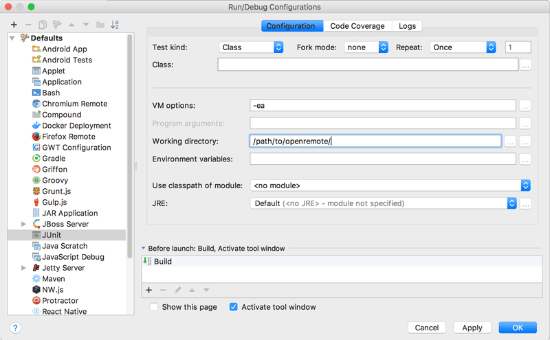

# Setting up an IDE

This guide helps you set up an environment with an IDE when you are done [Preparing the environment](./010-preparing-the-environment.md), so you can work comfortably on the Manager backend services.

This is not necessary if you prefer [Working on the UI](./110-working-on-ui-and-apps.md) only, any file manager and text editor will suffice.

If you have successfully cloned the OpenRemote repo or a custom project repo, you can run the Docker containers needed for development by running one of the following commands:

### Without SSL and proxy

```shell
docker-compose -p openremote -f profile/dev-testing.yml up --build -d
```

### With SSL and proxy

```shell
docker-compose -p openremote -f profile/dev-proxy.yml up --build -d
```

## Importing a project in an IDE

### IntelliJ IDEA

You can download the [IntelliJ Community Edition](https://www.jetbrains.com/idea/download/) for free.

- Choose the 'Open' option in the startup screen and open the root directory of the OpenRemote codebase.
- Note that IntelliJ might time out if a background Gradle process (for example, running the GWT compiler server) blocks the Gradle import. Stop and start the background process to unblock.
- Verify the build settings: Settings/Preferences -> Build,Execution,Deployment -> Build Tools -> Gradle:
  - Configure for 'Build and run using' the option 'Gradle'
  - Configure for 'Run tests using' the option 'Gradle'
  - Click on 'Apply'
- Run `./gradlew clean installDist` in a terminal in IntelliJ to be sure everything compiles.

##### Recommended Plugins

- [Grep Console](https://plugins.jetbrains.com/plugin/7125-grep-console)
- [Markdown Navigator](https://plugins.jetbrains.com/plugin/7896-markdown-navigator)

##### Grep Console Styling

The log messages of the running application can be colour-highlighted with the [GrepConsole plugin](https://plugins.jetbrains.com/plugin/7125-grep-console) and our [configuration](https://github.com/openremote/openremote/tree/master/tools/intellij).

- Locate XML style config for Grep Console in openremote/tools/intellij
- Choice the default or dark styling config
- Copy the xml to your IntelliJ IDEA Config folder 

```shell
cp ~/<PATH_TO_PROJECT>/openremote/tools/intellij/Theme-<Default|Darcula>-GrepConsole.xml \
~/.IntelliJIdea<VERSION>/config/options/GrepConsole.xml
```

### Eclipse

- Run `./gradlew eclipse`
- In Eclipse go to `File` > `Import` and import the project as `Existing Projects into Workspace`

### Visual Studio Code

1. Install Visual Studio Code.
2. Install extensions:
    - Java Extension Pack
    - Gradle for Java
    - Docker
    - Remote - Containers
3. Open the project: `File` > `Open Folder` > select OpenRemote project root
4. Configure Java:
    - Set "java.home" in settings if not auto-detected
5. Setup Gradle:
    - The Gradle plugin should auto-detect the project structure
    - If not, run "Java: Import Java projects into workspace" from command palette
6. Build and Run:
    - Terminal: `./gradlew clean installDist`
    - Use Run and Debug view (Ctrl+Shift+D) to run OpenRemote Manager


Ensure Docker services are running before launching the Manager. For UI work, run `npm run serve` in `/openremote/ui/app/manager`.

:::note

For custom working directory or launch settings, you may need to configure `.vscode/settings.json` and `.vscode/launch.json`. Refer to VS Code Java documentation for advanced configuration options.

:::

## Setting the working directory

All Docker and Gradle commands **must be executed in the project root directory**. If you are working on the main OpenRemote repository, this means the root of the repository. If you are [Creating a custom project](./040-creating-a-custom-project.md), this means the root of your project's repository.

The working directory in your IDE must also always be set to your project root directory.

We recommend you set this as the default directory in your IDE for all *Run Configurations*. To improve creation and execution of ad-hoc tests in the IDE you should set the default working directory for JUnit Run Configurations:



:::note

In newer versions of IntelliJ you need to change some run options. Go to Preferences -> Build,Execution,Deployment -> Build Tools -> Gradle:
- Configure for 'Build and run using' the option 'Gradle'
- Configure for 'Run tests using' the option 'Gradle'
- Click on 'Apply'

:::

## Running and debugging the Manager

The main entry point of the backend services is a Java class for the OpenRemote Manager, this process provides the frontend API and is the core of OpenRemote.

Make sure required testing services (dev-testing.yml) are running as described above.

If you are using the custom project repository as starting point the run configurations will already be set up. If not, set up a *Run Configuration*:

- Module/Classpath: `custom-project.setup.main` for custom projects
- Working directory: *Must be set to OpenRemote main project directory!*
- Main class: `org.openremote.manager.Main`
- Any environment variables that customise deployment (usually custom projects have some)

### Accessing the Manager UI

The manager UI web application isn't compiled until build time. \
To run the manager app run `npm run serve` from the `/openremote/ui/app/manager` directory.\
You can then access the manager UI at: http://localhost:9000/manager/ (NOTE: the trailing slash is required here) \
The default login is username `admin` with password `secret`.


:::note

The web server binds to only localhost interface (i.e. `127.0.0.1`). You can override this with `WEBSERVER_LISTEN_HOST=0.0.0.0` to bind to all interfaces and make it accessible on your LAN.

:::

Go to [Working on the UI](./110-working-on-ui-and-apps.md#working-on-an-app-eg-manager-ui) for more information.


## Building

Our build tooling is `gradle` and building the code is just a matter of executing the following gradle tasks:

```shell
./gradlew clean installDist
```

## Testing

Our test suite is mostly integration tests located in the `/test` module and they require the `keycloak` and `postgres` services to be running on `localhost`, you can start these using the `/profile/dev-testing.yml` Docker Compose profile.

Unit tests are located within each related module and can just be directly executed.

If you want to run the tests, execute:

```shell
./gradlew test
```
