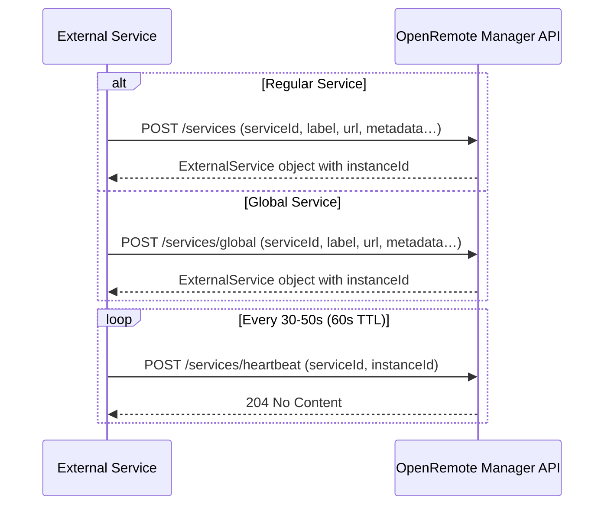

# External Services

External services allow developers to extend the functionality of the OpenRemote platform by integrating their own applications directly into the OpenRemote Manager, giving users a seamless way to configure and manage them.

The registration process is primarily intended for services that provide a **user interface**. When registered, the service's web interface is embedded in the Manager Web UI using an **iframe**, allowing users to interact with it without leaving OpenRemote.

Services without a UI can remain fully standalone applications. They can still make use of OpenRemote's APIs but do not need to register as an external service.

---

## Overview

### What is an External Service?

An external service is a standalone application that communicates with OpenRemote through its APIs. When registered, it appears in the Manager Web UI with its own embedded web interface, enabling direct interaction from within OpenRemote.

External services can be built using any programming language or framework. They should be viewed as independent applications that **extend the platform's capabilities** while leveraging OpenRemote for integration and management.

### Types of External Services

There are two types of external services in OpenRemote:

**Global Services**
- Registered using the `/services/global` endpoint
- Must be registered via the **master realm**
- Require a **Service User with Super User privileges** for registration
- Once registered, they are available and listed on **all realms**
- Typically designed with **multi-tenancy** in mind, but this is not strictly required

**Regular Services**
- Registered using the `/services` endpoint
- Bound to a **specific realm** and only available within that realm (single-tenant)
- Simpler to implement when multi-tenancy is not required

Both global and regular services must be registered by **Service Users**. Global services specifically require a Super User account in the master realm, while regular services can be registered with a realm-specific Service User. For more information on Service Users, see [Realm Users and Roles](../user-guide/identity-and-security/realms-users-and-roles.md) and [Security](../architecture/security.md).

---

## Development

Creating an external service involves building a standalone application that integrates with OpenRemote. Below is a step-by-step guide to developing your own service.

### Step 1: Build Your Application

External services can be built using **any programming language or framework** (Python, Node.js, Java, Go, etc.). Your application should:

- Provide the core functionality you want to extend OpenRemote with (e.g., ML forecasting, data analysis, device management)
- Expose a web server with both:
  - A **web interface** (HTML/CSS/JavaScript) that users will interact with
  - **API endpoints** for communication with OpenRemote
- Be packaged as a Docker container for easy deployment

**Technology choices:**
- **Backend**: Use any language/framework (FastAPI, Express, Spring Boot, etc.)
- **Frontend**: Use any web framework (React, Vue, Svelte, vanilla JavaScript, etc.)
- **Optional**: Use OpenRemote's [web components](https://www.npmjs.com/~openremotedeveloper) (buttons, panels, forms, tables) for a consistent UI that matches the Manager

### Step 2: Make Your Web Interface Iframe-Compatible

Since your service's web interface will be embedded in the OpenRemote Manager using an **iframe**, ensure it meets these requirements:

**Technical Requirements:**
- **Same origin and protocol**: Use the same domain and protocol (HTTP/HTTPS) as the OpenRemote Manager (no mixed content)
- **Headers**: Configure your web server to allow iframe embedding:
  - Avoid `X-Frame-Options: DENY` or overly restrictive `Content-Security-Policy`
  - Recommended: `Content-Security-Policy: frame-ancestors 'self' https://<manager-domain>`
- **Responsive design**: The iframe may resize; ensure your UI adapts dynamically
- **Navigation**: Avoid pop-ups or full-page redirects; keep all interactions within the iframe

### Step 3: Implement Registration Logic

Your service must register itself with OpenRemote on startup. This involves:

1. **On application startup**, send a `POST` request to `/services` (realm-specific) or `/services/global` (global)
2. Include service details in the request body (see Registration section below for format)
3. **Store the `instanceId`** returned in the response—you'll need it for heartbeats
4. Use your **Service User credentials** for authentication

This logic should run during your application's initialization phase, typically in your main startup code or initialization function.

### Step 4: Implement Heartbeat Mechanism

Your service must continuously signal that it's alive and operational:

1. **Implement a background task** (scheduled job, async loop, cron job, etc.) that runs periodically
2. Send `POST /services/heartbeat` with your `serviceId` and `instanceId`
3. Send heartbeats **every 30-50 seconds** (must be less than 60 seconds to avoid being marked unavailable)
4. Handle failures gracefully—if a heartbeat fails, retry or re-register if needed

Example pseudo-code structure:
```python
# On startup
instance_id = register_service()

# Background task
while True:
    send_heartbeat(instance_id)
    sleep(30)  # seconds
```

### Step 5: Integrate with OpenRemote APIs

Your service can interact with OpenRemote's APIs to read and write data:

- **Authentication**: Use OAuth2 with your Service User credentials
- **Read data**: Query assets, attributes, historical data
- **Write data**: Update attribute values, create assets
- **Listen for events**: Subscribe to asset/attribute changes via WebSocket or MQTT

Refer to the [OpenRemote API documentation](https://docs.openremote.io/docs/category/rest-api) for available endpoints.

### Security Considerations
When developing your external service, follow these security best practices:

- **Authentication**: Integrate with Keycloak (OpenRemote's identity provider) to ensure only authorized users can access your service UI
- **Authorization**: Validate that users have appropriate permissions before exposing sensitive functionality
- **Protocol**: Always use **HTTPS** in production to protect data integrity and confidentiality
- **Secrets management**: Store Service User credentials and API keys securely using environment variables or secret management tools
- **CORS**: If hosting on a different domain, configure Cross-Origin Resource Sharing (CORS) appropriately. Note that using a different domain may complicate Keycloak integration

---

## Registration

### Request Format

As described in Step 3 of the Development section, your service must send a registration request on startup. Below are the details of the API format.

**Example registration request body:**

```json
{
  "serviceId": "my-service",
  "label": "My External Service",
  "icon": "mdi-cloud",
  "homepageUrl": "https://my-external-service.com/interface",
  "status": "AVAILABLE"
}
```

OpenRemote responds with the same `ExternalService` object, but with an additional field, `instanceId`, which uniquely identifies the service and must be included in subsequent heartbeat requests.

### API Endpoints

| Endpoint                | Method | Scope     | Purpose                                                |
|-------------------------|--------|-----------|--------------------------------------------------------|
| `/services`             | POST   | Realm     | Register a realm-specific external service             |
| `/services/global`      | POST   | Global    | Register a global external service (master realm only) |
| `/services/heartbeat`   | POST   | Both      | Send periodic heartbeat with `instanceId`              |

The exact API endpoint and request format can be found in the [OpenRemote API documentation](https://docs.openremote.io/docs/category/rest-api).

### Heartbeat Format

As described in Step 4 of the Development section, your service must send periodic heartbeat requests. Below are the technical details.

**Request details:**
- **Endpoint**: `POST /services/heartbeat`
- **Body**: Include `serviceId` and `instanceId` (received during registration)
- **Frequency**: Every 30-50 seconds (TTL is 60 seconds)
- **Response**: `204 No Content` on success

If OpenRemote does not receive a heartbeat within the 60-second TTL, the service is marked as **unavailable** in the Manager UI.

**Registration and Heartbeat Flow:**

The diagram below illustrates the complete registration and heartbeat process:



---

## Deployment

### Docker Compose Setup

External services can be deployed alongside the OpenRemote stack using Docker Compose. The easiest approach is to add your service to an existing Docker Compose profile or create a custom one. For the instructions below, we will use the [ML Forecast Service](https://github.com/openremote/service-ml-forecast) as an example.

**Example service (service-ml-forecast) configuration:**

```yaml
volumes:
  service-ml-forecast-data:

services:
  ml-forecast:
    image: openremote/service-ml-forecast:latest
    restart: always
    environment:
      ML_LOG_LEVEL: INFO
      ML_ENVIRONMENT: production
      ML_WEBSERVER_ORIGINS: '["https://${OR_HOSTNAME:-localhost}"]'
      ML_OR_URL: https://${OR_HOSTNAME:-localhost} # OpenRemote Manager URL
      ML_OR_KEYCLOAK_URL: https://${OR_HOSTNAME:-localhost}/auth # Keycloak Auth URL
      ML_OR_SERVICE_USER: ${ML_OR_SERVICE_USER:-serviceuser} # Service User
      ML_OR_SERVICE_USER_SECRET: ${ML_OR_SERVICE_USER_SECRET:-secret} # Service User Secret
      ML_OR_SERVICE_URL: https://${OR_HOSTNAME:-localhost} # The homepageUrl of the service
    volumes:
      - service-ml-forecast-data:/app/deployment/data
```
For more information on the service configuration, refer to the [ML Forecast Service](https://github.com/openremote/service-ml-forecast) repository.


### Service User Configuration

Your external service will need a **service user account** in OpenRemote for API authentication. You can create the Service User via the OpenRemote Manager UI. The service user credentials should be provided via environment variables and kept secure.

### Reverse Proxy Configuration

If you want to use OpenRemote's reverse proxy (HAProxy) to route traffic to your external service:

**1. Enable Custom HAProxy Configuration**

```yaml
proxy:
  environment:
    HAPROXY_CONFIG: '/data/proxy/haproxy.cfg'
  volumes:
    - proxy-data:/deployment
    - deployment-data:/data
```

**2. Create Custom HAProxy Configuration**

Create a custom `haproxy.cfg` file based on the [base configuration](https://github.com/openremote/proxy/blob/main/haproxy.cfg) and place it at `deployment/proxy/haproxy.cfg`.

Add frontend routing:
```haproxy
acl ml-forecast path_beg /services/ml-forecast
use_backend ml-forecast if ml-forecast
```

Add backend configuration:
```haproxy
backend ml-forecast
    server ml-forecast ml-forecast:8000 resolvers docker_resolver
```

---

## Examples

### Use Cases

External services can be used to extend OpenRemote in many ways:

- **AI/LLM Integration**: Connect AI services (e.g., ChatGPT, Claude) to provide contextual querying of devices, assets, and data
- **Machine Learning**: Implement predictive maintenance, energy optimization, or anomaly detection
- **Firmware Management**: Manage and deploy firmware updates to connected devices

### Reference Implementation

We provide the [ML Forecast Service](https://github.com/openremote/service-ml-forecast) which can serve as a reference implementation. This service connects to OpenRemote, retrieves historical data, and provides forecasting capabilities using machine learning/statistical models.

It demonstrates how to implement:

- **Registration logic** at service startup
- **Heartbeat mechanism** as a background task
- **OAuth2 authentication** with OpenRemote's APIs for data retrieval and writing
- **Keycloak integration** for user authentication
- **Web interface** using OpenRemote's web components for a consistent UI

Reviewing this implementation will give you a clear example of how to structure your own external service, including the complete registration and heartbeat implementation code.

---

## Summary

By leveraging external services, developers can extend and enhance the OpenRemote platform in a flexible manner:

- **Registration** connects services with a UI to the Manager, embedding their interface directly
- **Global vs regular services** allow flexibility between multi-tenant and realm-specific use cases
- **Heartbeats** ensure service availability is tracked in real time
- **Security best practices** help ensure safe and reliable integrations

Together, these mechanisms provide a way to extend OpenRemote while maintaining a unified and secure user experience.