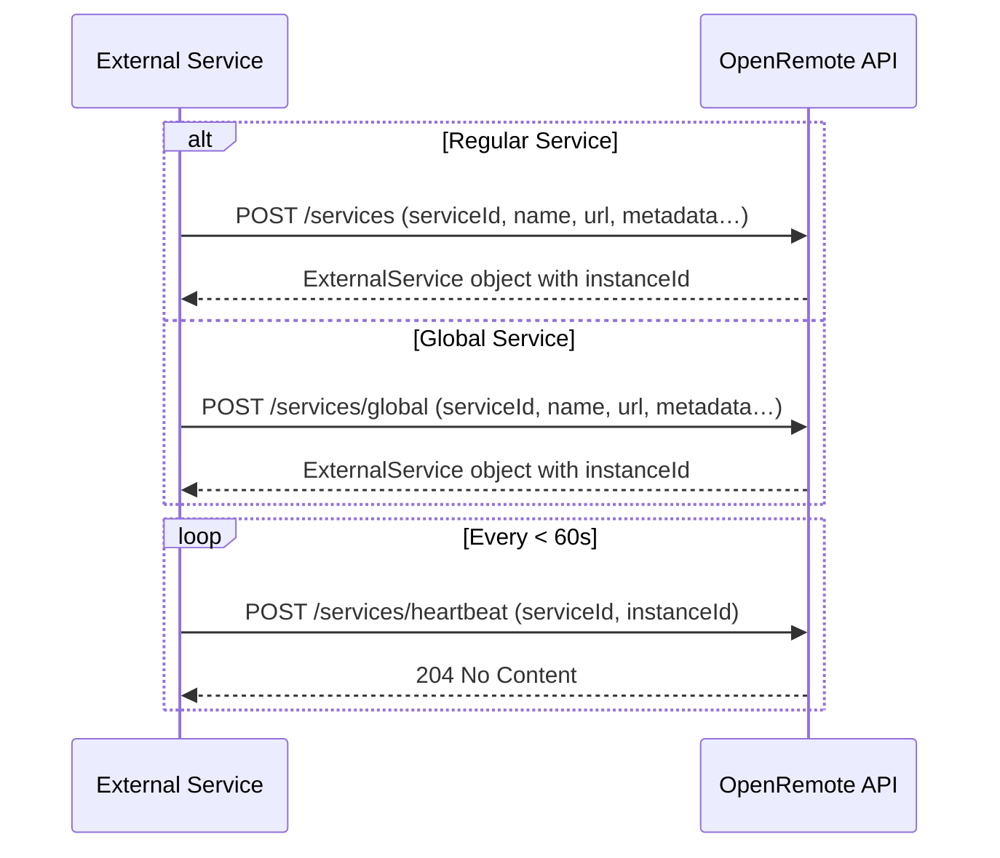

# External Services

External services allow developers to extend the functionality of the OpenRemote platform. By registering an external service, developers can integrate their own applications directly into the OpenRemote Manager, giving users a seamless way to configure and manage them.  

The registration process is primarily intended for services that provide a **user interface**. When registered, the service’s web interface is embedded in the Manager Web UI using an **iframe**, allowing users to interact with it without leaving OpenRemote.  

Services without a UI can remain fully standalone applications. They can still make use of OpenRemote’s APIs but do not need to register as an external service.

---

## What is an External Service?
An external service is a standalone application that communicates with OpenRemote through its APIs. When registered, it appears in the Manager Web UI with its own embedded web interface, enabling direct interaction from within OpenRemote.  

External services can be built using any programming language or framework. They should be viewed as independent applications that **extend the platform’s capabilities** while leveraging OpenRemote for integration and management.  

---

## Types of External Services
There are two types of external services in OpenRemote:

- **Global Services**  
  - Registered using the `/services/global` endpoint.  
  - Must be registered via the **master realm**.  
  - Require a **Service User with Super User privileges** for registration.  
  - Once registered, they are available and listed on **all realms**.  
  - They are typically designed with **multi-tenancy** in mind, but this is not strictly required.  
    For example, a global service may implement its own authentication and authorization instead of relying on OpenRemote's Keycloak instance.  

- **Regular Services**  
  - Registered using the `/services` endpoint.  
  - Bound to a **specific realm** and only available within that realm (single-tenant).  
  - Simpler to implement when multi-tenancy is not required.  

Both global and regular services must be registered by **Service Users**. Global services specifically require a Super User account in the master realm, while regular services can be registered with a realm-specific Service User.

---

## Registering an External Service
Registration is only required if the service provides a web interface and is expected to be embedded and used within the OpenRemote Manager UI.  
This process is always performed using a **Service User** account (see [Service Users](../architecture/security.md) for details).  

It involves sending a `POST` request to the OpenRemote API with details about the service.  

**Example request:**  

```json
{
  "serviceId": "my-service",
  "label": "My External Service",
  "icon": "mdi-cloud",
  "homepageUrl": "https://my-external-service.com/interface",
  "version": "1.0.0",
}
```

OpenRemote responds with the same `ExternalService` object, but with an additional field, `instanceId`, which uniquely identifies the service and must be included in subsequent heartbeat requests.  

➡ The exact API endpoint and request format can be found in the [OpenRemote API documentation](https://docs.openremote.io/developer-guide/api/).

The diagram below illustrates the registration and heartbeat process for both regular and global services:  



### Key Endpoints

| Endpoint                | Method | Scope     | Purpose                                                |
|-------------------------|--------|-----------|--------------------------------------------------------|
| `/services`             | POST   | Realm     | Register a realm-specific external service             |
| `/services/global`      | POST   | Global    | Register a global external service (master realm only) |
| `/services/heartbeat`   | POST   | Both      | Send periodic heartbeat with `instanceId`              |

---

## Heartbeat Mechanism
After registration, each service must send periodic heartbeat requests to confirm its availability.  

- The request must include the `instanceId` received during registration.  
- The default TTL (Time To Live) is **60 seconds**.  
- If OpenRemote does not receive a heartbeat within this period, the service is marked as **unavailable**.  

➡ The heartbeat flow is illustrated in the diagram above.  
➡ API details for heartbeats can be found in the [OpenRemote API documentation](https://docs.openremote.io/developer-guide/api/).

---

## Service Web Interface
Registered external services must expose a web interface via a URL. OpenRemote embeds this interface in the Manager Web UI using an **iframe**, allowing users to configure and interact with the service directly.  

### Requirements
- **Same origin and protocol**: The service must use the same domain and protocol (HTTP or HTTPS) as the OpenRemote Manager (no mixed content).  
- **Headers**: Do not block embedding. Avoid `X-Frame-Options: DENY` or restrictive `Content-Security-Policy`.  
  - Recommended:  
    ```
    Content-Security-Policy: frame-ancestors 'self' https://<manager-domain>
    ```
- **Responsive design**: The iframe may resize; ensure the UI adapts dynamically.  
- **Navigation**: Avoid pop-ups or full-page redirects; keep interactions within the iframe.  

### Building the Interface
Developers can use any web framework or technology stack. Optionally, OpenRemote provides a set of pre-made web components such as buttons, panels, forms, and tables that integrate seamlessly with the Manager UI for a consistent look and feel.  

These components are available on [npmjs](https://www.npmjs.com/~openremotedeveloper).  

---

## Security Considerations
When developing and integrating an external service, consider the following:  

- **Authentication**: OpenRemote uses Keycloak as an identity provider. External services should ensure that only authorized users can access them, either by integrating with Keycloak or implementing their own mechanism.  
- **Protocol**: Always use **HTTPS** in production to protect data integrity and confidentiality.  
- **Data validation**: Validate and sanitize all data received from OpenRemote or users to prevent vulnerabilities such as SQL injection or cross-site scripting (XSS).  
- **CORS**: If hosting on a different domain, configure Cross-Origin Resource Sharing (CORS) appropriately. Note that using a different domain may complicate Keycloak integration.  

---

## Example Use Cases
External services can be used to extend OpenRemote in many ways, such as:  

- **AI/LLM Integration**: Connect AI services (e.g., ChatGPT, Claude) to provide contextual querying of devices, assets, and data.  
- **Machine Learning**: Implement predictive maintenance, energy optimization, or anomaly detection.  
- **Firmware Updates**: Manage and deploy firmware updates to connected devices.

### Reference Implementation
We provide the [ML Forecasting Service](https://github.com/openremote/ml-forecasting-service) as a reference implementation.  
This service connects to OpenRemote, retrieves historical data, and provides forecasting capabilities using machine learning and statistical models. It also demonstrates how to:  

- **Register** an external service  
- **Send and manage** heartbeats  
- **Interact** with OpenRemote's APIs (OAuth2 authentication, data retrieval, data writing)  
- **Integrate** securely with Keycloak for authentication  
- **Implement** a web interface (using OpenRemote’s web components)  

---

## Summary
By leveraging external services, developers can significantly enhance the OpenRemote platform.  
- **Registration** connects services with a UI to the Manager, embedding their interface directly.  
- **Global vs regular services** allow flexibility between multi-tenant and realm-specific use cases.  
- **Heartbeats** ensure service availability is tracked in real time.  
- **Security best practices** help ensure safe and reliable integrations.  

Together, these mechanisms provide a seamless way to extend OpenRemote while maintaining a unified and secure user experience.
