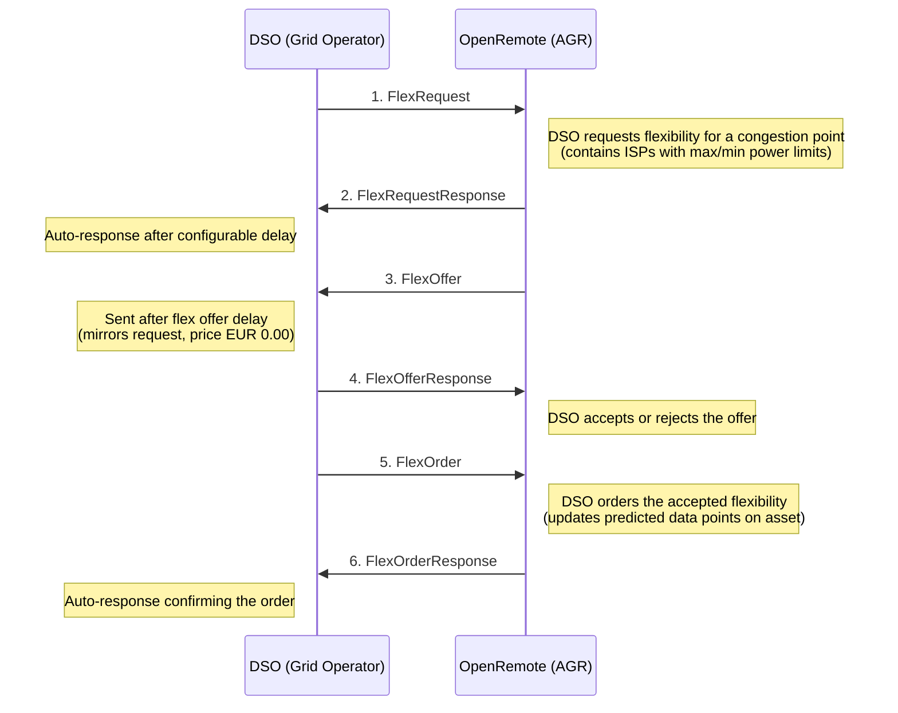

# GOPACS Integration

This page covers the developer internals of the GOPACS integration. For an overview of what GOPACS is, how to configure it, and how to set up the assets, see the [GOPACS user guide](../user-guide/domains/gopacs-integration.md).

The integration implements the **UFTP** (Universal Flexibility Trading Protocol) using the [Shapeshifter](https://github.com/shapeshifter) library, with OpenRemote acting as an **AGR (Aggregator)**.

## Components

The GOPACS extension lives in the `gopacs/` package within the extensions repository:

| File | Purpose |
| --- | --- |
| `GOPACSHandler.java` | Core orchestrator — handles all UFTP message processing, signing, OAuth2 auth, and scheduling |
| `GOPACSServerResource.java` | JAX-RS interface for the inbound endpoint (`POST /gopacs/message`) |
| `GOPACSServerResourceImpl.java` | Delegates incoming XML to `GOPACSHandler::processRawMessage` |
| `GOPACSAuthResource.java` | RESTEasy client proxy for OAuth2 token requests |
| `GOPACSAddressBookResource.java` | RESTEasy client proxy for DSO participant lookup |
| `FlexRequestISPTypeHelper.java` | Converts ISP numbers to timestamps (with DST handling) |
| `OAuth2TokenResponse.java` | DTO for OAuth2 token responses |

Related files outside this package:

- `agent/EmsGOPACSAsset.java` — JPA entity defining the GOPACS asset type (contracted EAN, power attributes)
- `manager/EmsOptimisationService.java` — Manages `GOPACSHandler` lifecycle (creates/destroys handlers when assets are added/removed)
- `manager/EmsOptimisationSetupService.java` — Setup class that optionally creates GOPACS assets

## Data flow

OpenRemote acts as an **AGR (Aggregator)** in the UFTP protocol. The message exchange with the DSO (Distribution System Operator) follows this sequence:



### How flex orders feed into optimisation

1. `FlexOrder` power values are written as predicted data points on the `EmsGOPACSAsset` attributes (`powerLimitMaximumProfileFlexOrder`, `powerLimitMinimumProfileFlexOrder`)
2. `EmsOptimisationService.updatePowerLimitProfileTotalForecasts()` merges these GOPACS constraints with manual power limits from the parent `EmsEnergyOptimisationAsset`
3. The combined limits are used by the optimisation methods to constrain energy scheduling

## Inbound endpoint

The handler deploys a JAX-RS web application at `/gopacs`. Incoming signed UFTP XML messages are posted to:

```
POST /gopacs/message
Content-Type: application/xml
```

Processing steps:

1. Deserialize the signed XML envelope
2. Verify the cryptographic signature using the sender's public key (from the address book)
3. Deserialize the UFTP payload
4. Process business logic (update asset attributes, schedule data points)
5. After a delay, send the auto-response (this ensures the HTTP response is returned first)

## Authentication

- **Inbound messages**: Verified using the DSO's public key, fetched from the GOPACS address book (`GET /v2/participants/DSO?contractedEan=<EAN>`) and cached in memory
- **Outbound messages**: Signed with the private key from `GOPACS_PRIVATE_KEY_FILE`, delivered with an OAuth2 Bearer token obtained via client credentials flow from the GOPACS Keycloak instance

## ISP handling

ISPs (Imbalance Settlement Periods) are 15-minute intervals. `FlexRequestISPTypeHelper` converts ISP numbers to timestamps and includes special handling for European DST transitions (CET/CEST) on the last Sundays of March and October.

## Testing

For information on testing with the GOPACS testing environment, see the [GOPACS user guide](../user-guide/domains/gopacs-integration.md#testing).
