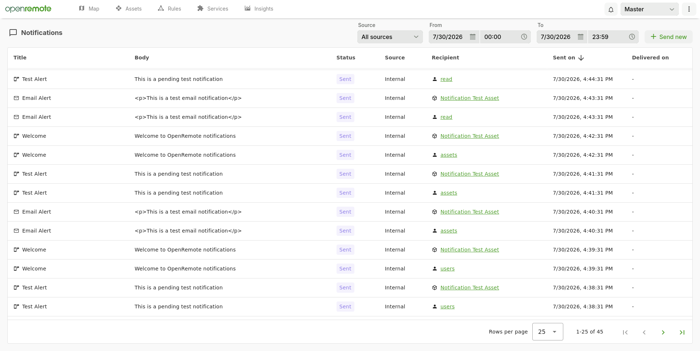

# Notifications

The Notifications page gives you an overview of all email and push notifications sent within a realm, and lets you send new ones directly from the Manager UI. You can find it in the settings menu (the dots on the top right) under `Notifications`. The page shows the notifications of the realm that is currently selected in the realm picker.

The Notifications page provides three capabilities:
- **Overview** — browse, filter and sort all notifications that were sent, whether they came from rules, the platform itself, or an API client
- **Send** — write an email or push notification and send it to users, users linked to assets, or all users in a realm
- **Details** — look at the full content, recipient and delivery status of a single notification

_Figure 1. The Notifications page with an overview of all sent notifications._

## Before you start

Notifications are only delivered when the matching channel is configured for your deployment:

| Channel | Requirements |
| :------ | :----------- |
| **Email** | An SMTP server, configured using the `OR_EMAIL_HOST`, `OR_EMAIL_USER`, `OR_EMAIL_PASSWORD` and `OR_EMAIL_FROM` environment variables. See [setting environment variables](../010-deploying/10-custom-deployment.md#setting-environment-variables-and-docker-volume-mappings-for-services). Recipients need an email address. |
| **Push** | A Firebase Cloud Messaging configuration file, set using the `OR_FIREBASE_CONFIG_FILE` environment variable. See [Push Notifications / FCM setup](../../developer-guide/140-working-on-the-mobile-consoles.md#push-notifications--fcm-setup). Recipients need the [OpenRemote app](./20-on-mobile.md) (or your own console app) with push notifications enabled. |

:::note

If a channel is not configured, sending a notification of that type fails and nothing is added to the overview. When you run the manager in dev mode without this configuration, notifications are recorded in the overview and written to the log instead of being sent.

:::

### Required roles

Access to the page is controlled by two roles, which you can assign on the [Roles](./10-manager-ui.md#roles) page:

| Role | Description |
| :--- | :---------- |
| `read:notifications` | View the Notifications page and the notifications sent within the realm |
| `write:notifications` | Send notifications, using the `Send new` button or the [API](#using-the-api) |

The admin roles don't give access to this page: users with `read:admin` or `write:admin` still need the notification roles above. Some parts of the page need additional roles:
- **Recipients** — to select users you need `read:users`, and to select assets you need `read:assets`; `read:admin` works for both. Without these roles, the recipients of users or assets are shown as `-` in the overview. The `Send new` button only appears if you have `write:notifications`, and is disabled if you can't select any recipients.
- **All users in a realm** — only superusers can send a notification to every user in a realm.
- **Restricted users** — a [restricted user](../070-identity-and-security/10-realms-users-and-roles.md#restricted-user-realm-role) only sees notifications they sent themselves, notifications sent to them, and notifications sent to their whole realm. They can only send notifications to users linked to the assets they are linked to.

:::warning

When you upgrade an existing installation, `read:notifications` and `write:notifications` are automatically added to the default `read` and `write` roles in every realm. Custom roles that you created yourself do not get them, so add the roles there if needed.

Sending a notification through the API now requires the `write:notifications` role as well. Give this role to any [service user](./10-manager-ui.md#service-users) that sends notifications.

:::

## Viewing sent notifications

The overview shows one row per recipient that was reached: a user or asset for an email, or a device with the app for a push notification. A user with two phones gets two rows for one push notification, and recipients that can't be reached get no row. By default, you see the notifications sent today, with the newest first.

| Column | Description |
| :----- | :---------- |
| **Title** | The title of a push notification or the subject of an email. The icon in front shows whether it was a push notification or an email |
| **Body** | The message of the notification. For emails this is the HTML that was sent |
| **Status** | Whether the notification was sent or failed. See [Status](#status) |
| **Source** | What sent the notification. See [Source](#source) |
| **Recipient** | The user, asset or realm that received the notification. Users and assets link to their page in the Manager UI |
| **Sent on** | The moment the notification was sent |
| **Delivered on** | The moment a console app confirmed that it received the notification (push notifications only) |

:::note

Delivery confirmation does not work at the moment. The `Delivered on` column stays empty, and push notifications keep the `Sent` status, even when they arrived on the device.

:::

Click a column header to sort by that column; click again to reverse the order. You can sort by Title, Status, Source, Sent on and Delivered on. Sorting is applied to all notifications, not just the current page. Use the controls at the bottom of the table to change the number of rows per page and to move between pages.

### Status

| Status | Description |
| :----- | :---------- |
| `Sent` | The notification left the platform: it was accepted by the email server or by Firebase |
| `Delivered` | A console app confirmed that it received the push notification. Emails never get this status. Not set at the moment, see the note above |
| `Error` | Sending failed. Hover over the status to see the reason |

### Source

| Source | Description |
| :----- | :---------- |
| **Internal** | Sent by the platform itself, for example by a service or by custom code running in the manager |
| **Client** | Sent through the [API](#using-the-api) by a user or service user. Notifications you send with `Send new` also get this source |
| **Global ruleset** | Sent by a global rule, such as a [When-Then rule](../060-rules-and-forecasting/20-when-then-rules.md#supported-actions) or [Groovy rule](../060-rules-and-forecasting/40-groovy-rules.md) |
| **Realm ruleset** | Sent by a rule in the realm |

<!-- Asset ruleset source is left out until notifications from asset rulesets are fully supported. Description: "Asset ruleset" - Sent by an asset rule. Not available as a filter option. -->

### Filtering notifications

Use the controls at the top of the page to narrow down the overview:

| Filter | Description |
| :----- | :---------- |
| **Source** | Only show notifications from one source. The default is `All sources` |
| **From** / **To** | Only show notifications sent within this period. The default is today, from 00:00 to 23:59 |

To see the notifications of another realm, select that realm in the realm picker. A notification is listed in the realm of its recipient, so a notification sent from the master realm to a user in another realm shows up in that other realm. If the recipient's realm cannot be determined, the notification is listed in the realm of the sender. For global rules and internal notifications, that is the master realm.

## Sending a notification

To send a notification, you need the `write:notifications` role.

1. Click `Send new` on the top right of the page.
2. Select the recipients: choose a **Recipient type** and select one or more recipients.
3. Choose the **Type** of notification, `Push` or `Email`, and enter its content.
4. For push notifications, optionally configure the **Actions**.
5. Click `Create`.

The `Create` button is only enabled when you have selected at least one recipient, filled in the title or subject and the body, and entered a valid website URL (if you entered one). After the notification is sent, the overview reloads and shows the new notification with the source `Client`.

### Recipients

| Recipient type | Who receives the notification | Availability |
| :------------- | :---------------------------- | :----------- |
| **Users** | The selected users of the current realm | Requires `read:users`. Not available for restricted users |
| **Users linked to assets** | The users linked to the assets you select in the asset tree | Requires `read:assets`. Restricted users can only select assets they are linked to |
| **All users in realms** | Every user in the selected realms | Superusers only |

How recipients are reached depends on the type of notification:
- **Email** — sent to the email address of each user. For `Users linked to assets`, the email is also sent to the address in the `email` attribute of the asset, if it has one.
- **Push** — sent to the console apps (for example the OpenRemote app on a phone) that are registered by the users. For push notifications the recipient in the overview is therefore the console asset, one row per device.

Service users, users without an email address (for email), users without a registered console app (for push), and users who turned off that type of notification never receive it.

### Content

| Field | Description |
| :---- | :---------- |
| **Type** | `Push` for a notification on a mobile device, or `Email` |
| **Title** / **Subject** | The title of the push notification or the subject of the email. Required |
| **Body** | The message. Required. Emails are sent as HTML, so use tags such as `
`, ` ` or `<a>` for formatting; line breaks are not kept otherwise |

### Actions

Push notifications can include an action and buttons. All fields are optional.

| Field | Description |
| :---- | :---------- |
| **Website to be opened** | The URL opened when the recipient taps the notification. The URL must include a scheme, such as `https://example.com` |
| **Open in browser (for external websites)** | Opens the website in the browser of the device instead of inside the app |
| **Text for action button** | Adds a button with this text. The button opens the website |
| **Text for decline button** | Adds a button with this text that dismisses the notification |
| **Priority** | `Normal` or `High`. Only applies to Android devices, where high priority notifications are delivered immediately, even when the device is idle. iOS devices always receive push notifications with high priority |

### When sending fails

If sending fails, you will see the message `Failed to send notification.` This happens when:
- none of the selected recipients can be reached, for example because the users have no email address or no console app with push notifications
- you are not allowed to send to one of the selected recipients
- the email or push channel is not [configured](#before-you-start)

If the notification was sent to some recipients but failed for others, rows with the `Error` status are added to the overview for the recipients that failed. Close the dialog to see them.

## Examples

The examples below show which fields to fill in for common situations. See [Sending a notification](#sending-a-notification) for a description of all fields.

### Send an urgent push notification to specific users

1. Click `Send new`.
2. Set **Recipient type** to `Users` and select the users.
3. Set **Type** to `Push` and enter a **Title** and **Body**.
4. Under **Actions**, set **Priority** to `High`. This makes a difference on Android devices only; iOS devices always receive push notifications with high priority.
5. Click `Create`.

### Open a website from a push notification

1. Click `Send new`, select the recipients, and set **Type** to `Push` with a **Title** and **Body**.
2. Under **Actions**, enter the address in **Website to be opened**, including the scheme, such as `https://`.
3. Turn on **Open in browser (for external websites)** to open the website in the browser of the device. Leave it off to open the website inside the app.
4. Click `Create`.

Recipients open the website by tapping the notification.

### Add buttons to a push notification

Buttons let recipients respond directly from the notification, for example to view more details or to dismiss the message.

1. Click `Send new`, select the recipients, and set **Type** to `Push` with a **Title** and **Body**.
2. Under **Actions**, enter the **Website to be opened**. The action button opens this website.
3. Enter the **Text for action button**, for example `View details`.
4. Enter the **Text for decline button**, for example `Dismiss`.
5. Click `Create`.

:::tip

Always fill in the **Text for action button** when you add a decline button. If you enter a website but only a text for the decline button, that button opens the website instead.

:::

### Email the users linked to an asset

Use this, for example, to inform the users responsible for a building or a machine. First make sure these users are [linked to the asset](./10-manager-ui.md#link-assets-to-users) and have an email address.

1. Click `Send new`.
2. Set **Recipient type** to `Users linked to assets` and check the assets in the asset tree.
3. Set **Type** to `Email` and enter a **Subject**.
4. Enter the **Body** as HTML, for example `
The heating will be serviced on Monday.
`.
5. Click `Create`.

If an asset has an `email` attribute, the email is also sent to that address.

### Send an announcement to all users in a realm

Only superusers can send a notification to every user in a realm.

1. Click `Send new`.
2. Set **Recipient type** to `All users in realms` and check one or more realms.
3. Choose the **Type** and enter the content.
4. Click `Create`.

A push announcement reaches every console app with push notifications enabled in the selected realms. An email announcement reaches every user with an email address. Each user (for email) or device (for push) gets its own row in the overview.

### Check whether a rule sent its notifications

When a rule should have sent a notification but nobody received it, use the overview to find out what happened.

1. In the realm picker, select the realm of the recipients.
2. Set **Source** to `Realm ruleset` or `Global ruleset`, depending on where the rule is defined.
3. Set **From** and **To** to the period in which the rule should have triggered.
4. Find the notification by its title and check the **Status**:
   - `Sent` — the notification left the platform. If it did not arrive, check the recipient's email or the notification settings of the app.
   - `Error` — hover over the status to see why sending failed.

If there is no row at all, either the rule did not trigger, or none of its recipients could be reached, for example because they have no email address or no app with push notifications enabled.

## Viewing notification details

Click a row in the overview to open the notification details. The details are read-only and show:
- **Recipient** — the recipient type and the ID of the recipient
- **Content** — the type, title or subject, and body
- **Actions** — the website, button texts and priority (push notifications only)
- **Properties** — the source, status, and the moments it was sent and delivered. If you have the `read:users` role, the source also shows the ID of the sender, such as the user for `Client` or the realm for `Realm ruleset`

The IDs of users and assets are only shown when you have the `read:users` or `read:assets` role. Push device tokens are never shown.

## Using the API

You can also retrieve and send notifications through the HTTP API, for example to send notifications from an external application. Notifications sent this way get the source `Client` and require the same roles as the Notifications page:

| Operation | Endpoint | Required role |
| :-------- | :------- | :------------ |
| [Retrieve notifications](../../rest-api/get-notifications.api.mdx) | `GET /api/{realm}/notification` | `read:notifications` |
| [Count notifications](../../rest-api/get-notifications-count.api.mdx) | `GET /api/{realm}/notification/count` | `read:notifications` |
| [Send a notification](../../rest-api/send-notification.api.mdx) | `POST /api/{realm}/notification/alert` | `write:notifications` |

The linked REST API pages describe the parameters and request bodies. For authentication, see [Manager APIs](../050-manager-apis.md).

## See Also

- [Manager UI — Notifications](./10-manager-ui.md#notifications)
- [When-Then rules — Supported actions](../060-rules-and-forecasting/20-when-then-rules.md#supported-actions)
- [Realms, users and roles](../070-identity-and-security/10-realms-users-and-roles.md)
- [On mobile](./20-on-mobile.md)
- [Working on the mobile consoles — Push Notifications / FCM setup](../../developer-guide/140-working-on-the-mobile-consoles.md#push-notifications--fcm-setup)
- [Custom deployment — Setting environment variables](../010-deploying/10-custom-deployment.md#setting-environment-variables-and-docker-volume-mappings-for-services)
