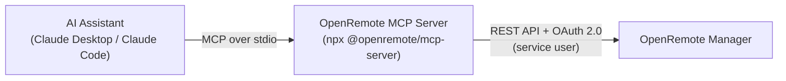

# AI Assistant Integration (MCP Server)

The OpenRemote MCP Server lets AI assistants talk to your OpenRemote instance. It implements the [Model Context Protocol](https://modelcontextprotocol.io/) (MCP), an open standard that AI clients such as Claude Desktop and Claude Code use to call external tools. Once connected, you can ask the assistant to query and manage your assets, attributes, users and realms in plain language, and it will call the OpenRemote REST API on your behalf.

It is published as the npm package [`@openremote/mcp-server`](https://www.npmjs.com/package/@openremote/mcp-server).

:::note
The MCP Server is currently in **Beta**. Its capabilities and configuration may change before a stable 1.0 release. For the full, up-to-date tool list and advanced options, always refer to the [package page on npm](https://www.npmjs.com/package/@openremote/mcp-server).
:::

## How it works

The MCP Server runs on the same machine as your AI client (for example your laptop), not on the OpenRemote server. The client launches it, communicates with it over standard input/output, and the server translates the assistant's requests into authenticated REST API calls. It signs in to OpenRemote as a [service user](070-identity-and-security/10-realms-users-and-roles.md#service-users) using the OAuth 2.0 `client_credentials` grant, so every action the assistant takes runs with that service user's permissions.

:::note
The server currently communicates over **stdio** only. It works with MCP clients that launch a local server, such as Claude Desktop and Claude Code. Remote (HTTP/SSE) transports are not yet supported, so clients that only connect to a hosted MCP endpoint cannot use it at this time.
:::



## What you can do

The server exposes a set of tools and read-only resources that the assistant can use. At a high level:

**Read (safe, non-mutating):**

- Query and inspect assets and their attributes, including historical attribute data
- Explore the asset model (asset types, value descriptors, meta item descriptors)
- List and inspect users, roles, and realms
- Check system health, version info, and syslog events

**Write (modifies your data):**

- Create, update, and delete assets
- Write attribute values and update attribute metadata
- Create, update, and delete users and manage their roles
- Create, update, and delete realms
- Update system configuration such as syslog settings

It also provides read-only *resources* that give the assistant background context, such as the asset model, realm definitions, and live health/version information.

For the complete and current list of tools, see the [npm package page](https://www.npmjs.com/package/@openremote/mcp-server).

## Prerequisites

- A running OpenRemote instance you can reach (for example `https://demo.openremote.io`)
- [Node.js](https://nodejs.org/) **24 or newer** installed on the machine that runs your AI client
- An MCP-capable AI client, such as Claude Desktop or Claude Code

## Setup

### 1. Create a service user

The server authenticates as a [service user](070-identity-and-security/10-realms-users-and-roles.md#service-users), which is an OpenRemote user that logs in programmatically with a client ID and secret.

1. In the Manager UI, sign in as a realm administrator. Creating the service user in the `master` realm is recommended if you want the assistant to work across multiple realms.
2. Create a new service user and assign it the roles the assistant needs:
   - **Read Assets** and **Write Assets** at minimum, for asset and attribute operations.
   - Add **Read Admin** and **Write Admin** if you want the assistant to see and manage users and realms.
3. Copy the generated **client ID** and **client secret** — you will need them in the next step.

See [Realms, users and roles](070-identity-and-security/10-realms-users-and-roles.md) for details on service users and role assignment.

:::tip
Grant only the roles the assistant genuinely needs. A service user with just the read roles gives the assistant full visibility but cannot change any data.
:::

### 2. Configure your AI client

**Claude Desktop** — add the server to your `claude_desktop_config.json` (on macOS this is at `~/Library/Application Support/Claude/claude_desktop_config.json`):

```json
{
  "mcpServers": {
    "openremote": {
      "command": "npx",
      "args": ["-y", "@openremote/mcp-server"],
      "env": {
        "OPENREMOTE_HOST": "https://your-instance.openremote.io",
        "OPENREMOTE_CLIENT_ID": "your-service-user",
        "OPENREMOTE_CLIENT_SECRET": "your-secret"
      }
    }
  }
}
```

Restart Claude Desktop after saving. The `openremote` server should then appear in the client's list of available tools.

**Claude Code** — add the server from the command line:

```bash
claude mcp add openremote -- npx -y @openremote/mcp-server
```

Provide the environment variables (see below) in your shell profile or a per-project `.env` file.

### 3. Environment variables

The server is configured entirely through environment variables:

| Variable | Required | Default | Description |
|---|---|---|---|
| `OPENREMOTE_HOST` | Yes | — | Base URL of your OpenRemote instance, e.g. `https://demo.openremote.io` |
| `OPENREMOTE_CLIENT_ID` | Yes | — | The service user's client ID |
| `OPENREMOTE_CLIENT_SECRET` | Yes | — | The service user's client secret |
| `OPENREMOTE_REALM` | No | `master` | The realm the service user belongs to |

## Security and permissions

:::warning
A service user with **write** roles gives the AI model the ability to **create, edit, and delete data** in your OpenRemote instance. Grant write access only when you need it, and only for the realms and resources the assistant should touch. When in doubt, start with a read-only service user.

The assistant keeps this access **for as long as** the client configuration holds working credentials **and** the service user in OpenRemote remains **active with its assigned permissions**. To revoke access, disable or delete the service user, remove its write roles, or rotate its client secret — the change takes effect immediately for new requests.
:::

:::danger
Some write tools are destructive and act immediately, with no built-in confirmation step. In particular, deleting a realm cascades to **all** users, assets, and rules within it, and assets and users can be deleted in bulk. Limit the service user's roles and realm scope accordingly, and avoid pointing the assistant at a production instance while experimenting.
:::

## Learn more

For the full tool reference, installation options, and the latest configuration details, see the package page:

- [`@openremote/mcp-server` on npm](https://www.npmjs.com/package/@openremote/mcp-server)
