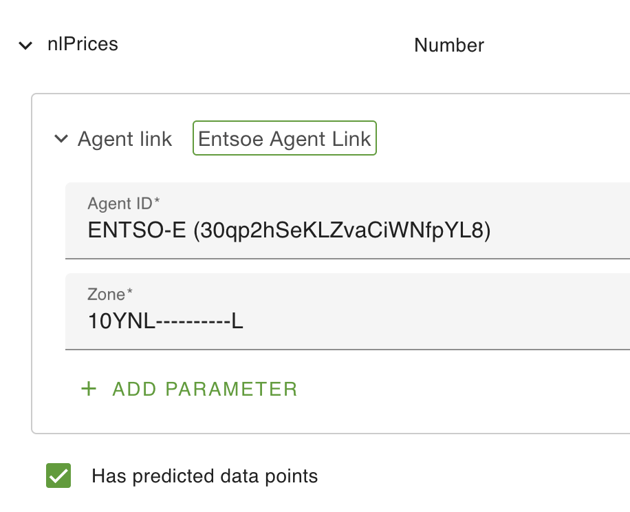

# ENTSO-E

## Introduction

[ENTSO-E](https://www.entsoe.eu/data/transparency-platform/) is a European transparency platform for the energy market that provides 
a large collection of energy related data.

This agent uses their [REST API](https://documenter.getpostman.com/view/7009892/2s93JtP3F6#3b383df0-ada2-49fe-9a50-98b1bb201c6b) to retrieve the `Energy Prices` (document type A44) data.

## Prerequisites

Accessing the REST API requires a security token. You must create an account and request such a token for your own usage.  
To do so, follow the process described at [How to get security token? – Transparency Platform](https://transparencyplatform.zendesk.com/hc/en-us/articles/12845911031188-How-to-get-security-token).

## Agent usage

### ENTSO-E Agent

To get access to the data, add an ENTSO-E agent to your configuration.  
On the agent, fill-in the `Security token` attribute with the token you got from ENTSO-E (see [Prerequisites](#prerequisites) above).    
You can optionally add the `Polling millis` attribute to set the polling frequency. It defaults to 1h.  

### Getting the data

Retrieved pricing data is stored as predicted datapoints of any compatible asset attribute in your configuration.  
Note: Compatible means capable of storing positive or negative decimal numbers i.e. the attribute type must be Number or Big Number.  
If the attribute is of a different type a warning log will be generated, predicted datapoints will still be generated
but inconsistencies in the system will occur (e.g. errors while trying to graph the attribute).

On an attribute of type `Number`, add an `Agent link` configuration (MetaItem).  
Select the ENTSO-E agent created above, a `Zone` field will appear.  
This indicates the region to fetch data for and must be an [Energy Identification Codes](https://www.entsoe.eu/data/energy-identification-codes-eic/).  
[EIC Approved codes](https://www.entsoe.eu/data/energy-identification-codes-eic/eic-approved-codes/) provides a complete list of the available code.  
Tip: when searching, be sure to select "All Codes" for the "EIC Type Code" criteria.  
You'll for instance find that `10YNL----------L` is the code to use for The Netherlands.

Make sure to also add the `Has predicted data points` configuration to your attribute.

