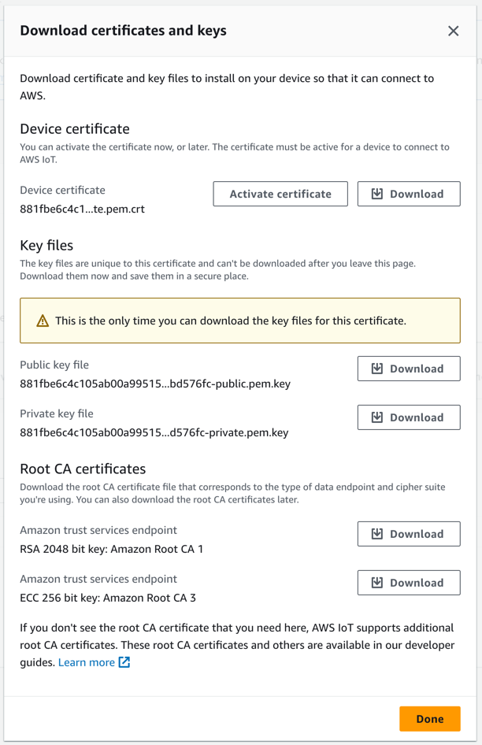

# MQTT

There is an MQTT Agent (Client) in OpenRemote that you can use to connect to an external MQTT Broker. First use the MQTT
Agent to establish the connection to the broker. Then create an asset with attribute(s) of the Value Type that matches
the incoming/outgoing data, and give those attributes the configuration item 'Agent Link'. In this agent link select
your MQTT Agent and add the parameter Publish Topic or Subscription Topic. We have no extensive documentation yet, 
and recommend to [check our forum](https://forum.openremote.io/t/mqtt-agents-publish-subscription/985). 

OpenRemote also has an [MQTT Broker](../manager-apis.md#mqtt-api-mqtt-broker) (or MQTT API).

## Connecting to an MQTT broker using (m)TLS, AWS IoT Core


AWS IoT Core provides the option to authenticate clients to the MQTT broker using X.509 Client Certificates. To do so,
we will need to add the X.509 client certificates assigned to the Thing we have created to OpenRemote's realm-specific
KeyStores. Below is a tutorial of how that can be done;

You will need to have `keytool` installed; this can also be done using any GUI for keystores (ex. [KeyStore Explorer](https://github.com/kaikramer/keystore-explorer)).

After creating a Thing in AWS IoT Core, you need to retrieve its certificate, its private key, and Amazon's Root CA certificate.

They are all provided after accessing that thing's dashboard and creating a new certificate for it: 

Download the Device Certificate and activate it, download the private key file, and the Amazon Trust Services endpoint RSA 2048 bit key.

:::warning
The password of the keystore and the password of each keypair within the keystore should be the same, and it should be set to `OR_KEYSTORE_PASSWORD`. Otherwise, you may see errors like `Get Key failed: Given final block not properly padded`. If you do, make sure you change the passwords to be the same. You can find a more detailed explanation in [this GitHub issue](https://github.com/openremote/openremote/issues/2093).
:::

The password of everything keystore-related is `OR_KEYSTORE_PASSWORD`, for when it is requested. If it is not set as an environment variable before starting OpenRemote for the first time, it will default to `<empty string>`. If you want to change the password later, you will need to change it in both the keystore and the truststore, as well as the passwords of each keypair within the keystore and truststore, and make sure to set `OR_KEYSTORE_PASSWORD` as that password.

Make sure that OpenRemote has been started at least once before proceeding, so that the required keystore files are created automatically. If you have a pre-existing keystore file, make sure to provide the file's location using `OR_SSL_CLIENT_KEYSTORE_FILE`, `OR_SSL_CLIENT_TRUSTSTORE_FILE`, and `OR_SSL_CLIENT_KEYSTORE_PASSWORD` or `OR_SSL_CLIENT_TRUSTSTORE_PASSWORD` for their passwords.


After doing so, we need to:
- Combine the certificate and Private Key into a PKCS#12 keypair file, so that it can be easily imported into the KeyStore:
```bash 
openssl pkcs12 -export -in OpenRemoteAWSCertificate.pem.crt -inkey OpenRemoteAWSPrivate.key -out OpenRemoteAWSKeyPair.p12 -name openremoteagent
```
- Import the keypair into the existing keystore. 

**Warning! the alias you use here will be used to distinguish between keypairs to be used in different agents.** For this to work, you will need to use the following format; `<the realm where you will be creating the agent>.<an alias you will enter into the OpenRemote agent configuration>`. For example, we will use `master.OpenRemoteAwsIoTClientCertificate`. So we will be creating the agent in the master realm, and the certificate alias we will provide is `OpenRemoteAwsIoTClientCertificate`.
```shell
keytool -importkeystore -destkeystore <storage dir>/client_keystore.p12 -srckeystore OpenRemoteAWSKeyPair.p12 -srcstoretype PKCS12 -alias master.OpenRemoteAwsIoTClientCertificate
```
- Import the Amazon Root CA certificate into the truststore;
```shell
keytool -importcert -file AmazonRootCA1.pem -keystore <storage dir>/client_truststore.p12 -alias amazonrootca1
```

Now, we are ready to start OpenRemote again, and create a new MQTT Agent.

**Make sure** that the Agent is situated in the realm that is specified in the Alias from the command above, or else OpenRemote will not be able to retrieve the correct certificate. An error will be logged with more information if that happens.

In that agent, ensure that you have set:
- The correct host and port (AWS IoT Core MQTT broker is set to `8883`)
- Secure mode turned on
- Set the certificate alias to the alias we set above, without the realm and the `.`: `OpenRemoteAwsIoTClientCertificate`. The alias is used to allow the MQTT agent to select the correct certificate to use for the authentication. 
- Set the client ID, ensuring that it is allowed by the created Policy of the thing (Check AWS IoT Dashboard->`<your thing's name>`->Certificate->Policy to verify)

The agent attempts to connect, and it successfully authenticates and connects to the MQTT broker, ready to pub/sub according to your needs.

## See also

- [Agent overview](overview.md)
- [MQTT Broker](../manager-apis.md#mqtt-api-mqtt-broker)
- [Quick Start](https://github.com/openremote/openremote/blob/master/README.md)
- [Manager UI Guide](../manager-ui/manager-ui.md)
- [Custom Deployment](../deploying/custom-deployment.md)
- [Setting up an IDE](../../developer-guide/setting-up-an-ide.md)
- [Working on the UI](../../developer-guide/working-on-ui-and-apps.md)
