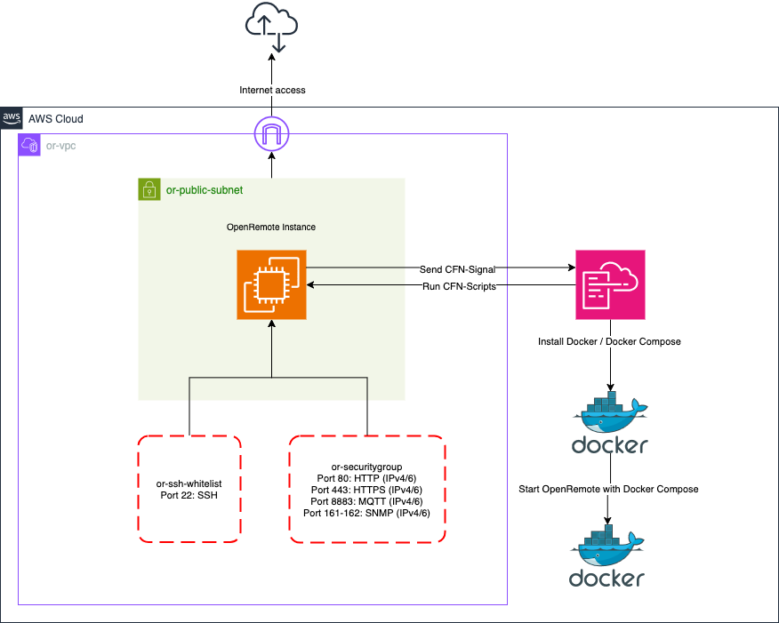

# AWS Marketplace

We have created an app for the AWS Marketplace to make deployment of OpenRemote easier. This guide describes how to configure the instance using the special AWS CloudFormation template.

# Architecture Diagram

## Subscribe to the AWS Marketplace app
1. Search for OpenRemote on the [AWS Marketplace](https://aws.amazon.com/marketplace/search/results?searchTerms=openremote) and click on the listing.
2. Click on the orange button 'View purchase options'.
3. Accept the EULA by pressing the 'Accept Terms' button
4. You're now subscribed to the free OpenRemote Marketplace app. It will take a couple of minutes to process your subscription. After that, the 'Continue to Configuration' button becomes available.
5. When the subscription is fully processed, click on the 'Continue to Configuration' button.
6. Select a software version (By default, the latest version is already selected) and choose in which AWS region you want to deploy the software.
7. After selecting the options, press the 'Continue to Launch' button
8. Review your choices and press the 'Launch' button. You will now be redirected to the AWS CloudFormation page.
9. Then the AWS CloudFormation page is displayed, press the 'Next' button.

## Instance Configuration
Now we're successfully subscribed to the OpenRemote marketplace app, we can start configuring it. In the section below, you will find a detailed description of each AWS CloudFormation parameter that's available in the template.

#### `Name`
This can be anything and is used for recognizing the CloudFormation Stack. The Stack name must be 1 to 128 characters, start with a letter, and only contain alphanumeric characters.

#### `InstanceName`
This name is used for recognizing the (OpenRemote) EC2 instance on the overview page.

#### `InstanceType`
You can choose an instance based on your monthly budget. There are three options available:
- `t4g.small` - `2 vCPU` / `2 GB RAM` - around $10 dollars per month AWS running costs
- `t4g.medium` - `2 vCPU` / `4 GB RAM` - around $25 dollars per month AWS running costs
- `t4g.large` - `2 vCPU` / `8 GB RAM` - around $50 dollars per month AWS running costs

#### `Hostname`
You can fill in the `FQDN (Fully Qualified Domain Name)` that you want to use for this OpenRemote instance. 
If no value is submitted, you can access the software via the public `IPv4 address` from the EC2 instance.

> :::note
> The software is not using `Amazon Route53` for DNS management. This means that – when you want to
> use a custom hostname,  you must add an A-record pointing to the `IPv4` address of the EC2 instance. 

> :::tip
> Leave the `hostname` field blank for initial deployment. Once deployed and you have updated your DNS with 
> an A-Record pointing to the Static IP, update the CloudFormation stack via the AWS console and add the hostname. 
> Then run the **Clear Proxy Configuration** script as described below so that the proxy container will generate 
> a new [Lets Encrypt SSL certificate](https://letsencrypt.org/). If the hostname entered is not pointing to the 
> Static IP when the proxy container is started, a will fail certificate retrieval, and you will be unable 
> to access the site via the domain name. 

#### `Keypair`
Choose a `keypair` for SSH Access. The `keypair` must exist in the same AWS region where you want to deploy the software. 
Information on how to create a new `keypair` can be found [here](https://eu-central-1.console.aws.amazon.com/ec2/home?region=REGION#KeyPairs:).

> :::tip
> Create a keypair first and save it somewhere safe and secure. You will need this to SSH into the EC2 instance associated with this deployment.

#### `SSHLocation`
For security reasons, SSH is blocked by default on all IP addresses. In this field, you can fill in an `IPv4 address` on which you want to enable SSH access.

Please make sure you are using the following notation:
`0.0.0.0/32` allow one specific IP address access, or `0.0.0.0/0` allows all IP address access.

#### `CIDRBlock`
The default (web) ports `80` and `443` are blocked by default for security reasons.
In this field, you can fill in an `IPv4` address on which you want to enable these ports.

Please make sure you are using CIDR notation:
`x.x.x.x/32` allow one specific IP address access, or `0.0.0.0/0` allows all IP address access.

## OpenRemote Configuration

#### `Password`
Create a password for your OpenRemote instance. This password is used for the administrator account.
The password must meet the following conditions:
- The minimum length is eight characters
- Must have at least one special character

## E-mail Configuration

The email configuration is not mandatory. All fields can be left blank / default if email is not required. 

#### `SMTPHost`
Provide the `SMTP` hostname that you want to use for sending e-mails.

#### `SMTPUser`
Provide the `SMTP` username that you want to use for sending e-mails.

#### `SMTPPassword`
Provide the `SMTP` password that corresponds to the hostname and user.

#### `SMTPPort`
The system is using port `587 (TLS)` by default for sending e-mails. If you want to use something else, for example, `465 (SSL)`, You can change it here.

#### `SMTPTLS`
Select if you want to use TLS for sending e-mails. Choose between `true` or `false`.

#### `SMTPFrom`
Provide the e-mail address that you want to use for sending e-mails. The e-mail address must be usable by the `SMTP` host.

#### `SMTPProtocol`
Select the SMTP protocol you want to use for sending e-mails. Choose between `smtp` or `smtps` (smtps = SSL).

# Updating 

## Update OpenRemote Images

1. Access the AWS Systems Manager via your AWS Console (note the region)
2. Under Node Tools, press **Run Command**, then **Run command** again
3. Search for `docker` and select the **OpenRemote-updateDockerImagesDocument-xxxxxxxxxxxx**
4. Scroll down to the **Target** selection section, select **Choose instances manually**, and select the OpenRemote instance
5. Press the **Run** button at the bottom of the page
6. The next page will show the status of the command, and the below once the command has run successfully and any messages
7. Clicking on the Instance ID will show the output of the commands

## Update Packages

1. Access the AWS Systems Manager via your AWS Console (note the region)
2. Under Node Tools, press **Run Command**, then **Run command** again
3. Search for `packages` and select the **OpenRemote-updatePackagesDocument-xxxxxxxxxxxx**
4. Scroll down to the **Target** selection section, select **Choose instances manually**, and select the OpenRemote instance
5. Press the **Run** button at the bottom of the page
6. The next page will show the status of the command, and the below once the command has run successfully and any messages
7. Clicking on the Instance ID will show the output of the commands

## Update EC2 Instance OS

1. Access the AWS Systems Manager via your AWS Console (note the region)
2. Under Node Tools, press **Run Command**, then **Run command** again
3. Search for `aws` and select the **OpenRemote-updateAWSLinuxDocument-xxxxxxxxxxxx**
4. Scroll down to the **Target** selection section, select **Choose instances manually**, and select the OpenRemote instance
5. Press the **Run** button at the bottom of the page
6. The next page will show the status of the command, and the below once the command has run successfully and any messages
7. Clicking on the Instance ID will show the output of the commands

## Clear Proxy Configuration

If a change is made to the hostname field, this script will need to be run to clear the proxy data and prompt it to re-request
a certificate for the specified domain. Run this script if:

1. You want to add, change, or remove domain name to the OpenRemote instance.
2. You receive an `Invalid parameter: redirect_url` error
3. You receive a `ERR_TOO_MANY_REDIRECTS` error in Chrome or a `The page isn't redirecting properly` error in Firefox 

If adding or changing the hostname, run this script after the DNS A-record has been pointed to the Static IP and the record has propagated. 

1. Access the AWS Systems Manager via your AWS Console (note the region)
2. Under Node Tools, press **Run Command**, then **Run command** again
3. Search for `proxy` and select the **OpenRemote-clearProxyDataDocument-xxxxxxxxxxxx**
4. Scroll down to the **Target** selection section, select **Choose instances manually**, and select the OpenRemote instance
5. Press the **Run** button at the bottom of the page
6. The next page will show the status of the command, and the below once the command has run successfully and any messages
7. Clicking on the Instance ID will show the output of the commands

# Troubleshooting
For further troubleshooting, SSH into the EC2 instance. You will need to have added an SSH key to the deployment to do this.

## Service Logs
To see the OpenRemote service logs run the below commands:

`sudo systemctl status openremote.service`

`journalctl -u openremote.service`

## Docker Logs
OpenRemote runs in a Docker environment. This means you can use standard Docker commands:
See the Containers section of the [Docker CLI Cheat Sheet](https://docs.docker.com/get-started/docker_cheatsheet.pdf)

For example, use `sudo docker ps` to see all of the running containers.

Then use `sudo docker logs <CONTAINER_ID>` to check the logs of each container.
