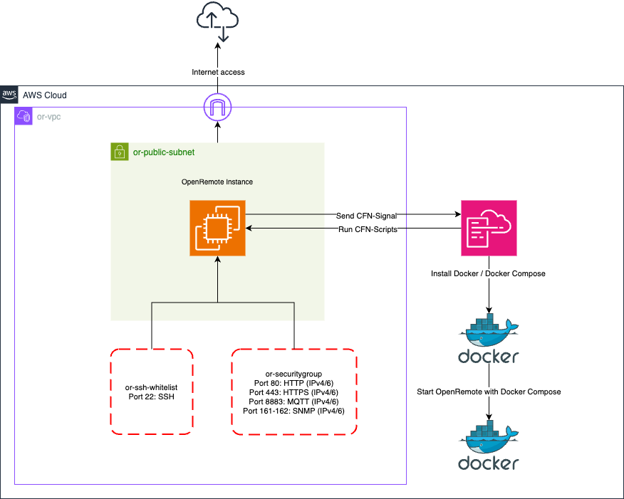

# AWS Marketplace

This guide explains how to provision/configure OpenRemote via the AWS Marketplace.
The `CloudFormation` template can be found at [cloudformation-aws-marketplace.yml](https://github.com/openremote/openremote/blob/master/.ci_cd/aws/cloudformation-aws-marketplace.yml).

This product requires an internet connection to deploy properly. The following packages are downloaded on deployment:
* `Docker`
* `Docker Compose`

# Architecture Diagram

## Subscribe to the AWS Marketplace
To use OpenRemote through the AWS Marketplace, you need an active subscription. Follow the steps below to subscribe.

- Search for OpenRemote on the [AWS Marketplace](https://aws.amazon.com/marketplace/search/results?searchTerms=openremote) and click on the listing.
- Click the `View purchase options` button.
- Accept the EULA by selecting `Accept Terms`.
- You are now subscribed on OpenRemote via the AWS Marketplace. Processing the subscription will take a few minutes. Once completed, the `Continue to Configuration` button becomes available.
- Click `Continue to Configuration` to start configuring OpenRemote.
- Choose a template version (the latest version is selected by default) and select your preferred AWS `region` for deployment.
- Click `Continue to Launch` after making your selections.
- Review your selections and click `Launch` to proceed. You will be redirected to the AWS `CloudFormation` page.
- On the AWS `CloudFormation` page, click `Next` to continue.

## Instance Configuration
After subscribing on OpenRemote via the AWS Marketplace, you can start configuring it. Below, you will find a detailed description of each parameter available in the template.

* `Stack name` - You need to specify an unique `CloudFormation` stack name for this deployment. 
  The `stack name` must contain only letters (a-z, A-Z), numbers (0-9), and hyphens (-) and start with a letter. Max 128 characters.

* `Hostname` - You can specify the fully qualified domain name (`FQDN`) you want to use for this OpenRemote instance.  
   If no value is provided, you can access OpenRemote using the public `IPv4` address of the `EC2` instance.

* `Instance Type` - You can choose from the following `t4g` and `m6g` instance types:
  - `t4g.small`
     - vCPU: 2 
     - Memory: 2GB
  - `t4g.medium` 
     - vCPU: 2 
     - Memory: 4GB
  - `t4g.large` 
     - vCPU: 2 
     - Memory: 8GB
  - `m6g.large` 
     - vCPU: 2 
     - Memory: 8GB
  - `m6g.xlarge` 
     - vCPU: 4 
     - Memory: 16GB
  
   Prices vary based on the selected instance. All instances are using the `ARM` architecture.
   For detailed pricing information, visit the pricing pages for [t4g](https://aws.amazon.com/ec2/instance-types/t4/) and [m6g](https://aws.amazon.com/ec2/instance-types/m6g/).

* `Amazon Machine Image` - This is the Amazon Machine Image (`AMI`) that is used by the `EC2` instance.
  
  :::danger

  Do not modify this value, as it is provided by Amazon. Changing it may cause instance creation to fail.
  
  :::

* `Storage` - You can specify the amount of block storage to provision for this OpenRemote instance, with options of `8GB`, `16GB`, `32GB`, `48GB` and `64GB`.
   It is possible to expand the volume after instance creation, but a reboot will be required.

* `Key pair` - Choose a `key pair` for this OpenRemote instance. With the selected `key pair` you can `SSH` into the machine.
  You can only select an `key pair` that were created in the **same** region as where you want to deploy the OpenRemote instance.

   :::tip
   
   To create a new `key pair`, follow the steps provided [here](https://docs.aws.amazon.com/AWSEC2/latest/UserGuide/create-key-pairs.html).

   :::

   :::danger

   After creating the `key pair`, you receive a private key. \
   Make sure to save this file on a secure location, as you will not be able to `SSH` into the machine without it.

   If you accidentally lose your key, follow the steps provided [here](https://docs.aws.amazon.com/AWSEC2/latest/UserGuide/replacing-key-pair.html) to recover access to your instance.

   :::

* `Elastic IP` - You can choose whether to assign an `Elastic IP` to this OpenRemote instance. Enabling this option ensures that your `IPv4` address remains the same after `stopping` the instance. 
   Additional charges may apply, visit the pricing page [here](https://aws.amazon.com/vpc/pricing/).

## OpenRemote Configuration (Optional)

* `Password` - You can override the default password (`secret`) by providing a new password.
  There are no specific requirements for this password. If you do not provide one, you can log in to the manager using the default credentials (username `admin` and password `secret`).

## E-mail Configuration (Optional)

* `SMTP Hostname` - You can specify the `hostname` that will be used for sending e-mails. (e.g. mail.example.com).
* `SMTP Username` - You can specify the username for authenticating with the `SMTP` server. In most cases this is the e-mail address of the sending account.
* `SMTP Password` - You can specify the password for authenticating with the `SMTP` server.
* `SMTP Sending Address` - You can specify the e-mail address that will be used as the sending address. The e-mail address is visible for the receivers. (e.g. no-reply@example.com).

## OpenRemote installation
Once you've entered all the required details, click the `Next` button at the bottom of the page. You’ll be taken to a configuration page where you can configure various stack options. There’s no need to make any changes here, simply click `Next` again.
On the final page, you'll see a summary of your deployment. Review the information, then click the `Submit` button at the bottom to confirm and proceed.

Amazon is now building the `EC2` instance using the provided `CloudFormation` template, this process takes around `5` to `10` minutes. You can monitor the progress by regularly refreshing the page using the refresh button located on the right-hand side.

After the `EC2` instance is successfully provisioned, the `CREATE_COMPLETE` status will appear on the `CloudFormation` page. 

To start using OpenRemote, either visit the `hostname` you specified during configuration or navigate to the `EC2` dashboard and locate the instance named `AWS-STACKNAME/AWS Marketplace`. (Replace `AWS-STACKNAME` with the stack name you have provided during configuration)

## Unsubscribe from the AWS Marketplace
To stop using OpenRemote from the AWS Marketplace, you can unsubscribe by following the steps below.

-  Visit the AWS Marketplace subscriptions page by clicking [here](https://us-east-1.console.aws.amazon.com/marketplace/home#/subscriptions).
-  Find the OpenRemote subscription in the list and click on it.
-  Click the `Actions` button, then select `Cancel Subscription`.
-  A modal pops up asking you to confirm the cancellation of the subscription.
-  To confirm cancellation, type `confirm` in the designated input field and click the `Yes, cancel subscription` button.

:::note

To cancel the subscription, you must first delete the OpenRemote stack created with it.

:::