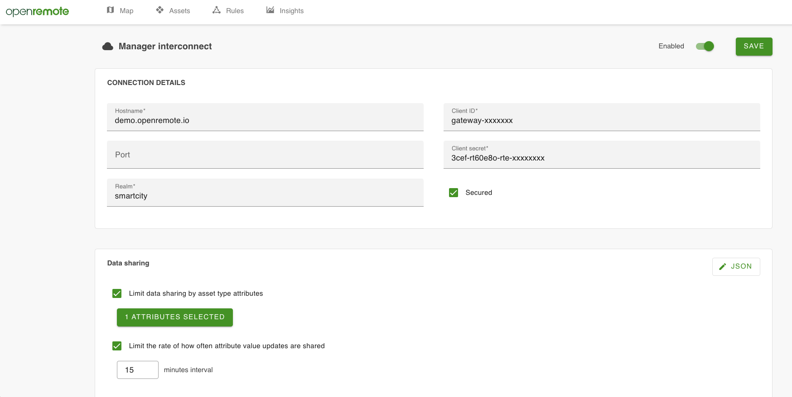

# OpenRemote as Edge Gateway

## Overview
An Edge Gateway is an OpenRemote Manager that connects to another OpenRemote Manager (referred to as central manager here on); and is intended for scenarios where a Manager is required within a LAN without being exposed directly to the internet and is quite often running on constrained hardware.

The edge gateway establishes the connection to the central manager using the WebSocket API and the Edge Gateway must be provisioned in the central Manager to generate OAuth client credentials which can then be used by the edge gateway to authenticate.

An edge gateway connection is defined per edge gateway realm and only a single connection can be made to a central manager per realm.

## Interaction via the Gateway asset
The edge gateway is the master and the central manager is a slave; when an edge gateway is not connected to the central manager then any attempt to interact with the edge gateway assets on the central manager will result in an error, when an edge gateway connects to a central manager the edge gateway assets are synchronised (uni-directional synchronisation from edge gateway to central manager), any change to an edge gateway asset is then also sent to the central manager to maintain synchronisation. When interacting with an edge gateway asset via the central manager the request is forwarded to the edge gateway and the edge gateway handles the request and any resulting asset changes are then also forwarded to the central manager.

Depending on network connection there can be a delay between interacting with an edge gateway asset via the central manager and the interaction being completed and relayed back to the central manager.

**The central manager must be using the Keycloak identity provider**

## Edge gateway setup

### 1. Provisioning in the central manager
Just create a new Asset of type Gateway and the manager will provision a Keycloak client for it with Client Credentials grant type, the client ID and client Secret will then be stored in the clientId and clientSecret attributes of the gateway asset.

### 2. Entering credentials in the edge gateway
   1. On the edge gateway login to the manager UI and select the realm you wish to connect to the central manager (only applicable to super users).
   1. Go to the Manager interconnect page (top right menu)
      1. Enter the host (e.g. `demo.openremote.io`)
      1. Enter port if not using default `80` or `443`
      1. Enter the realm of the gateway asset on the central manager (e.g. `master`)
      1. Enter Client Id and Client Secret which can be found by looking at the attributes of the gateway asset in the central manager
      1. Select secured (if the central manager is using `HTTPS`)
      1. Click Save
      1. In the top right of the dialog the status should change to `CONNECTED`

### 3. Limit data rate at which edge gateway synchronises
   1. On the Manager interconnect page select the asset type and attributes which you want to synchronise with the central instance.
   2. Select whether you want to limit the data rate and set the time interval.
      

## Interaction with Gateway Manager UI via Gateway tunnels

On top of the Interaction via the Gateway, you can remotely access the full Manager UI of the Gateway instances of OpenRemote, by creating Gateway tunnels. Note that you first have to [technically configure the (edge) gateway and central instance of OpenRemote to enable the the tunnelling set-up](../../developer-guide/gateway-tunnelling-setup.md). Next you can acces the Manager UI of the Gateway instance via the 'Gateway Tunnels' (Settings) or via a 'Gateway Widget' on the Insights dashboards.

_Creating a gateway tunnel and opening the manager UI of the remote instance which is connected as a gateway._

## Requirements
### Central Manager
- Must be running the Keycloak identity provider

### Edge Gateway
- Processor: AMD64 or ARM64
- RAM: 4GB (if using Keycloak identity provider) 2GB (if using basic identity provider)
- Disk: 1.5GB (preferrably SATA or eMMC)
