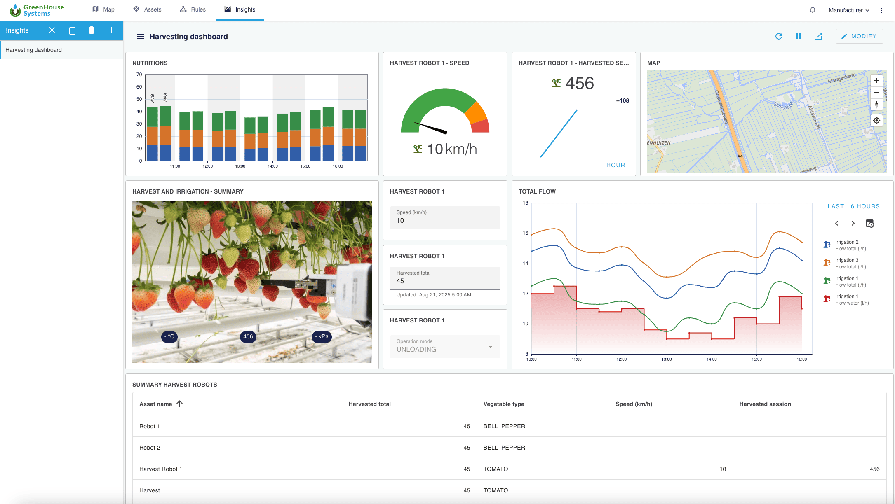
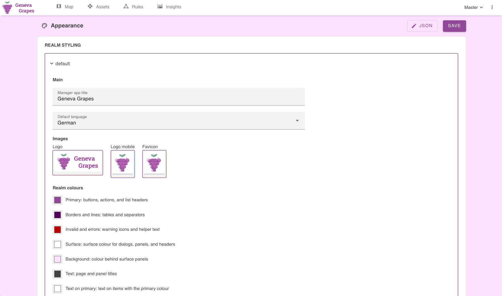

# Manager UI

The Manager UI is the dashboard which gives you access to OpenRemote, and allows you to configure, monitor, and control your IoT platform. You can access it at `https://localhost` for the master realm, or at `https://localhost/manager/?realm=yourrealm`, for a specific realm. We'll explain the main features of the Manager UI, sometimes referring to examples from the [online Demo](https://openremote.io/demo/), for which you only have access in 'read' mode. To have full 'admin' access to all functionality you will first need to [install OpenRemote](https://github.com/openremote/openremote/blob/master/README.md). If you prefer watching a video, rather than reading, check out the [Introduction Videos](https://youtu.be/K28CQMKr-rQ).

To access the Manager you will first need to login with the correct credentials (admin/secret for your local installation). Note that our account management and identity service includes features like a 'forgot password' flow. See [Realms](#realms), [Users and Roles](#users-and-access-configuration) for more details.

If you open the application you will get four main pages: [Map](#map), [Assets](#assets), [Rules](#rules), and [Insights](#insights). In addition there are a series of [Settings](#settings-and-access) to interconnect managers, change language, edit your account, and create users, roles, or realms. Also the service users for the [Manager APIs](#manager-apis) can be set here.

## Map

The `Map` page will show your map (see the [custom deployment](../deploying/custom-deployment.md) documentation if you like to change the map). You can pan, zoom, and tilt the map. On the map all assets are shown which have a location as well the configuration item `show on dashboard` set. Assets can both have static or dynamic locations (eg. a car, boat or plane). You will see the direction an asset is facing or moving if the asset includes an attribute called 'direction'. When selecting an asset, a panel will show its attributes and values. The `Asset details` button in this panel will bring you to the respective Asset page.

As part of the [configuring the manager UI](../deploying/configuring-the-manager-ui.md) you can also configure assets to change their colour based on an attribute value (number, boolean, or string) and show a label with or without units. 

If you want to add map layers, you can add GeoJSON based points, lines and shapes. You can directly add GeoJSON files in settings/appearance. For creating GeoJSON files, you can use e.g. https://geojson.io/. For searching existing GeoJSON map layers, you can use https://overpass-turbo.eu/

_Figure 1. The Map view, here with the Demo Smart City, showing the map with different assets across the city as well as an additional map layer showing primary and secondary highways (GeoJSON). The ship is also showing its direction_

## Assets

The `Assets` page lets you view and modify assets and their attributes. You will see the asset tree structure on the left, and the details of the selected asset on the right. The asset page contains an Info panel, an Attributes panel, a Location panel (if any) and a History panel.

The Info and Attribute panels will give an overview of all attributes and their value. These can hold meta-, sensor-, or control-data. For attributes of which the value can be changed via the UI, and for which you have the 'write' role as a user, you can type a value and press 'enter' or press the `send` arrow on the right (e.g. in below example the 'Manufacturer', 'Model' and 'Notes' attributes are manual inputs). Other attribute values could be live readings from sensors or are automatically updated by Rules.

_Figure 2. An asset of the type 'environment'_

### Create an asset

With the correct permissions (not available in the demo, you'll need your own [installation](https://github.com/openremote/openremote/blob/master/README.md)), you can create a new asset on the Assets page by clicking the `+` in the header of the asset tree. This will open a modal that shows the available asset types. When you select one you will see the attributes and optional attributes. Optional attributes can be added by selecting them in this modal. You can set or change its parent by selecting the upper right pencil and selecting an asset in the asset tree. Click `Add` to create the asset.

_Figure 3. Creating an asset of the type 'environment' with the Building selected as parent_

Often you will want to add or configure attributes to define how they are used in the system, e.g. get values through agent link, make the attribute available in rules, or format its value. We'll explain how that works next.

### Add an attribute

On the Assets page enable `Edit asset` (on the top middle of the page) which changes the view to a list of all the assets attributes. Click `+ Add attribute` at the bottom of the list of attributes. In the modal you can choose optional attributes already associated with the asset type of the asset, or you can create a `custom attribute`. The custom attributes should be given a `camelCase` name, which will automatically be translated to Sentence case with spaces. You can create attributes of prepared value types that are known by the system.

_Figure 4. The Asset view in 'Edit mode' while adding an attribute_

### Configure attributes

While in `Edit asset` mode you can expand each attribute, which gives you the option to add configuration items or change existing ones. You can use configuration items for to arrange access permission, parse and store data points, allow data to be used in rules, or define whether and how to show data. The available configuration items are:

| Configuration items | Description |
| :--- | :--- |
| `Access public read` | Users can read without authentication, e.g. use with public dashboard |
| `Access public write` | Users can write without authentication |
| `Access restricted read` | Restricted users can read if they have read attribute access to the asset |
| `Access restricted write` | Restricted users can write if they have write attribute access to the asset |
| `Agent link` | Define the Agent from which data is retrieved including data parsing, see [agent links](../agents-protocols/overview.md#agent-links) |
| `Attribute links` | Filter and parse multiple values retrieved with an Agent link, see [example](../../tutorials/open-weather-api-using-http-agent.md#setting-multiple-attributes-with-one-agent-link) |
| `Constraints` | Value constraints applied to the value (size/length, regex, not empty, etc.) |
| `Data points max age days` | Time period for which data is stored |
| `Forecast` | Adds [forecasting data](../rules-and-forecasting/forecasting.md), to be used in combination with 'Has predicted data points' |
| `Format` | Used for data parsing, see [format for available options](https://github.com/openremote/openremote/blob/201cc15451a2cd040a6ab9e699cbec5297821e80/model/src/main/java/org/openremote/model/value/ValueFormat.java#L37) |
| `Has predicted data points` | Enable the option to add forecasted values |
| `Label` | Add a friendly name, replacing the default name |
| `Momentary` | Button input to send the true/on/pressed/closed value when pressed; and false value when released |
| `Multiline` | Indicates that any input should support multiline text entry |
| `Read only` | Data can not be filled via UI, only by agents or rules |
| `Rule event` | Events are stored in rule to allow evaluation of change history of an attribute  |
| `Rule event expires` | Set lifetime of event triggers and facts |
| `Rule state` | Add this attribute as option to select in rules, on lefthand side |
| `Rule reset immediate` | Allows rule to re-trigger immediately. Can be useful for event based data |
| `Secret` | Marks the value as secret indicating clients to display this in a concealed manner |
| `Show on dashboard` | Used in combination with 'location' will display asset on the Map view |
| `Store data points` | Stores data points in the database, default for one month |
| `Units` | Adds a unit to the attribute value, see [composition and options](../assets-and-attributes/assets-agents-and-attributes.md#attribute-descriptor) |
| `User connected` | Shows all restricted users which have access to this asset, [see](../identity-and-security/realms-users-and-roles.md#restricted-user-realm-role) |

See the documentation page [explaining all available configuration item options for assets and attributes, and references](../assets-and-attributes/assets-agents-and-attributes.md#asset-type-model). Don't forget to save the asset after making changes.

### Create an agent

Agents are a specific type of asset used to connect to external sensors, actuators, gateways, or services using protocols. They are added in the same manner as assets by clicking the `+` in the header of the asset tree. This will open a modal that shows the available agent types at the top of the list. You will see the generic ones: [HTTP](../agents-protocols/http.md), [WebSocket](../agents-protocols/websocket-agent.md), [MQTT](../agents-protocols/mqtt.md), [TCP](../agents-protocols/tcp.md), [UDP](../agents-protocols/udp.md) and [SNMP](../agents-protocols/snmp.md); as well as more specific ones like [Z-wave](../agents-protocols/z-wave), [KNX](../agents-protocols/knx) or [Velbus](../agents-protocols/velbus.md).
Once you create an Agent, the agent page will display the relevant attributes, required to establish an actual connection to the external world.

Some Agents have auto discovery (e.g. Z-wave) or use configuration files (e.g. KNX and Velbus). The Agent page will show a discovery button or a file selector. Once set correctly the Agent will also create an additional asset/attribute structure for all discovered or configured assets. 

_Figure 5. Creating an Agent, using the HTTP Agent (top) creates the Agent asset page (bottom)_

Note that you can also connect to OpenRemote through the Manager APIs without using the UI, see the [paragraph: Manager APIs](#manager-apis).

### Link agents and assets

If the Agent doesn't support discovery or configuration files, you will manually need to link data coming in through your agents to the attributes of your assets. We use [configuration items](../assets-and-attributes/assets-agents-and-attributes.md) on attributes such as `Agent link` and `Attribute link` for that. See the tutorial for connecting to [OpenWeatherMap via an HTTP Agent to a Weather asset](../../tutorials/open-weather-api-using-http-agent.md).

### Filtering assets and agents

In the asset tree on the left, you can filter assets by typing their name. The advanced filter also allows selecting an asset type, typing the attribute name (without spaces) and filter on a value.

_Figure 6. Asset filtering by typing the asset name (left) or by using the advanced filter, selecting an asset type, typing the attribute name (without spaces) and filter on an attribute value_

### Grouping assets and group control

In the asset tree you can multi-select assets and collectively add them as children to a group, just by dragging them onto another asset. You can use it for example to add a series of lights as children to a room or building. Additionally, by adding [this Control Groovy rule](https://github.com/openremote/openremote/blob/master/test/src/test/resources/org/openremote/test/rules/ChildAssetControl.groovy) for each group asset, you can control all these child assets at the same time, just by creating the corresponding attributes (same name and type) in the parent asset. So in case of the light example: by creating an 'onOff' (boolean) attribute in the room or building asset you can control all lights at the same time. Note that you create a [Control Groovy rule](https://github.com/openremote/openremote/blob/master/test/src/test/resources/org/openremote/test/rules/ChildAssetControl.groovy) for each parent asset and adjust the parentAssetID to the ID of the parent asset. You can find the ID in the URL of the asset page. Additionally, don't forget to add the configuration item 'Rule state' to the attribute of both the parent and child assets.

## Rules

The Rules page (only available on desktop screen sizes) allows you to build three types of rules:
* [WHEN-THEN Rules](#when-then-rules): When certain conditions created with asset attributes are met, then trigger an action for another attribute.
* [FLOW](#flow-rules): Process attributes and convert them into new attributes with a simple drag-and-drop interface. 
* [GROOVY](#groovy-rules): programming any advanced logic, using attributes in the system.
All rules can be set to only be active during a (recurring) event set with the scheduler.

Note that you need to add the configuration item 'Rule state' to both the attributes used on the left-hand-side and right-hand-side of the rule, to make the rule actually fire an action.

### When-Then Rules

When-Then rules use conditions set for attributes to trigger an action for another attribute. The actions do not only include controlling assets, but can also be used to send e-mails or push notifications to mobile apps (using the OpenRemote consoles), or use web hooks. 

_Figure 7. A When-Then example, which shows how, on the When-side an asset type can be selected, while on the Then-side the action, in this case a push notification, is defined._

The frequency on which rules trigger as well as a timer schedule can be set. 
The rule frequency, a dropdown on the upper right of each 'Then' panel defines how frequent a rule can trigger. For example 'Always' means every time the  condition is triggered, but only after the condition has been false (so not continuously on being true).
The scheduler (right next to the name field of the rule) lets you set an occurrence period as well as repeat that occurrence.

_Figure 8. The Rules trigger frequency (right) as well as time scheduler (left) defines when rules are triggered and active. The scheduled example sets the rule to be active until June 20 2022, only on weekdays._

See the [When-Then rules](../rules-and-forecasting/when-then-rules.md) documentation for more details. 

### Flow Rules

Flow rules can be used to fill (new) attributes with processed other attributes. In the visual editor you can use `Input` (blue), `Processor` (green), and `Output` (purple) nodes, and wire them up. See the [Flow Rules](../rules-and-forecasting/flow-rules.md) documentation for more details.

_Figure 9. Flow rules to process data_

### Groovy Rules

Groovy rules are intended for more advanced processing and automation (see an example in figure 10). For more information see [Groovy Rules](../rules-and-forecasting/groovy-rules.md).

_Figure 10. Groovy rules for more advanced processing, logic or automation_

### Global versus Realm Rules

As an admin user of the system who can access all realms, you have the option to select 'Global' versus 'Realm' rules. Global rules allow you to use When-Then and Groovy rules that can access assets across realms. Realm users can only use Realm rules which are a part of their realm and can only access attributes within that realm.

## Insights

The Insights page (see figure 11) allows you to create multiple dashboards within the manager UI. You can:
* Define the dashboard behaviour for different screen sizes and optimise the design for a specific screen.
* Share dashboards with other users even as standalone app, or keep your dashboard private. 
* Make dashboards public. Note this requires assets to be set as 'public' and attributes as 'public read'.
* Share via the [iOS or Android console](on-mobile.md) and benefit push notifications (see figure 12).
* Use eight types of widgets (or [extend with your own](../../developer-guide/adding-widgets-on-insights.md)): Chart, KPI, Gauge, Image, Map, Table, Attribute (with control) and Gateway.
* The gateway widget allows for opening the Manager UI of OpenRemote instances connected as gateways to this instance. See [Gateway tunnelling setup](../../developer-guide/gateway-tunnelling-setup.md) for the technical configuration.

_Figure 11. Example of an Insights dashboard, showing a dashboard with seven types of widgets._

_Figure 12. The Insights view of the Manufacturer demo accessed via the consoles, showing how your dashboards easily turn into an app for your end users._

## Alarms

The alarms functionality (top right) allows you to automatically generate alarms, assign them to users, and track their status. You can also see an overview of alarms assigned to you, and high priority alarms are automatically send to assigned persons. These features are supported:
* Generate alarms with rules: Alarms can be created by When-Then rules.
* Severity: High severity alarms are automatically emailed to the assigned person.
* Assigning alarms to users: Assignees always have an overview of alarms assigned to them.
* Status: The status indicates the steps in a typical workflow: Open - Acknowleged - In progress - Resolved - Closed.
* Linked assets: Assets which triggered an alarm rule will be displayed to make it easier to resolve problems.
* Ordering and filtering alarms.

_Figure 13. The alarms page with an overview of all alarms._

## Settings and access

Admin users of the 'Master' realm see the Realm selector on the top right to switch between Realms. Next to that the dots give you access to a series of general settings as well as account access related settings. We will explain these here:

### Manager interconnect

You can link multiple instances of OpenRemote (as Gateways) to a single Central instance of OpenRemote by creating a Gateway asset in the central instance and linking the Gateway instance of OpenRemote, using the 'Manager interconnect' function. The Gateway in the central instances will show the assets of the linked Gateway instance of OpenRemote, as children of the Gateway asset and will enable bidirectional communication with its attributes. Moreover, to limit traffic, you can slect and limit the attributes shown as well as the rate at which they are synchronised with the Central instance.
See the [Edge Gateway documentation](../gateways-and-devices/edge-gateway.md) for more details.

_Figure 14. Several OpenRemote instances can be interconnected, e.g. connecting multiple instances on edge gateways to one central cloud hosted instance. The Manager Interconnect page, used at the edge instances (left) uses the keys which are created on the central instance by adding Edge gateway Assets (right)._

_Figure 15. Next to interconnecting you can choose which asset attributes are actually linked as well as the rate at which data is exchanged._

### Gateway tunnels

On top of the 'Manager Interconnect' functionality, you can remotely access the full Manager UI of the Gateway instances of OpenRemote, by creating Gateway tunnels. See the [Edge Gateway documentation](../gateways-and-devices/edge-gateway.md) for more details.  

_Figure 16. Creating a gateway tunnel and opening the manager UI of the remote instance which is connected as a gateway._

### Languages

OpenRemote currently supports 9 languages: English, German, French, Spanish, Portuguese, Italian, Chinese, Ukrainian, and Dutch.

### Logs

The logs page shows information, warnings and errors of the different activities of OpenRemote. You can use it to understand the behaviour of the whole platform or debug issues, e.g. errors connecting agent with device.

_Figure 17. The Logs page to evaluate system behaviour._

### Account

On the Account page you can (re)set you personal information or password. You can also monitor your past sessions or enable 2FA via an Authenticator (default disabled).

_Figure 18. The account page with contact details (left) and reset passwords (right)._

### Users and access configuration

If you have the correct access rights (role or permissions) for it you can also create new Users for the selected realm and set the roles and access of a user. 

#### Link assets to users 

By linking assets to users, the system will understand which users are connected to a specific asset. Consequently you can create a rule such as "When any temperature sensor measures more than 100 degree, send an email to the linked user".

#### Restricted user

When, next to linking an asset to a user, you also set the Realm role to 'Restricted User', users will only have access to the assets they are linked to. Note that you additionally have to indicate on the assets which attributes of the asset they have access to. To do that, set the configuration item 'Access restricted user read/write' on the attribute ([see 'Configure attributes'](#configure-attributes)). 

_Figure 19. Creating users for a selected realm, assigning roles. In this example, the user is made a 'restricted user' linked to only 6 assets._

### Roles

With the correct permissions, you can create and edit roles. These roles define which parts of the system a user is allowed to Read or Write, e.g. system settings, assets, attributes, map, or rules. Also see the userguide: [Realms, users and roles](../identity-and-security/realms-users-and-roles.md).

_Figure 20. Roles are made of a set of permissions_

### Realms

Only the Master realm Admin user can create `Realms` by accessing the master realm `https://youradress/manager`. Realms are separated projects which can be used for individual users or customers of your platform. Individual Realms can be reached at `https://youradress/manager/?realm=realmname`. Note that the Master realm Admin user should have created a new user in this realm first, before the individual Realm can be accessed.

You can create a realm by adding a `realmname` name (single word, lower case letters), and a `Friendly name`. You can (temporarily) disable realms, which blocks access for any user.    

_Figure 21. Realms can be created to manage multiple independent projects within one OpenRemote instance_

Also see the userguide: [Realms, users and roles](../identity-and-security/realms-users-and-roles.md).

### Auto provisioning of devices

If you are an OEM, developing and producing your own hardware, you can provision your devices and OpenRemote to automatically have your devices connecting, once they get online. Using certificates (we currently support X.509) your devices will register and automatically generate and connect to an asset of a defined type in the OpenRemote Manager (see figure 21). For details, check out the documentation about ['Auto provisioning'](../gateways-and-devices/auto-provisioning.md).

_Figure 22. Auto provisioning of devices_

### Appearance

You can restyle any realm in OpenRemote as well as adjust the map views (go to settings/appearance). You can change the logo's, use different colours, change the title and default language, or set and change the menu items. For adding map layers you can add GeoJSON files (created e.g. with https://geojson.io/). More advanced settings like visible asset and agent types on the asset and rules page, can be configured directly in a JSON file. For the options available in the JSON file and an example, check out [Configuring the Manager UI](../deploying/configuring-the-manager-ui.md). For the maps you can set the centerpoint, zoom levels and boundaries.

_Figure 23. Appearance settings allow white labeling of your OpenRemote manager_

## Manager APIs

The Manager APIs let you interact with OpenRemote without using the UI. This can be used to e.g synchronize attribute data with external clients, accessing configurations, or creating new assets. To authenticate you'll need to create a service user first on the Users page. We have three types of APIs to choose from: HTTP, MQTT, and WebSocket.

### Service users

Service users can be created on the `Users` page, and selecting `Add user` in the `Service user` panel (see figure 23). The `Username` (ClientID) can be set using letters, dashes, and numbers, while the `Secret` will be generated automatically once saved. Note that you also select the role(s).

_Figure 24. Creating service users, with Username, Secret and Roles for a selected Realm_

### HTTP, MQTT, and WebSocket

The Manager API is compose of three APIs: HTTP, MQTT, and WebSocket:
* HTTP API is the traditional request response API with live documentation available via Swagger UI (see `https://youraddress/swagger/`) or you can look at the [demo environment swagger](https://demo.openremote.app/swagger/).
* MQTT is a publish-subscribe API which allows connecting to our MQTT broker
* WebSocket API is a publish-subscribe API that is event based.

More information on these APIs regarding formats and authentication can be found in the documentation for [Manager APIs](../manager-apis/manager-apis.md)

## See Also
- [Custom Deployment](../deploying/custom-deployment.md)
- [Setting up an IDE](../../developer-guide/setting-up-an-ide.md)
- [Working on the UI](../../developer-guide/working-on-ui-and-apps.md)
