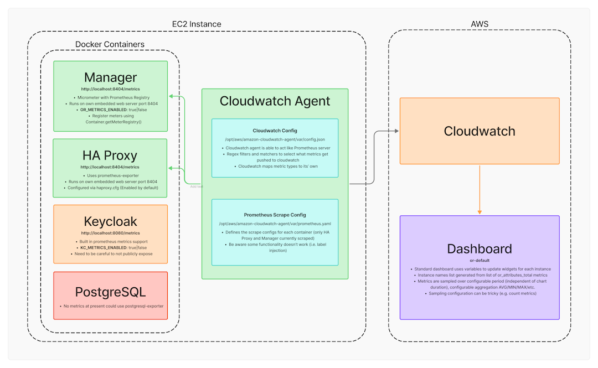

# Metrics

Prometheus formatted metrics endpoints can be configured for each container (including the OpenRemote Manager), you will either need Prometheus server running to scrape these endpoints or use a cloud provider service; here's an example using AWs Cloudwatch:

_Image of metrics endpoints and AWS Cloudwatch configuration_

Refer to the website of each container app for details of metrics exposed and their meaning; here's an overview of the OpenRemote Manager metrics.

## OpenRemote Manager
|Component| Metric name | Metric type | Labels | Description |
|:--:|--|--|--|---|
|Artemis| artemis_active | gauge | broker=localhost | If the server is active |
|Artemis| artemis_address_memory_usage | gauge | broker=localhost | Memory used by all the addresses on broker for in-memory messages |
|Artemis| artemis_address_memory_usage_percentage | gauge | broker=localhost | Memory used by all the addresses on broker as a percentage of the global-max-size |
|Artemis| artemis_address_size | gauge | address=*.*.writeattribute.#,*.*.writeattributevalue.#,provisioning.*.request,broker=localhost | The number of estimated bytes being used by all the queue(s) bound to this address; used to control paging and blocking |
|Artemis| artemis_authentication_count | gauge | broker=localhost,result=failure,success | Number of successful authentication attempts |
|Artemis| artemis_authorization_count | gauge | broker=localhost,result=failure,success | Number of successful authorization attempts |
|Artemis| artemis_connection_count | gauge | broker=localhost | Number of clients connected to this server |
|Artemis| artemis_consumer_count | gauge | address=*.*.writeattribute.#,*.*.writeattributevalue.#,provisioning.*.request,broker=localhost,queue=*.*.writeattribute.#,*.*.writeattributevalue.#,provisioning.*.request | Number of consumers consuming messages from this queue |
|Artemis| artemis_delivering_durable_message_count | gauge | address=*.*.writeattribute.#,*.*.writeattributevalue.#,provisioning.*.request,broker=localhost,queue=*.*.writeattribute.#,*.*.writeattributevalue.#,provisioning.*.request | Number of durable messages that this queue is currently delivering to its consumers |
|Artemis| artemis_delivering_durable_persistent_size | gauge | address=*.*.writeattribute.#,*.*.writeattributevalue.#,provisioning.*.request,broker=localhost,queue=*.*.writeattribute.#,*.*.writeattributevalue.#,provisioning.*.request | Persistent size of durable messages that this queue is currently delivering to its consumers |
|Artemis| artemis_delivering_message_count | gauge | address=*.*.writeattribute.#,*.*.writeattributevalue.#,provisioning.*.request,broker=localhost,queue=*.*.writeattribute.#,*.*.writeattributevalue.#,provisioning.*.request | Number of messages that this queue is currently delivering to its consumers |
|Artemis| artemis_delivering_persistent_size | gauge | address=*.*.writeattribute.#,*.*.writeattributevalue.#,provisioning.*.request,broker=localhost,queue=*.*.writeattribute.#,*.*.writeattributevalue.#,provisioning.*.request | Persistent size of messages that this queue is currently delivering to its consumers |
|Artemis| artemis_disk_store_usage | gauge | broker=localhost | Fraction of total disk store used |
|Artemis| artemis_durable_message_count | gauge | address=*.*.writeattribute.#,*.*.writeattributevalue.#,provisioning.*.request,broker=localhost,queue=*.*.writeattribute.#,*.*.writeattributevalue.#,provisioning.*.request | Number of durable messages currently in this queue (includes scheduled, paged, and in-delivery messages) |
|Artemis| artemis_durable_persistent_size | gauge | address=*.*.writeattribute.#,*.*.writeattributevalue.#,provisioning.*.request,broker=localhost,queue=*.*.writeattribute.#,*.*.writeattributevalue.#,provisioning.*.request | Persistent size of durable messages currently in this queue (includes scheduled, paged, and in-delivery messages) |
|Artemis| artemis_limit_percent | gauge | address=*.*.writeattribute.#,*.*.writeattributevalue.#,provisioning.*.request,broker=localhost | The % of memory limit (global or local) that is in use by this address |
|Artemis| artemis_message_count | gauge | address=*.*.writeattribute.#,*.*.writeattributevalue.#,provisioning.*.request,broker=localhost,queue=*.*.writeattribute.#,*.*.writeattributevalue.#,provisioning.*.request | Number of messages currently in this queue (includes scheduled, paged, and in-delivery messages) |
|Artemis| artemis_messages_acknowledged | gauge | address=*.*.writeattribute.#,*.*.writeattributevalue.#,provisioning.*.request,broker=localhost,queue=*.*.writeattribute.#,*.*.writeattributevalue.#,provisioning.*.request | Number of messages acknowledged from this queue since it was created |
|Artemis| artemis_messages_added | gauge | address=*.*.writeattribute.#,*.*.writeattributevalue.#,provisioning.*.request,broker=localhost,queue=*.*.writeattribute.#,*.*.writeattributevalue.#,provisioning.*.request | Number of messages added to this queue since it was created |
|Artemis| artemis_messages_expired | gauge | address=*.*.writeattribute.#,*.*.writeattributevalue.#,provisioning.*.request,broker=localhost,queue=*.*.writeattribute.#,*.*.writeattributevalue.#,provisioning.*.request | Number of messages expired from this queue since it was created |
|Artemis| artemis_messages_killed | gauge | address=*.*.writeattribute.#,*.*.writeattributevalue.#,provisioning.*.request,broker=localhost,queue=*.*.writeattribute.#,*.*.writeattributevalue.#,provisioning.*.request | Number of messages removed from this queue since it was created due to exceeding the max delivery attempts |
|Artemis| artemis_number_of_pages | gauge | address=*.*.writeattribute.#,*.*.writeattributevalue.#,provisioning.*.request,broker=localhost | Number of pages used by this address |
|Artemis| artemis_persistent_size | gauge | address=*.*.writeattribute.#,*.*.writeattributevalue.#,provisioning.*.request,broker=localhost,queue=*.*.writeattribute.#,*.*.writeattributevalue.#,provisioning.*.request | Persistent size of all messages (including durable and non-durable) currently in this queue (includes scheduled, paged, and in-delivery messages) |
|Artemis| artemis_replica_sync | gauge | broker=localhost | If the initial replication synchronization process is complete |
|Artemis| artemis_routed_message_count | gauge | address=*.*.writeattribute.#,*.*.writeattributevalue.#,provisioning.*.request,broker=localhost | Number of messages routed to one or more bindings |
|Artemis| artemis_scheduled_durable_message_count | gauge | address=*.*.writeattribute.#,*.*.writeattributevalue.#,provisioning.*.request,broker=localhost,queue=*.*.writeattribute.#,*.*.writeattributevalue.#,provisioning.*.request | Number of durable scheduled messages in this queue |
|Artemis| artemis_scheduled_durable_persistent_size | gauge | address=*.*.writeattribute.#,*.*.writeattributevalue.#,provisioning.*.request,broker=localhost,queue=*.*.writeattribute.#,*.*.writeattributevalue.#,provisioning.*.request | Persistent size of durable scheduled messages in this queue |
|Artemis| artemis_scheduled_message_count | gauge | address=*.*.writeattribute.#,*.*.writeattributevalue.#,provisioning.*.request,broker=localhost,queue=*.*.writeattribute.#,*.*.writeattributevalue.#,provisioning.*.request | Number of scheduled messages in this queue |
|Artemis| artemis_scheduled_persistent_size | gauge | address=*.*.writeattribute.#,*.*.writeattributevalue.#,provisioning.*.request,broker=localhost,queue=*.*.writeattribute.#,*.*.writeattributevalue.#,provisioning.*.request | Persistent size of scheduled messages in this queue |
|Artemis| artemis_session_count | gauge | broker=localhost | Number of sessions on this server |
|Artemis| artemis_total_connection_count | gauge | broker=localhost | Total number of clients which have connected to this server since it was started |
|Artemis| artemis_total_session_count | gauge | broker=localhost | Total number of sessions created on this server since it was started |
|Artemis| artemis_unrouted_message_count | gauge | address=*.*.writeattribute.#,*.*.writeattributevalue.#,provisioning.*.request,broker=localhost | Number of messages not routed to any bindings |
|Executors| executor_active_threads | gauge | name=ContainerExecutor,ContainerScheduledExecutor | The approximate number of threads that are actively executing tasks |
|Executors| executor_completed_tasks_total | counter | name=ContainerExecutor,ContainerScheduledExecutor | The approximate total number of tasks that have completed execution |
|Executors| executor_idle_seconds | summary | name=ContainerExecutor,ContainerScheduledExecutor | idle time of executor |
|Executors| executor_idle_seconds_max | gauge | name=ContainerExecutor,ContainerScheduledExecutor | maximum idle time of executor |
|Executors| executor_pool_core_threads | gauge | name=ContainerExecutor,ContainerScheduledExecutor | The core number of threads for the pool |
|Executors| executor_pool_max_threads | gauge | name=ContainerExecutor,ContainerScheduledExecutor | The maximum allowed number of threads in the pool |
|Executors| executor_pool_size_threads | gauge | name=ContainerExecutor,ContainerScheduledExecutor | The current number of threads in the pool |
|Executors| executor_queue_remaining_tasks | gauge | name=ContainerExecutor,ContainerScheduledExecutor | The number of additional elements that this queue can ideally accept without blocking |
|Executors| executor_queued_tasks | gauge | name=ContainerExecutor,ContainerScheduledExecutor | The approximate number of tasks that are queued for execution |
|Executors| executor_scheduled_once_total | counter | name=ContainerExecutor | total tasks scheduled once |
|Executors| executor_scheduled_repetitively_total | counter | name=ContainerScheduledExecutor | total tasks scheduled repetitively |
|Executors| executor_seconds | summary | name=ContainerExecutor,ContainerScheduledExecutor | measures executor task execution time |
|Executors| executor_seconds_max | gauge | name=ContainerExecutor,ContainerScheduledExecutor | maximum execution time of executor tasks |
|Events| or_attributes_total | counter | source=AgentService,AttributeLinkingService,EnergyOptimisationService,GatewayService,RulesEngine,none,... | total attributes processed by source |
|Events| or_attributes_seconds | summary | (none) | total time spent processing attribute events |
|Events| or_attributes_seconds_max | gauge | (none) | maximum time spent processing an attribute event |
|Events| or_provisioning_seconds | summary | (none) | Total time spent processing provisioning requests |
|Events| or_provisioning_seconds_max | gauge | (none) | Maximum time spent processing provisioning requests |
|Rules| or_rules_seconds | summary | (none) | Total time spent processing rules |
|Rules| or_rules_seconds_max | gauge | (none) | Maximum time spent processing rules |
