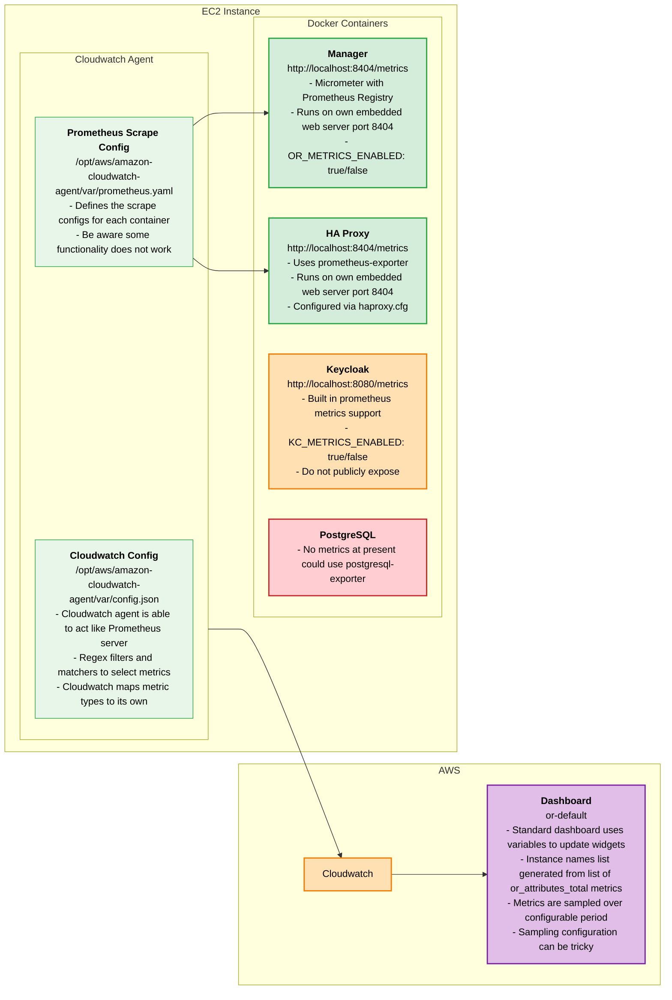

# Metrics

Prometheus formatted metrics endpoints can be configured for each container (including the OpenRemote Manager), you will either need Prometheus server running to scrape these endpoints or use a cloud provider service; here's an example using AWS Cloudwatch:

Refer to the website of each container app for details of metrics exposed and their meaning; here's an overview of the OpenRemote Manager metrics.

## OpenRemote Manager
<table>
  <thead>
    <tr>
      <th width="10%">Component</th>
      <th width="15%">Metric name</th>
      <th width="5%">Type</th>
      <th width="25%">Labels</th>
      <th>Description   &nbsp;&nbsp;&nbsp;&nbsp;&nbsp;&nbsp;&nbsp;&nbsp;&nbsp;&nbsp;&nbsp;&nbsp;&nbsp;&nbsp;&nbsp;&nbsp;&nbsp;&nbsp;&nbsp;&nbsp;&nbsp;&nbsp;&nbsp;&nbsp;&nbsp;&nbsp;&nbsp;&nbsp;&nbsp;&nbsp;&nbsp;&nbsp;&nbsp;&nbsp;&nbsp;&nbsp;&nbsp;&nbsp;&nbsp;&nbsp;&nbsp;&nbsp;&nbsp;&nbsp;&nbsp;&nbsp;&nbsp;&nbsp;&nbsp;&nbsp;&nbsp;&nbsp;&nbsp;&nbsp;&nbsp;&nbsp;&nbsp;&nbsp;&nbsp;&nbsp;&nbsp;&nbsp;&nbsp;&nbsp;&nbsp;&nbsp;&nbsp;&nbsp;&nbsp;&nbsp;&nbsp;&nbsp;&nbsp;&nbsp;&nbsp;&nbsp;&nbsp;&nbsp;&nbsp;</th>
    </tr>
  </thead>
  <tbody>
    <tr>
      <td>Artemis</td>
      <td>artemis_active</td>
      <td>gauge</td>
      <td>broker: localhost</td>
      <td>If the server is active</td>
    </tr>
    <tr>
      <td>Artemis</td>
      <td>artemis_address_memory_usage</td>
      <td>gauge</td>
      <td>broker: localhost</td>
      <td>Memory used by all the addresses on broker for in-memory messages</td>
    </tr>
    <tr>
      <td>Artemis</td>
      <td>artemis_address_memory_usage_percentage</td>
      <td>gauge</td>
      <td>broker: localhost</td>
      <td>Memory used by all the addresses on broker as a percentage of the global-max-size</td>
    </tr>
    <tr>
      <td>Artemis</td>
      <td>artemis_address_size</td>
      <td>gauge</td>
      <td>address: *.*.writeattribute.# | *.*.writeattributevalue.# | provisioning.*.request broker: localhost</td>
      <td>The number of estimated bytes being used by all the queue(s) bound to this address; used to control paging and blocking</td>
    </tr>
    <tr>
      <td>Artemis</td>
      <td>artemis_authentication_count</td>
      <td>gauge</td>
      <td>broker: localhost result: failure | success</td>
      <td>Number of successful authentication attempts</td>
    </tr>
    <tr>
      <td>Artemis</td>
      <td>artemis_authorization_count</td>
      <td>gauge</td>
      <td>broker: localhost result: failure | success</td>
      <td>Number of successful authorization attempts</td>
    </tr>
    <tr>
      <td>Artemis</td>
      <td>artemis_connection_count</td>
      <td>gauge</td>
      <td>broker: localhost</td>
      <td>Number of clients connected to this server</td>
    </tr>
    <tr>
      <td>Artemis</td>
      <td>artemis_consumer_count</td>
      <td>gauge</td>
      <td>address: *.*.writeattribute.# | *.*.writeattributevalue.# | provisioning.*.request broker: localhost queue: *.*.writeattribute.# | *.*.writeattributevalue.# | provisioning.*.request</td>
      <td>Number of consumers consuming messages from this queue</td>
    </tr>
    <tr>
      <td>Artemis</td>
      <td>artemis_delivering_durable_message_count</td>
      <td>gauge</td>
      <td>address: *.*.writeattribute.# | *.*.writeattributevalue.# | provisioning.*.request broker: localhost queue: *.*.writeattribute.# | *.*.writeattributevalue.# | provisioning.*.request</td>
      <td>Number of durable messages that this queue is currently delivering to its consumers</td>
    </tr>
    <tr>
      <td>Artemis</td>
      <td>artemis_delivering_durable_persistent_size</td>
      <td>gauge</td>
      <td>address: *.*.writeattribute.# | *.*.writeattributevalue.# | provisioning.*.request broker: localhost queue: *.*.writeattribute.# | *.*.writeattributevalue.# | provisioning.*.request</td>
      <td>Persistent size of durable messages that this queue is currently delivering to its consumers</td>
    </tr>
    <tr>
      <td>Artemis</td>
      <td>artemis_delivering_message_count</td>
      <td>gauge</td>
      <td>address: *.*.writeattribute.# | *.*.writeattributevalue.# | provisioning.*.request broker: localhost queue: *.*.writeattribute.# | *.*.writeattributevalue.# | provisioning.*.request</td>
      <td>Number of messages that this queue is currently delivering to its consumers</td>
    </tr>
    <tr>
      <td>Artemis</td>
      <td>artemis_delivering_persistent_size</td>
      <td>gauge</td>
      <td>address: *.*.writeattribute.# | *.*.writeattributevalue.# | provisioning.*.request broker: localhost queue: *.*.writeattribute.# | *.*.writeattributevalue.# | provisioning.*.request</td>
      <td>Persistent size of messages that this queue is currently delivering to its consumers</td>
    </tr>
    <tr>
      <td>Artemis</td>
      <td>artemis_disk_store_usage</td>
      <td>gauge</td>
      <td>broker: localhost</td>
      <td>Fraction of total disk store used</td>
    </tr>
    <tr>
      <td>Artemis</td>
      <td>artemis_durable_message_count</td>
      <td>gauge</td>
      <td>address: *.*.writeattribute.# | *.*.writeattributevalue.# | provisioning.*.request broker: localhost queue: *.*.writeattribute.# | *.*.writeattributevalue.# | provisioning.*.request</td>
      <td>Number of durable messages currently in this queue (includes scheduled, paged, and in-delivery messages)</td>
    </tr>
    <tr>
      <td>Artemis</td>
      <td>artemis_durable_persistent_size</td>
      <td>gauge</td>
      <td>address: *.*.writeattribute.# | *.*.writeattributevalue.# | provisioning.*.request broker: localhost queue: *.*.writeattribute.# | *.*.writeattributevalue.# | provisioning.*.request</td>
      <td>Persistent size of durable messages currently in this queue (includes scheduled, paged, and in-delivery messages)</td>
    </tr>
    <tr>
      <td>Artemis</td>
      <td>artemis_limit_percent</td>
      <td>gauge</td>
      <td>address: *.*.writeattribute.# | *.*.writeattributevalue.# | provisioning.*.request broker: localhost</td>
      <td>The % of memory limit (global or local) that is in use by this address</td>
    </tr>
    <tr>
      <td>Artemis</td>
      <td>artemis_message_count</td>
      <td>gauge</td>
      <td>address: *.*.writeattribute.# | *.*.writeattributevalue.# | provisioning.*.request broker: localhost queue: *.*.writeattribute.# | *.*.writeattributevalue.# | provisioning.*.request</td>
      <td>Number of messages currently in this queue (includes scheduled, paged, and in-delivery messages)</td>
    </tr>
    <tr>
      <td>Artemis</td>
      <td>artemis_messages_acknowledged</td>
      <td>gauge</td>
      <td>address: *.*.writeattribute.# | *.*.writeattributevalue.# | provisioning.*.request broker: localhost queue: *.*.writeattribute.# | *.*.writeattributevalue.# | provisioning.*.request</td>
      <td>Number of messages acknowledged from this queue since it was created</td>
    </tr>
    <tr>
      <td>Artemis</td>
      <td>artemis_messages_added</td>
      <td>gauge</td>
      <td>address: *.*.writeattribute.# | *.*.writeattributevalue.# | provisioning.*.request broker: localhost queue: *.*.writeattribute.# | *.*.writeattributevalue.# | provisioning.*.request</td>
      <td>Number of messages added to this queue since it was created</td>
    </tr>
    <tr>
      <td>Artemis</td>
      <td>artemis_messages_expired</td>
      <td>gauge</td>
      <td>address: *.*.writeattribute.# | *.*.writeattributevalue.# | provisioning.*.request broker: localhost queue: *.*.writeattribute.# | *.*.writeattributevalue.# | provisioning.*.request</td>
      <td>Number of messages expired from this queue since it was created</td>
    </tr>
    <tr>
      <td>Artemis</td>
      <td>artemis_messages_killed</td>
      <td>gauge</td>
      <td>address: *.*.writeattribute.# | *.*.writeattributevalue.# | provisioning.*.request broker: localhost queue: *.*.writeattribute.# | *.*.writeattributevalue.# | provisioning.*.request</td>
      <td>Number of messages removed from this queue since it was created due to exceeding the max delivery attempts</td>
    </tr>
    <tr>
      <td>Artemis</td>
      <td>artemis_number_of_pages</td>
      <td>gauge</td>
      <td>address: *.*.writeattribute.# | *.*.writeattributevalue.# | provisioning.*.request broker: localhost</td>
      <td>Number of pages used by this address</td>
    </tr>
    <tr>
      <td>Artemis</td>
      <td>artemis_persistent_size</td>
      <td>gauge</td>
      <td>address: *.*.writeattribute.# | *.*.writeattributevalue.# | provisioning.*.request broker: localhost queue: *.*.writeattribute.# | *.*.writeattributevalue.# | provisioning.*.request</td>
      <td>Persistent size of all messages (including durable and non-durable) currently in this queue (includes scheduled, paged, and in-delivery messages)</td>
    </tr>
    <tr>
      <td>Artemis</td>
      <td>artemis_replica_sync</td>
      <td>gauge</td>
      <td>broker: localhost</td>
      <td>If the initial replication synchronization process is complete</td>
    </tr>
    <tr>
      <td>Artemis</td>
      <td>artemis_routed_message_count</td>
      <td>gauge</td>
      <td>address: *.*.writeattribute.# | *.*.writeattributevalue.# | provisioning.*.request broker: localhost</td>
      <td>Number of messages routed to one or more bindings</td>
    </tr>
    <tr>
      <td>Artemis</td>
      <td>artemis_scheduled_durable_message_count</td>
      <td>gauge</td>
      <td>address: *.*.writeattribute.# | *.*.writeattributevalue.# | provisioning.*.request broker: localhost queue: *.*.writeattribute.# | *.*.writeattributevalue.# | provisioning.*.request</td>
      <td>Number of durable scheduled messages in this queue</td>
    </tr>
    <tr>
      <td>Artemis</td>
      <td>artemis_scheduled_durable_persistent_size</td>
      <td>gauge</td>
      <td>address: *.*.writeattribute.# | *.*.writeattributevalue.# | provisioning.*.request broker: localhost queue: *.*.writeattribute.# | *.*.writeattributevalue.# | provisioning.*.request</td>
      <td>Persistent size of durable scheduled messages in this queue</td>
    </tr>
    <tr>
      <td>Artemis</td>
      <td>artemis_scheduled_message_count</td>
      <td>gauge</td>
      <td>address: *.*.writeattribute.# | *.*.writeattributevalue.# | provisioning.*.request broker: localhost queue: *.*.writeattribute.# | *.*.writeattributevalue.# | provisioning.*.request</td>
      <td>Number of scheduled messages in this queue</td>
    </tr>
    <tr>
      <td>Artemis</td>
      <td>artemis_scheduled_persistent_size</td>
      <td>gauge</td>
      <td>address: *.*.writeattribute.# | *.*.writeattributevalue.# | provisioning.*.request broker: localhost queue: *.*.writeattribute.# | *.*.writeattributevalue.# | provisioning.*.request</td>
      <td>Persistent size of scheduled messages in this queue</td>
    </tr>
    <tr>
      <td>Artemis</td>
      <td>artemis_session_count</td>
      <td>gauge</td>
      <td>broker: localhost</td>
      <td>Number of sessions on this server</td>
    </tr>
    <tr>
      <td>Artemis</td>
      <td>artemis_total_connection_count</td>
      <td>gauge</td>
      <td>broker: localhost</td>
      <td>Total number of clients which have connected to this server since it was started</td>
    </tr>
    <tr>
      <td>Artemis</td>
      <td>artemis_total_session_count</td>
      <td>gauge</td>
      <td>broker: localhost</td>
      <td>Total number of sessions created on this server since it was started</td>
    </tr>
    <tr>
      <td>Artemis</td>
      <td>artemis_unrouted_message_count</td>
      <td>gauge</td>
      <td>address: *.*.writeattribute.# | *.*.writeattributevalue.# | provisioning.*.request broker: localhost</td>
      <td>Number of messages not routed to any bindings</td>
    </tr>
    <tr>
      <td>Executors</td>
      <td>executor_active_threads</td>
      <td>gauge</td>
      <td>name: ContainerExecutor | ContainerScheduledExecutor</td>
      <td>The approximate number of threads that are actively executing tasks</td>
    </tr>
    <tr>
      <td>Executors</td>
      <td>executor_completed_tasks_total</td>
      <td>counter</td>
      <td>name: ContainerExecutor | ContainerScheduledExecutor</td>
      <td>The approximate total number of tasks that have completed execution</td>
    </tr>
    <tr>
      <td>Executors</td>
      <td>executor_idle_seconds</td>
      <td>summary</td>
      <td>name: ContainerExecutor | ContainerScheduledExecutor</td>
      <td>idle time of executor</td>
    </tr>
    <tr>
      <td>Executors</td>
      <td>executor_idle_seconds_max</td>
      <td>gauge</td>
      <td>name: ContainerExecutor | ContainerScheduledExecutor</td>
      <td>Maximum idle time of executor</td>
    </tr>
    <tr>
      <td>Executors</td>
      <td>executor_pool_core_threads</td>
      <td>gauge</td>
      <td>name: ContainerExecutor | ContainerScheduledExecutor</td>
      <td>The core number of threads for the pool</td>
    </tr>
    <tr>
      <td>Executors</td>
      <td>executor_pool_max_threads</td>
      <td>gauge</td>
      <td>name: ContainerExecutor | ContainerScheduledExecutor</td>
      <td>The maximum allowed number of threads in the pool</td>
    </tr>
    <tr>
      <td>Executors</td>
      <td>executor_pool_size_threads</td>
      <td>gauge</td>
      <td>name: ContainerExecutor | ContainerScheduledExecutor</td>
      <td>The current number of threads in the pool</td>
    </tr>
    <tr>
      <td>Executors</td>
      <td>executor_queue_remaining_tasks</td>
      <td>gauge</td>
      <td>name: ContainerExecutor | ContainerScheduledExecutor</td>
      <td>The number of additional elements that this queue can ideally accept without blocking</td>
    </tr>
    <tr>
      <td>Executors</td>
      <td>executor_queued_tasks</td>
      <td>gauge</td>
      <td>name: ContainerExecutor | ContainerScheduledExecutor</td>
      <td>The approximate number of tasks that are queued for execution</td>
    </tr>
    <tr>
      <td>Executors</td>
      <td>executor_scheduled_once_total</td>
      <td>counter</td>
      <td>name: ContainerExecutor</td>
      <td>Total tasks scheduled once</td>
    </tr>
    <tr>
      <td>Executors</td>
      <td>executor_scheduled_repetitively_total</td>
      <td>counter</td>
      <td>name: ContainerScheduledExecutor</td>
      <td>Total tasks scheduled repetitively</td>
    </tr>
    <tr>
      <td>Executors</td>
      <td>executor_seconds</td>
      <td>summary</td>
      <td>name: ContainerExecutor | ContainerScheduledExecutor</td>
      <td>Measures executor task execution time</td>
    </tr>
    <tr>
      <td>Executors</td>
      <td>executor_seconds_max</td>
      <td>gauge</td>
      <td>name: ContainerExecutor | ContainerScheduledExecutor</td>
      <td>Maximum execution time of executor tasks</td>
    </tr>
    <tr>
      <td>Events</td>
      <td>or_attributes_total</td>
      <td>counter</td>
      <td>source: AgentService | AttributeLinkingService | EnergyOptimisationService | GatewayService | RulesEngine | none | ...</td>
      <td>total attributes processed by source</td>
    </tr>
    <tr>
      <td>Events</td>
      <td>or_attributes_seconds</td>
      <td>summary</td>
      <td>(none)</td>
      <td>Total time spent processing attribute events</td>
    </tr>
    <tr>
      <td>Events</td>
      <td>or_attributes_seconds_max</td>
      <td>gauge</td>
      <td>(none)</td>
      <td>maximum time spent processing an attribute event</td>
    </tr>
    <tr>
      <td>Events</td>
      <td>or_provisioning_seconds</td>
      <td>summary</td>
      <td>(none)</td>
      <td>Total time spent processing provisioning requests</td>
    </tr>
    <tr>
      <td>Events</td>
      <td>or_provisioning_seconds_max</td>
      <td>gauge</td>
      <td>(none)</td>
      <td>Maximum time spent processing provisioning requests</td>
    </tr>
    <tr>
      <td>Rules</td>
      <td>or_rules_seconds</td>
      <td>summary</td>
      <td>(none)</td>
      <td>Total time spent processing rules</td>
    </tr>
    <tr>
      <td>Rules</td>
      <td>or_rules_seconds_max</td>
      <td>gauge</td>
      <td>(none)</td>
      <td>Maximum time spent processing rules</td>
    </tr>
  </tbody>
</table>
