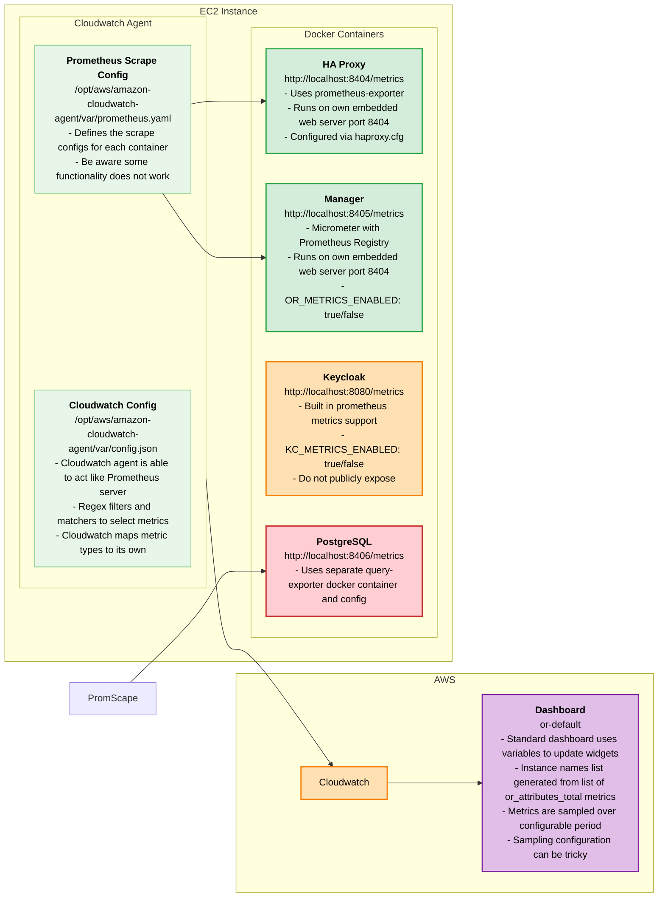

# Metrics

Prometheus formatted metrics endpoints can be configured for each container (including the OpenRemote Manager), you will either need Prometheus server running to scrape these endpoints or use a cloud provider service; here's an example using AWS Cloudwatch:

```mermaid
graph LR
    %% Styling Definitions
    classDef greenStyle fill:#d4edda,stroke:#28a745,stroke-width:2px,color:#000;
    classDef innerGreenStyle fill:#e8f5e9,stroke:#28a745,stroke-width:1px,color:#000;
    classDef orangeStyle fill:#ffe0b2,stroke:#f57c00,stroke-width:2px,color:#000;
    classDef redStyle fill:#ffcdd2,stroke:#c62828,stroke-width:2px,color:#000;
    classDef purpleStyle fill:#e1bee7,stroke:#7b1fa2,stroke-width:2px,color:#000;

    subgraph AWS [AWS]
        direction TB
        CW[Cloudwatch]:::orangeStyle
        DB["<b>Dashboard</b><br/>or-default<br/>- Standard dashboard uses variables to update widgets<br/>- Instance names list generated from list of or_attributes_total metrics<br/>- Metrics are sampled over configurable period<br/>- Sampling configuration can be tricky"]:::purpleStyle
    end

    subgraph EC2 [EC2 Instance]
        
        subgraph CWAgent [Cloudwatch Agent]
            direction TB
            CWConfig["<b>Cloudwatch Config</b><br/>/opt/aws/amazon-cloudwatch-agent/var/config.json<br/>- Cloudwatch agent is able to act like Prometheus server<br/>- Regex filters and matchers to select metrics<br/>- Cloudwatch maps metric types to its own"]:::innerGreenStyle
            PromScrape["<b>Prometheus Scrape Config</b><br/>/opt/aws/amazon-cloudwatch-agent/var/prometheus.yaml<br/>- Defines the scrape configs for each container<br/>- Be aware some functionality does not work"]:::innerGreenStyle
        end

        subgraph Docker [Docker Containers]
            direction TB
            HAProxy["<b>HA Proxy</b><br/>http://localhost:8404/metrics<br/>- Uses prometheus-exporter<br/>- Runs on own embedded web server port 8404<br/>- Configured via haproxy.cfg"]:::greenStyle
            Manager["<b>Manager</b><br/>http://localhost:8405/metrics<br/>- Micrometer with Prometheus Registry<br/>- Runs on own embedded web server port 8404<br/>- OR_METRICS_ENABLED: true/false"]:::greenStyle
            Keycloak["<b>Keycloak</b><br/>http://localhost:8080/metrics<br/>- Built in prometheus metrics support<br/>- KC_METRICS_ENABLED: true/false<br/>- Do not publicly expose"]:::orangeStyle
            PostgreSQL["<b>PostgreSQL</b><br/>http://localhost:8406/metrics<br/>- Uses separate query-exporter docker container and config"]:::redStyle
        end
    end

    %% Connections
    PromScrape --> Manager
    PromScrape --> HAProxy
    PromScape --> PostgreSQL
    CWAgent --> CW
    CW --> DB

```

Refer to the website of each container app for details of metrics exposed and their meaning; here's an overview of the OpenRemote Manager metrics.

## OpenRemote Manager
<table>
  <thead>
    <tr>
      <th width="10%">Component</th>
      <th width="15%">Metric name</th>
      <th width="5%">Type</th>
      <th width="25%">Labels</th>
      <th>Description   &nbsp;&nbsp;&nbsp;&nbsp;&nbsp;&nbsp;&nbsp;&nbsp;&nbsp;&nbsp;&nbsp;&nbsp;&nbsp;&nbsp;&nbsp;&nbsp;&nbsp;&nbsp;&nbsp;&nbsp;&nbsp;&nbsp;&nbsp;&nbsp;&nbsp;&nbsp;&nbsp;&nbsp;&nbsp;&nbsp;&nbsp;&nbsp;&nbsp;&nbsp;&nbsp;&nbsp;&nbsp;&nbsp;&nbsp;&nbsp;&nbsp;&nbsp;&nbsp;&nbsp;&nbsp;&nbsp;&nbsp;&nbsp;&nbsp;&nbsp;&nbsp;&nbsp;&nbsp;&nbsp;&nbsp;&nbsp;&nbsp;&nbsp;&nbsp;&nbsp;&nbsp;&nbsp;&nbsp;&nbsp;&nbsp;&nbsp;&nbsp;&nbsp;&nbsp;&nbsp;&nbsp;&nbsp;&nbsp;&nbsp;&nbsp;&nbsp;&nbsp;&nbsp;&nbsp;</th>
    </tr>
  </thead>
  <tbody>
    <tr>
      <td>Artemis</td>
      <td>artemis_active</td>
      <td>gauge</td>
      <td>broker: localhost</td>
      <td>If the server is active</td>
    </tr>
    <tr>
      <td>Artemis</td>
      <td>artemis_address_memory_usage</td>
      <td>gauge</td>
      <td>broker: localhost</td>
      <td>Memory used by all the addresses on broker for in-memory messages</td>
    </tr>
    <tr>
      <td>Artemis</td>
      <td>artemis_address_memory_usage_percentage</td>
      <td>gauge</td>
      <td>broker: localhost</td>
      <td>Memory used by all the addresses on broker as a percentage of the global-max-size</td>
    </tr>
    <tr>
      <td>Artemis</td>
      <td>artemis_address_size</td>
      <td>gauge</td>
      <td>address: \*.\*.writeattribute.# | \*.\*.writeattributevalue.# | provisioning.\*.request broker: localhost</td>
      <td>The number of estimated bytes being used by all the queue(s) bound to this address; used to control paging and blocking</td>
    </tr>
    <tr>
      <td>Artemis</td>
      <td>artemis_authentication_count</td>
      <td>gauge</td>
      <td>broker: localhost result: failure | success</td>
      <td>Number of successful authentication attempts</td>
    </tr>
    <tr>
      <td>Artemis</td>
      <td>artemis_authorization_count</td>
      <td>gauge</td>
      <td>broker: localhost result: failure | success</td>
      <td>Number of successful authorization attempts</td>
    </tr>
    <tr>
      <td>Artemis</td>
      <td>artemis_connection_count</td>
      <td>gauge</td>
      <td>broker: localhost</td>
      <td>Number of clients connected to this server</td>
    </tr>
    <tr>
      <td>Artemis</td>
      <td>artemis_consumer_count</td>
      <td>gauge</td>
      <td>address: \*.\*.writeattribute.# | \*.\*.writeattributevalue.# | provisioning.\*.request broker: localhost queue: \*.\*.writeattribute.# | \*.\*.writeattributevalue.# | provisioning.\*.request</td>
      <td>Number of consumers consuming messages from this queue</td>
    </tr>
    <tr>
      <td>Artemis</td>
      <td>artemis_delivering_durable_message_count</td>
      <td>gauge</td>
      <td>address: \*.\*.writeattribute.# | \*.\*.writeattributevalue.# | provisioning.\*.request broker: localhost queue: \*.\*.writeattribute.# | \*.\*.writeattributevalue.# | provisioning.\*.request</td>
      <td>Number of durable messages that this queue is currently delivering to its consumers</td>
    </tr>
    <tr>
      <td>Artemis</td>
      <td>artemis_delivering_durable_persistent_size</td>
      <td>gauge</td>
      <td>address: \*.\*.writeattribute.# | \*.\*.writeattributevalue.# | provisioning.\*.request broker: localhost queue: \*.\*.writeattribute.# | \*.\*.writeattributevalue.# | provisioning.\*.request</td>
      <td>Persistent size of durable messages that this queue is currently delivering to its consumers</td>
    </tr>
    <tr>
      <td>Artemis</td>
      <td>artemis_delivering_message_count</td>
      <td>gauge</td>
      <td>address: \*.\*.writeattribute.# | \*.\*.writeattributevalue.# | provisioning.\*.request broker: localhost queue: \*.\*.writeattribute.# | \*.\*.writeattributevalue.# | provisioning.\*.request</td>
      <td>Number of messages that this queue is currently delivering to its consumers</td>
    </tr>
    <tr>
      <td>Artemis</td>
      <td>artemis_delivering_persistent_size</td>
      <td>gauge</td>
      <td>address: \*.\*.writeattribute.# | \*.\*.writeattributevalue.# | provisioning.\*.request broker: localhost queue: \*.\*.writeattribute.# | \*.\*.writeattributevalue.# | provisioning.\*.request</td>
      <td>Persistent size of messages that this queue is currently delivering to its consumers</td>
    </tr>
    <tr>
      <td>Artemis</td>
      <td>artemis_disk_store_usage</td>
      <td>gauge</td>
      <td>broker: localhost</td>
      <td>Fraction of total disk store used</td>
    </tr>
    <tr>
      <td>Artemis</td>
      <td>artemis_durable_message_count</td>
      <td>gauge</td>
      <td>address: \*.\*.writeattribute.# | \*.\*.writeattributevalue.# | provisioning.\*.request broker: localhost queue: \*.\*.writeattribute.# | \*.\*.writeattributevalue.# | provisioning.\*.request</td>
      <td>Number of durable messages currently in this queue (includes scheduled, paged, and in-delivery messages)</td>
    </tr>
    <tr>
      <td>Artemis</td>
      <td>artemis_durable_persistent_size</td>
      <td>gauge</td>
      <td>address: \*.\*.writeattribute.# | \*.\*.writeattributevalue.# | provisioning.\*.request broker: localhost queue: \*.\*.writeattribute.# | \*.\*.writeattributevalue.# | provisioning.\*.request</td>
      <td>Persistent size of durable messages currently in this queue (includes scheduled, paged, and in-delivery messages)</td>
    </tr>
    <tr>
      <td>Artemis</td>
      <td>artemis_limit_percent</td>
      <td>gauge</td>
      <td>address: \*.\*.writeattribute.# | \*.\*.writeattributevalue.# | provisioning.\*.request broker: localhost</td>
      <td>The % of memory limit (global or local) that is in use by this address</td>
    </tr>
    <tr>
      <td>Artemis</td>
      <td>artemis_message_count</td>
      <td>gauge</td>
      <td>address: \*.\*.writeattribute.# | \*.\*.writeattributevalue.# | provisioning.\*.request broker: localhost queue: \*.\*.writeattribute.# | \*.\*.writeattributevalue.# | provisioning.\*.request</td>
      <td>Number of messages currently in this queue (includes scheduled, paged, and in-delivery messages)</td>
    </tr>
    <tr>
      <td>Artemis</td>
      <td>artemis_messages_acknowledged</td>
      <td>gauge</td>
      <td>address: \*.\*.writeattribute.# | \*.\*.writeattributevalue.# | provisioning.\*.request broker: localhost queue: \*.\*.writeattribute.# | \*.\*.writeattributevalue.# | provisioning.\*.request</td>
      <td>Number of messages acknowledged from this queue since it was created</td>
    </tr>
    <tr>
      <td>Artemis</td>
      <td>artemis_messages_added</td>
      <td>gauge</td>
      <td>address: \*.\*.writeattribute.# | \*.\*.writeattributevalue.# | provisioning.\*.request broker: localhost queue: \*.\*.writeattribute.# | \*.\*.writeattributevalue.# | provisioning.\*.request</td>
      <td>Number of messages added to this queue since it was created</td>
    </tr>
    <tr>
      <td>Artemis</td>
      <td>artemis_messages_expired</td>
      <td>gauge</td>
      <td>address: \*.\*.writeattribute.# | \*.\*.writeattributevalue.# | provisioning.\*.request broker: localhost queue: \*.\*.writeattribute.# | \*.\*.writeattributevalue.# | provisioning.\*.request</td>
      <td>Number of messages expired from this queue since it was created</td>
    </tr>
    <tr>
      <td>Artemis</td>
      <td>artemis_messages_killed</td>
      <td>gauge</td>
      <td>address: \*.\*.writeattribute.# | \*.\*.writeattributevalue.# | provisioning.\*.request broker: localhost queue: \*.\*.writeattribute.# | \*.\*.writeattributevalue.# | provisioning.\*.request</td>
      <td>Number of messages removed from this queue since it was created due to exceeding the max delivery attempts</td>
    </tr>
    <tr>
      <td>Artemis</td>
      <td>artemis_number_of_pages</td>
      <td>gauge</td>
      <td>address: \*.\*.writeattribute.# | \*.\*.writeattributevalue.# | provisioning.\*.request broker: localhost</td>
      <td>Number of pages used by this address</td>
    </tr>
    <tr>
      <td>Artemis</td>
      <td>artemis_persistent_size</td>
      <td>gauge</td>
      <td>address: \*.\*.writeattribute.# | \*.\*.writeattributevalue.# | provisioning.\*.request broker: localhost queue: \*.\*.writeattribute.# | \*.\*.writeattributevalue.# | provisioning.\*.request</td>
      <td>Persistent size of all messages (including durable and non-durable) currently in this queue (includes scheduled, paged, and in-delivery messages)</td>
    </tr>
    <tr>
      <td>Artemis</td>
      <td>artemis_replica_sync</td>
      <td>gauge</td>
      <td>broker: localhost</td>
      <td>If the initial replication synchronization process is complete</td>
    </tr>
    <tr>
      <td>Artemis</td>
      <td>artemis_routed_message_count</td>
      <td>gauge</td>
      <td>address: \*.\*.writeattribute.# | \*.\*.writeattributevalue.# | provisioning.\*.request broker: localhost</td>
      <td>Number of messages routed to one or more bindings</td>
    </tr>
    <tr>
      <td>Artemis</td>
      <td>artemis_scheduled_durable_message_count</td>
      <td>gauge</td>
      <td>address: \*.\*.writeattribute.# | \*.\*.writeattributevalue.# | provisioning.\*.request broker: localhost queue: \*.\*.writeattribute.# | \*.\*.writeattributevalue.# | provisioning.\*.request</td>
      <td>Number of durable scheduled messages in this queue</td>
    </tr>
    <tr>
      <td>Artemis</td>
      <td>artemis_scheduled_durable_persistent_size</td>
      <td>gauge</td>
      <td>address: \*.\*.writeattribute.# | \*.\*.writeattributevalue.# | provisioning.\*.request broker: localhost queue: \*.\*.writeattribute.# | \*.\*.writeattributevalue.# | provisioning.\*.request</td>
      <td>Persistent size of durable scheduled messages in this queue</td>
    </tr>
    <tr>
      <td>Artemis</td>
      <td>artemis_scheduled_message_count</td>
      <td>gauge</td>
      <td>address: \*.\*.writeattribute.# | \*.\*.writeattributevalue.# | provisioning.\*.request broker: localhost queue: \*.\*.writeattribute.# | \*.\*.writeattributevalue.# | provisioning.\*.request</td>
      <td>Number of scheduled messages in this queue</td>
    </tr>
    <tr>
      <td>Artemis</td>
      <td>artemis_scheduled_persistent_size</td>
      <td>gauge</td>
      <td>address: \*.\*.writeattribute.# | \*.\*.writeattributevalue.# | provisioning.\*.request broker: localhost queue: \*.\*.writeattribute.# | \*.\*.writeattributevalue.# | provisioning.\*.request</td>
      <td>Persistent size of scheduled messages in this queue</td>
    </tr>
    <tr>
      <td>Artemis</td>
      <td>artemis_session_count</td>
      <td>gauge</td>
      <td>broker: localhost</td>
      <td>Number of sessions on this server</td>
    </tr>
    <tr>
      <td>Artemis</td>
      <td>artemis_total_connection_count</td>
      <td>gauge</td>
      <td>broker: localhost</td>
      <td>Total number of clients which have connected to this server since it was started</td>
    </tr>
    <tr>
      <td>Artemis</td>
      <td>artemis_total_session_count</td>
      <td>gauge</td>
      <td>broker: localhost</td>
      <td>Total number of sessions created on this server since it was started</td>
    </tr>
    <tr>
      <td>Artemis</td>
      <td>artemis_unrouted_message_count</td>
      <td>gauge</td>
      <td>address: \*.\*.writeattribute.# | \*.\*.writeattributevalue.# | provisioning.\*.request broker: localhost</td>
      <td>Number of messages not routed to any bindings</td>
    </tr>
    <tr>
      <td>Executors</td>
      <td>executor_active_threads</td>
      <td>gauge</td>
      <td>name: ContainerExecutor | ContainerScheduledExecutor</td>
      <td>The approximate number of threads that are actively executing tasks</td>
    </tr>
    <tr>
      <td>Executors</td>
      <td>executor_completed_tasks_total</td>
      <td>counter</td>
      <td>name: ContainerExecutor | ContainerScheduledExecutor</td>
      <td>The approximate total number of tasks that have completed execution</td>
    </tr>
    <tr>
      <td>Executors</td>
      <td>executor_idle_seconds</td>
      <td>summary</td>
      <td>name: ContainerExecutor | ContainerScheduledExecutor</td>
      <td>Idle time of executor</td>
    </tr>
    <tr>
      <td>Executors</td>
      <td>executor_idle_seconds_max</td>
      <td>gauge</td>
      <td>name: ContainerExecutor | ContainerScheduledExecutor</td>
      <td>Maximum idle time of executor</td>
    </tr>
    <tr>
      <td>Executors</td>
      <td>executor_pool_core_threads</td>
      <td>gauge</td>
      <td>name: ContainerExecutor | ContainerScheduledExecutor</td>
      <td>The core number of threads for the pool</td>
    </tr>
    <tr>
      <td>Executors</td>
      <td>executor_pool_max_threads</td>
      <td>gauge</td>
      <td>name: ContainerExecutor | ContainerScheduledExecutor</td>
      <td>The maximum allowed number of threads in the pool</td>
    </tr>
    <tr>
      <td>Executors</td>
      <td>executor_pool_size_threads</td>
      <td>gauge</td>
      <td>name: ContainerExecutor | ContainerScheduledExecutor</td>
      <td>The current number of threads in the pool</td>
    </tr>
    <tr>
      <td>Executors</td>
      <td>executor_queue_remaining_tasks</td>
      <td>gauge</td>
      <td>name: ContainerExecutor | ContainerScheduledExecutor</td>
      <td>The number of additional elements that this queue can ideally accept without blocking</td>
    </tr>
    <tr>
      <td>Executors</td>
      <td>executor_queued_tasks</td>
      <td>gauge</td>
      <td>name: ContainerExecutor | ContainerScheduledExecutor</td>
      <td>The approximate number of tasks that are queued for execution</td>
    </tr>
    <tr>
      <td>Executors</td>
      <td>executor_scheduled_once_total</td>
      <td>counter</td>
      <td>name: ContainerExecutor</td>
      <td>Total tasks scheduled once</td>
    </tr>
    <tr>
      <td>Executors</td>
      <td>executor_scheduled_repetitively_total</td>
      <td>counter</td>
      <td>name: ContainerScheduledExecutor</td>
      <td>Total tasks scheduled repetitively</td>
    </tr>
    <tr>
      <td>Executors</td>
      <td>executor_seconds</td>
      <td>summary</td>
      <td>name: ContainerExecutor | ContainerScheduledExecutor</td>
      <td>Measures executor task execution time</td>
    </tr>
    <tr>
      <td>Executors</td>
      <td>executor_seconds_max</td>
      <td>gauge</td>
      <td>name: ContainerExecutor | ContainerScheduledExecutor</td>
      <td>Maximum execution time of executor tasks</td>
    </tr>
    <tr>
      <td>Events</td>
      <td>or_attributes_total</td>
      <td>counter</td>
      <td>source: AgentService | AttributeLinkingService | EnergyOptimisationService | GatewayService | RulesEngine | none | ...</td>
      <td>Total attributes processed by source</td>
    </tr>
    <tr>
      <td>Events</td>
      <td>or_attributes_seconds</td>
      <td>summary</td>
      <td>(none)</td>
      <td>Total time spent processing attribute events</td>
    </tr>
    <tr>
      <td>Events</td>
      <td>or_attributes_seconds_max</td>
      <td>gauge</td>
      <td>(none)</td>
      <td>Maximum time spent processing an attribute event</td>
    </tr>
    <tr>
      <td>Events</td>
      <td>or_provisioning_seconds</td>
      <td>summary</td>
      <td>(none)</td>
      <td>Total time spent processing provisioning requests</td>
    </tr>
    <tr>
      <td>Events</td>
      <td>or_provisioning_seconds_max</td>
      <td>gauge</td>
      <td>(none)</td>
      <td>Maximum time spent processing provisioning requests</td>
    </tr>
    <tr>
      <td>Rules</td>
      <td>or_rules_seconds</td>
      <td>summary</td>
      <td>(none)</td>
      <td>Total time spent processing rules</td>
    </tr>
    <tr>
      <td>Rules</td>
      <td>or_rules_seconds_max</td>
      <td>gauge</td>
      <td>(none)</td>
      <td>Maximum time spent processing rules</td>
    </tr>
  </tbody>
</table>

## PostgreSQL (via Query Exporter)

The following metrics are exposed by the Query Exporter, which connects directly to the OpenRemote PostgreSQL database to monitor TimescaleDB performance, connection limits, and general database health. The
following is based on the default configuration found in `/deployment/query-exporter/config.yaml`.

<table>
  <thead>
    <tr>
      <th width="25%">Metric name</th>
      <th width="10%">Type</th>
      <th width="25%">Labels</th>
      <th>Description</th>
    </tr>
  </thead>
  <tbody>
    <tr>
      <td>pg_collation_mismatch_count</td>
      <td>gauge</td>
      <td>(none)</td>
      <td>Number of text indexes with collation version mismatches requiring a REINDEX</td>
    </tr>
    <tr>
      <td>pg_cache_hit_percentage</td>
      <td>gauge</td>
      <td>(none)</td>
      <td>What percentage of data is being served instantly from RAM versus being slowly read from disk. You want this as high as possible</td>
    </tr>
    <tr>
      <td>pg_connections_limit</td>
      <td>gauge</td>
      <td>(none)</td>
      <td>Count of connections max limit</td>
    </tr>
    <tr>
      <td>pg_connections_used</td>
      <td>gauge</td>
      <td>(none)</td>
      <td>Count of connections in use</td>
    </tr>
    <tr>
      <td>pg_connections_free</td>
      <td>gauge</td>
      <td>(none)</td>
      <td>Count of connections available</td>
    </tr>
    <tr>
      <td>pg_connections_stuck</td>
      <td>gauge</td>
      <td>(none)</td>
      <td>Count of connections with state of idle in transaction</td>
    </tr>
    <tr>
      <td>pg_hot_update_percent</td>
      <td>gauge</td>
      <td>table_name</td>
      <td>Table percentage of updates that are HOT updates indicates good fillfactor</td>
    </tr>
    <tr>
      <td>pg_dead_tuple_percent</td>
      <td>gauge</td>
      <td>table_name</td>
      <td>Table ratio of dead tuples to live ones a ratio &gt; 10-20% indicates not aggressive enough autovacuum</td>
    </tr>
    <tr>
      <td>pg_last_autovacuum_hours</td>
      <td>gauge</td>
      <td>table_name</td>
      <td>Table hours since last auto vacuum run successfully</td>
    </tr>
    <tr>
      <td>pg_last_autoanalyze_hours</td>
      <td>gauge</td>
      <td>table_name</td>
      <td>Table hours since last auto analyze run successfully</td>
    </tr>
    <tr>
      <td>pg_db_disk_size</td>
      <td>gauge</td>
      <td>(none)</td>
      <td>DB size in MB</td>
    </tr>
    <tr>
      <td>pg_datapoint_raw_data_size</td>
      <td>gauge</td>
      <td>(none)</td>
      <td>Asset datapoint table raw uncompressed size in MB</td>
    </tr>
    <tr>
      <td>pg_datapoint_indexes_size</td>
      <td>gauge</td>
      <td>(none)</td>
      <td>Asset datapoint table indexes size in MB</td>
    </tr>
    <tr>
      <td>pg_datapoint_toast_size</td>
      <td>gauge</td>
      <td>(none)</td>
      <td>Asset datapoint TOAST table size in MB</td>
    </tr>
    <tr>
      <td>pg_datapoint_disk_size</td>
      <td>gauge</td>
      <td>(none)</td>
      <td>Asset datapoint table size in MB</td>
    </tr>
    <tr>
      <td>pg_datapoint_chunk_count</td>
      <td>gauge</td>
      <td>(none)</td>
      <td>Asset datapoint table hypertable chunk count</td>
    </tr>
    <tr>
      <td>pg_datapoint_uncompressed_chunk_count</td>
      <td>gauge</td>
      <td>(none)</td>
      <td>Asset datapoint table hypertable uncompressed chunk count</td>
    </tr>
    <tr>
      <td>pg_datapoint_chunks_needing_compression</td>
      <td>gauge</td>
      <td>(none)</td>
      <td>Asset datapoint table hypertable chunks needing compression count</td>
    </tr>
    <tr>
      <td>pg_datapoint_chunk_start_weeks</td>
      <td>gauge</td>
      <td>(none)</td>
      <td>Asset datapoint table oldest hypertable chunk in weeks</td>
    </tr>
    <tr>
      <td>pg_datapoint_chunk_end_weeks</td>
      <td>gauge</td>
      <td>(none)</td>
      <td>Asset datapoint table newest hypertable chunk in weeks</td>
    </tr>
    <tr>
      <td>pg_datapoint_chunks_not_analyzed</td>
      <td>gauge</td>
      <td>(none)</td>
      <td>Asset datapoint table hypertable chunks not yet analyzed</td>
    </tr>
    <tr>
      <td>pg_datapoint_largest_uncompressed_chunk</td>
      <td>gauge</td>
      <td>(none)</td>
      <td>Asset datapoint table largest uncompressed hypertable chunk in MB</td>
    </tr>
    <tr>
      <td>pg_datapoint_uncompressed_cache_hit_ratio</td>
      <td>gauge</td>
      <td>(none)</td>
      <td>Asset datapoint table cache hit ratio for uncompressed chunks (Aim for 99%+)</td>
    </tr>
    <tr>
      <td>pg_datapoint_uncompressed_blks_read_total</td>
      <td>counter</td>
      <td>(none)</td>
      <td>Asset datapoint total physical disk blocks read for uncompressed chunks (Monitor rate with spikes indicate RAM spillover)</td>
    </tr>
    <tr>
      <td>pg_datapoint_compression_ratio</td>
      <td>gauge</td>
      <td>(none)</td>
      <td>Asset datapoint table compression ratio</td>
    </tr>
    <tr>
      <td>pg_datapoint_query</td>
      <td>gauge</td>
      <td>(none)</td>
      <td>Dummy metric to get typical query time metric</td>
    </tr>
    <tr>
      <td>pg_background_errors</td>
      <td>counter</td>
      <td>(none)</td>
      <td>Count of errors in background worker processes</td>
    </tr>
    <tr>
      <td>pg_timescale_job_total_runs</td>
      <td>counter</td>
      <td>job_id | proc_name</td>
      <td>TimescaleDB job total runs by job</td>
    </tr>
    <tr>
      <td>pg_timescale_job_total_failures</td>
      <td>counter</td>
      <td>job_id | proc_name</td>
      <td>TimescaleDB job total failures by job</td>
    </tr>
    <tr>
      <td>pg_timescale_job_last_run_duration_seconds</td>
      <td>gauge</td>
      <td>job_id | proc_name</td>
      <td>TimescaleDB job last run duration in seconds</td>
    </tr>
    <tr>
      <td>pg_timescale_job_next_start_seconds</td>
      <td>gauge</td>
      <td>job_id | proc_name</td>
      <td>Seconds until next scheduled run for each TimescaleDB job</td>
    </tr>
    <tr>
      <td>pg_timescale_job_last_run_status</td>
      <td>gauge</td>
      <td>job_id | proc_name | last_run_status</td>
      <td>TimescaleDB job last run status marker</td>
    </tr>
    <tr>
      <td>pg_wal_total</td>
      <td>counter</td>
      <td>(none)</td>
      <td>Total WAL written since statistics reset in MB</td>
    </tr>
    <tr>
      <td>pg_bgwriter_checkpoints_timed_total</td>
      <td>counter</td>
      <td>(none)</td>
      <td>Scheduled checkpoints executed</td>
    </tr>
    <tr>
      <td>pg_bgwriter_checkpoints_req_total</td>
      <td>counter</td>
      <td>(none)</td>
      <td>Requested checkpoints executed</td>
    </tr>
    <tr>
      <td>pg_bgwriter_checkpoint_write_time_seconds_total</td>
      <td>counter</td>
      <td>(none)</td>
      <td>Total time spent writing checkpoints in seconds</td>
    </tr>
    <tr>
      <td>pg_bgwriter_checkpoint_sync_time_seconds_total</td>
      <td>counter</td>
      <td>(none)</td>
      <td>Total time spent syncing checkpoints in seconds</td>
    </tr>
    <tr>
      <td>pg_table_bloat_count</td>
      <td>gauge</td>
      <td>(none)</td>
      <td>Number of tables where dead tuples &gt; 30% of live rows</td>
    </tr>
    <tr>
      <td>pg_index_bloat_count</td>
      <td>gauge</td>
      <td>(none)</td>
      <td>Number of indexes that are larger than 150% of table size</td>
    </tr>
  </tbody>
</table>
