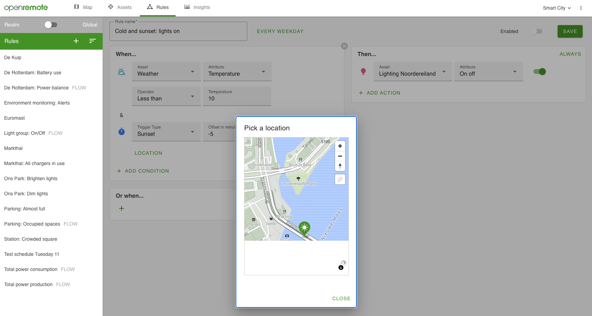

# When-Then Rules

When-Then rules are used in combination with the or-rules UI component. They are meant to be used to allow application users to define 'When this, then that' statements. For example "During weekdays, when it's cold, turn on the lights 5 minutes before sunset" or "send push notification to anybody who reaches the stadium".

## Supported actions

On the right hand side you can trigger different types of actions:
- Update attribute values
- Send push- and email notifications to users, assets, or users linked to the asset triggering the rule. Notifications support multi-language notification based on the users preferred language. For details see [Appearance page](../manager-ui/manager-ui.md#appearance).

##### Using Placeholders in Notifications
  When configuring notifications in your rules, you can use the following placeholders to include dynamic information:

- `%TRIGGER_ASSETS%` - Includes details about the assets that triggered the rule
- `%RULESET_NAME%` - Inserts the name of the current ruleset 
- `%RULESET_ID%` - Inserts the ID of the current ruleset
- `%ASSET_ID%` - Includes the ID of the triggering asset (when used in notification actions)

These placeholders are automatically replaced with actual values when the rule executes, making it easy to create dynamic, context-aware notifications.

- Generate alarm, including assigned user, severity, status, title and message with linked assets. See more details in the [Alarms documentation](../manager-ui/manager-ui.md#alarms).
- Link to an external system with webhooks. This can be used e.g. for connecting to your Maintenance or Messaging service, using your ERP or CRM system.

## Guide to setting up your first When-Then rule

To get familiar with the When-Then interface we will be creating a rule that turns on lights when the temperature drops below a certain threshold and just before sunset (makes sense right?).
We only want this rule to be active on weekdays.
This guide assumes you are using the [Demo](https://openremote.io/demo/). Otherwise you need to create some assets first.

To create an asset and configure an attribute so it can be used in rules do the following:

Creating an asset:
   * Go to the `Assets` page and click the `+` icon
   * Select the `Weather Asset` and name it **Weather**
   * Click `ADD` to create the asset

Enabling the rule state on an attribute so it can be used in rules:
   * Select the **Weather** asset and click on `MODIFY`
   * Click on the `>` icon of the `temperature` attribute and click on `+ ADD CONFIGURATION ITEMS`
   * Select `Rule state` and click `ADD`
   * Click `SAVE` to save the changes

The remainder of the guide assumes you are using the [Demo](https://openremote.io/demo/) where all assets and attributes have already been created and configured:

1. Switch from the `master` realm to the `Smart city` realm in the top. You will see the assets used in the demo setup. 
2. Navigate to the `Rules` page, here you will find some demo rules that are running at the moment. We will add our own.
3. Add a new rule:
   * Click the `+`.
   * Select 'When-Then'.
   * Name it `Cold and sunset: lights on`.
4. Create the When side of the rule:
   * Click the `+`, a list of asset types will appear.
   * Select `Weather Asset`, a condition will get added for this asset type.
   * Switch the asset from `Any of this type` to `Weather`.
   * In the next field select the attribute of interest: `temperature`.
   * In the next field select the operator: `less than`.
   * Finally set a value of `10`. You have now finished the first condition. This can be combined through `AND` or `OR` with other conditions.
5. Create a second condition to take the time into account:
   * Click the `+` in the section below where it says `ADD CONDITION` and select `Time`.
   * Select Trigger Type `Sunset`.
   * Set the value `-5` for the `Offset in minutes`.
   * Select: `location`. You have finished the `AND` condition. If both conditions are met, the `Then` actions will trigger.
6. Create an action on the `Then` side of the rule:
   * Click the `+` on the right in the `Then` section.
   * Select the `Light Asset` asset type.
   * Select the lights that you want to control. In this case we want to turn on all lights at once using the `Lighting Noordereiland`.
   * Select the attribute you want to control: `On Off`.
   * Toggle the switch on. The Actions are done.
7. Set the schedule for this rule:
   * Open up the scheduler by clicking `Always active` next to the rules name.
   * Select `Plan a repeating occurrence` as we want the rule to work only on weekdays.
   * At `Repeat occurrence every` click the five `weekdays`
   * Leave the `Repetition ends` at `Never`
   * Click `Apply` and save the rule in the top right.

Your rule is finished! Every weekday the rule will check if both conditions are met and if so, turn on the lights of Noordereiland. 

## See Also

- [Create Rules](create-rules.md)
- [Manager UI](../manager-ui/manager-ui.md)
