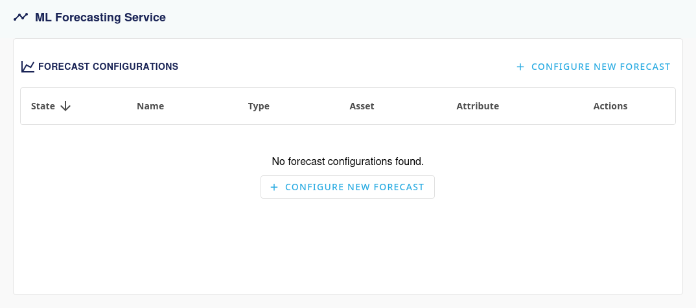
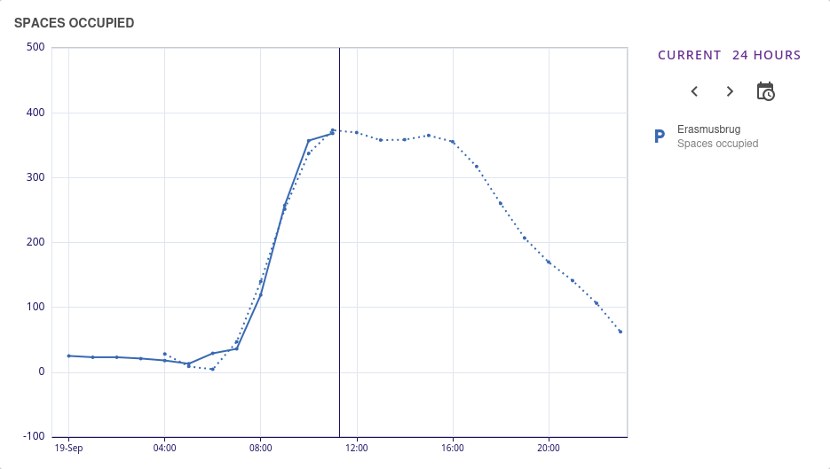

# ML Forecasting Service

The ML Forecasting Service is an **optional** service that uses machine learning models to generate forecasts for any attribute that has historical data.

:::note
This service is not installed by default. It can be installed by your administrator by following the instructions in the [External Services](../developer-guide/external-services.md) page.
:::

## Features

- Create forecast configurations for any attribute that has historical data
- Forecasts are automatically generated at a specified interval
- Manage forecast configurations in the UI
- Fine-tune the configuration by adjusting model parameters
- Generated forecasts can be viewed as predicted data points when visualized via the Insights UI

## Accessing the Service

To access the service, you must first navigate to the `Services` page in the Manager UI.

If the service is properly installed, you will see the `ML Forecasting Service` in the list of services.

## Usage

When the service is selected, you should see a list of forecast configurations. If none are present, you can create one by clicking the `Configure New Forecast` button.

You can then configure the forecast by filling in the form.

### Configuration Form

The form contains sensible defaults for forecast generation, training, and model parameters. It is recommended to keep the `Parameters` fields at their defaults unless you have a specific reason to change them.

| Section | Field | Description |
|---------|-------|-------------|
| **General** | `Name` | The name of the forecast configuration |
| | `Model Type` | The model to use for forecasting |
| **Forecast Generation** | `Generate new forecast every` | How often to create new predictions (increase if data changes quickly) |
| | `Unit` | Time measurement (hours, minutes, etc.) |
| | `Forecasted datapoints` | How many future points to predict (more for long-term planning) |
| | `Time between datapoints` | Gap between each predicted point |
| | `Unit` | Time measurement for prediction gaps |
| **Forecast Target** | `Asset` | The device or system with the data you want to predict |
| | `Attribute` | The specific data you want to predict |
| | `Training data period` | How much past data to learn from (more for complex patterns, less if there has been a systemic change) |
| | `Unit` | Time measurement (days, weeks, months, years) |
| **Model Training** | `Train model every` | How often the system learns from new data (keep same as forecast generation) |
| | `Unit` | Time measurement for relearning |
| **Parameters** | `Changepoint range` | How much of your data to check for changes (0.8 = 80%). Reduce if predictions are too jumpy |
| | `Changepoint prior scale` | How likely the system thinks changes will happen (0.05 = 5%). Increase for more flexible forecasts that adapt quickly to changes, decrease for smoother forecasts that ignore minor variations |
| | `Seasonality mode` | How seasonal patterns work (`additive` or `multiplicative`). Use `multiplicative` if seasonal effects grow with trend |
| | `Daily seasonality` | Look for daily patterns. Enable for daily cycles (energy, temperature) |
| | `Weekly seasonality` | Look for weekly patterns. Enable for weekday/weekend differences |
| | `Yearly seasonality` | Look for yearly patterns. Enable for seasonal data (needs 1+ year history) |
| **Regressors** | `Asset` | Asset containing the regressor attribute |
| *(Optional)* | `Attribute` | The attribute to use as a regressor |
| | `Training data period` | Historical period for regressor data (should match or exceed target training period) |
| | `Unit` | Time unit for regressor training data |

Regressors can be added when there's a relationship between your target variable and other attributes. For example, when forecasting energy consumption, you might add weather data or solar production as regressors.

#### Saving Configuration

Once you've configured all fields, click the `Save` button to store the forecast configuration. The model will automatically train and begin generating forecasts according to your specified intervals.

## Viewing the Forecast

Once the forecast is generated, you can view it in the Insights UI.

The forecast will be displayed as a dotted line in the chart.

