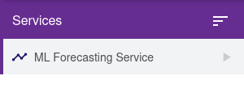

# ML Forecasting Service

The ML Forecasting Service is an **optional** external service that can be used to leverage machine learning models to generate forecasts for any attribute that has a history of data.

:::note
This service is not installed by default. It can be installed by your administrator by following the instructions in the [External Services](services.md) page.
:::

## Features

- Create forecast configurations for any attribute that has a history of data
- Forecasts are automatically generated at a specified interval
- Manage forecast configurations in the UI
- Fine-tune the configuration by adjusting model parameters
- Generated forecasts can be viewed as predicted data points when visualized via the Insights UI

## Accessing the Service

To access the service, you must first navigate to the `Services` page in the Manager UI.

If the service is properly installed, you will see the `ML Forecasting Service` in the list of services.

## Usage

When the service is selected, you should see a list of forecast configurations. If none are present, you can create one by clicking the `Configure New Forecast` button.
