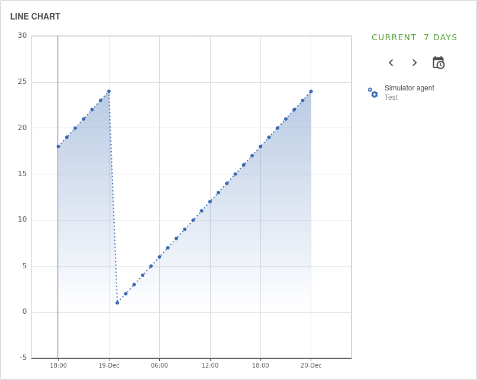
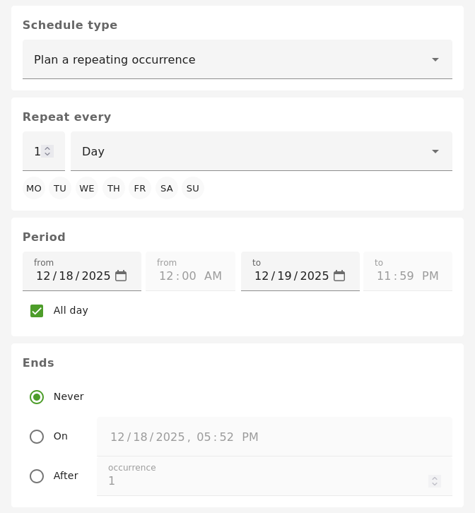

# Simulator

Simulate a connection to an external service, useful during development when the real service is un-available etc. It can also be used to automatically replay a fixed set of simulated values over a repeating 24h period, or configured with a custom schedule.

## Agent configuration
There is no configuration required on the agent for this protocol.

## Agent link
For attributes linked to this agent, the following describes the supported agent link fields which are in addition to the standard [Agent Link](overview.md#agent-links) fields:

| Field | Description | Value type | Required |
| ------------- | ------------- | ------------- | ------------- |
| `replayData` | A dataset of values that should be replayed (i.e. written to the linked attribute) in a continuous loop | [SimulatorReplayDatapoint[]](https://github.com/openremote/openremote/blob/master/model/src/main/java/org/openremote/model/simulator/SimulatorReplayDatapoint.java) | N |
| `schedule` | When defined overwrites the default 24h dataset length and how it is replayed. | [SimulatorProtocol.Schedule](https://github.com/openremote/openremote/blob/master/agent/src/main/java/org/openremote/agent/protocol/simulator/SimulatorProtocol.java) | N |

## Additional info
Attributes linked to this agent that are written to will follow a route through the system as if it came from a remote service.

The `has predicted data points` configuration item will cause the dataset of the current and next occurrence to be inserted as predicted data points alongside the normally scheduled data points.

If the `replayData` contains data points scheduled after the default 24 hours or the recurrence rule, the data points will be ignored.

### Simulator Replay Datapoints
Attributes linked to this agent that have a `replayData` field in their Agent Link will cause the values within to be replayed over a 24h period in a continuous loop, unless a schedule is configured. Each `SimulatorReplayDatapoint` value must have a `timestamp` (seconds offset from midnight `00:00` in the system time of the machine that hosts the manager) and a `value`, this value will then be written to the attribute at the specified seconds offset from midnight each day.

### Schedule
The schedule can be set to occur only once by selecting "Plan an occurrence". This will allow a period to be specified where the data will be replayed. Any datapoints specified to be replayed after the end date are ignored.

The dataset can also be replayed recurringly by selecting "Plan a repeating occurrence". In addition to the period options this allows a frequency to be specified and how the repeating occurrence ends.

The `frequency` defines how often the replay data is replayed. The frequency can be set to replay the dataset every `minute`, `hour`, `day`, `week`, `month` or `year`. By increasing the number alongside the selected frequency (the `interval`),  the frequency will change to run every few `minutes`, `hours`, `days`, `weeks`, `months` or `years`. Besides the interval and frequency, the dataset can also be replayed on certain days of the week when selected.

The `repeating occurrence ending` can be specified to stop at a certain date and time or set to end after a certain amount of occurrences.

These options follow the [RFC 5545 RRULE](https://datatracker.ietf.org/doc/html/rfc5545#section-3.3.10) specification.

If the schedule is not provided it defaults to every 24 hours.
