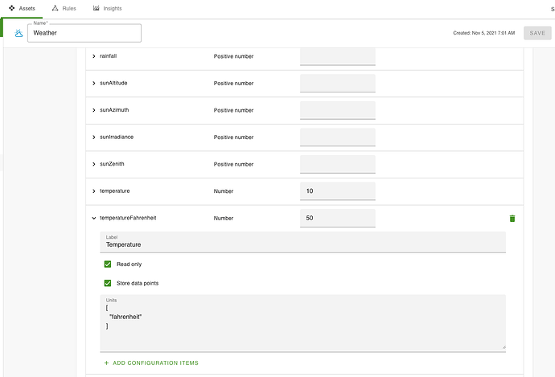
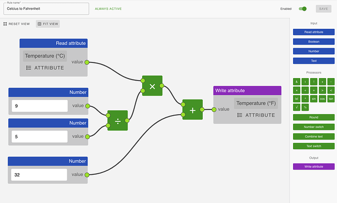

# Celsius to Fahrenheit with Flow

An example for converting an attribute value, using the Flow editor is the conversion from temperature Celsius into Fahrenheit.

First of all create the attribute you want to show the temperature in Fahrenheit. Note that you have to add the configuration item “Rule state” to be able to use it in the flow editor. In the example we also:

* added a new name (using the configuration item ‘Label’)
* set it to “Read only” (so you can’t write a new number on the asset page)
* selected “Store data points” (so you can look back at historical values)
* added the unit Fahrenheit

Next create a flow in the flow editor, which looks like this:

You will now have the second temperature in Fahrenheit filled once the temperature in Celsius updates. It will look like this.

