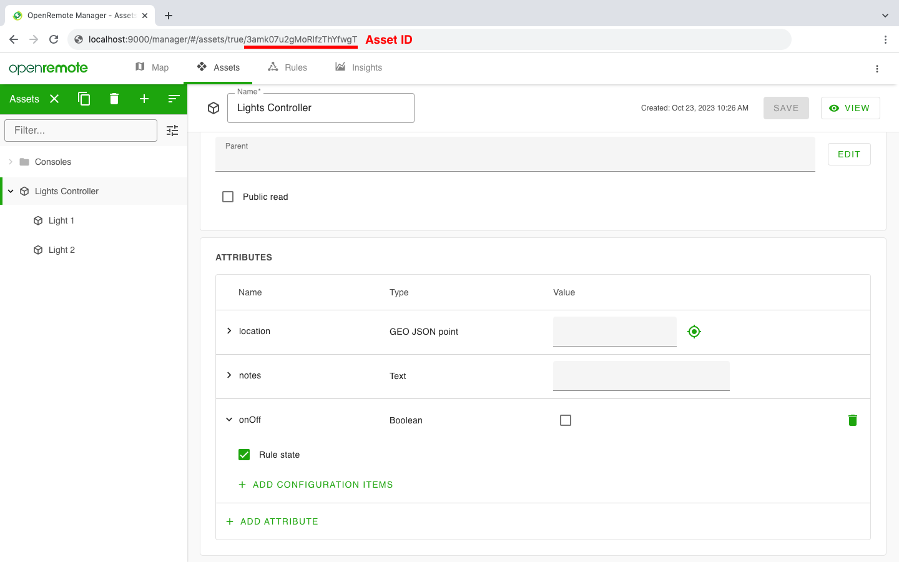
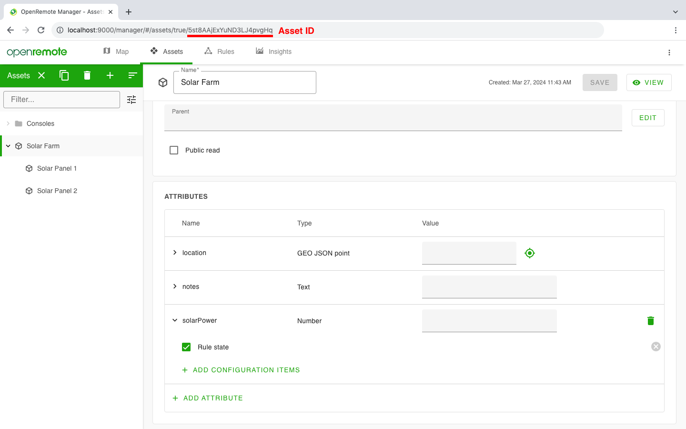

# Groovy Rules

Groovy Rules are written in Groovy, a programming language that can seamlessly work together with Java. These rules are capable of performing any task that OpenRemote allows rules to do and are intended for scenarios too complex to be defined by [When-Then Rules](when-then-rules.md) or [Flow Rules](flow-rules.md). Users with programming experience may prefer to write rules in Groovy, regardless of their complexity.

Groovy Rules can be created in the technical manager and have to be written manually. The following sections give more information on how to create your own Groovy Rules.

## How do Groovy Rules work?

Groovy Rules work using a Groovy scripting engine. Rules are parsed and various objects are bound. The rules are subsequently registered, ordered from top to bottom within a ruleset.

List of objects:

* `LOG` provides basic logging functionality using `java.util.logging.Logger`

* `rules` provides access to the ruleset. This is how individual rules are added to the ruleset. [Relevant class in source](https://github.com/openremote/openremote/blob/master/manager/src/main/java/org/openremote/manager/rules/RulesBuilder.java)

* `assets` provides access to relevant assets. [Relevant class in source](https://github.com/openremote/openremote/blob/master/model/src/main/java/org/openremote/model/rules/Assets.java)

* `users` provides access to relevant users. [Relevant class in source](https://github.com/openremote/openremote/blob/master/model/src/main/java/org/openremote/model/rules/Users.java)

* `notifications` provides the ability to send notifications. [Relevant class in source](https://github.com/openremote/openremote/blob/master/manager/src/main/java/org/openremote/manager/rules/facade/NotificationsFacade.java)

## Example Groovy Rules
In this section you can find code templates and corresponding examples on how to use Groovy Rules.

### Groovy Rule templates:
* [Group Control Rule](https://github.com/openremote/openremote/blob/master/test/src/test/resources/org/openremote/test/rules/ChildAssetControl.groovy)
* [Group Summation Rule](https://github.com/openremote/openremote/blob/master/test/src/test/resources/org/openremote/test/rules/GroupSummationRule.groovy)
### Example: Group Control

_Example: Group Control. The asset group along with the attributes and configuration items used in this example._

This example demonstrates how to control multiple child assets (lights) by the parent asset (lights controller) simultaneously. We will use a generic `Thing Asset` for demonstration purposes but you can replace it with your own asset type. If you already have an asset group with `Rule state` configuration, you can skip steps 1-3.

1. Create asset:
   * Go to the `Assets` page and click the `+` icon
   * Select the `Thing Asset` and name it **Lights Controller**
   * Click `ADD` to create the asset

2. Create attribute with rule state:
   * Select the **Lights Controller** asset and click on `MODIFY`
   * Click on `+ ADD ATTRIBUTE`
   * Create an attribute with:
      * Type: `Custom attribute`
      * Name: `onOff`
      * Value type: `Boolean`
   * Click `ADD`
   * Click on the `>` icon of the newly created `onOff` attribute and click on `+ ADD CONFIGURATION ITEMS`
   * Select `Rule state` and click `ADD`
   * Click `SAVE` to save the changes
   * Create 2 additional assets by clicking the `❐` copy icon, name the assets **Light 1** and **Light 2**
   * Click on `VIEW` to return to the asset view
   

3. Create asset group:
   * Select **Light 1** and **Light 2** from the assets list, and drag them to **Lights controller**

4. Create rule:
   * Select the **Lights Controller** asset and note down its asset ID (the last part of the URL, see above figure)
   * Go to the `Rules` page, click the `+` icon, and select `Groovy`. A basic Groovy Rule example will appear in the code editor, remove this example
   * Copy the [Group Control Rule](https://github.com/openremote/openremote/blob/master/test/src/test/resources/org/openremote/test/rules/ChildAssetControl.groovy) into the code editor
   * In the code editor, replace the asset ID of the `parentAssetId` variable with your **Lights Controller** asset ID
   * Name the rule **Lights Controller rule** and click `SAVE`

After following the above steps, you should be able to control **Light 1** and **Light 2** simultaneously by clicking on the `On off` button of the **Lights Controller**. You can still control lights individually, but their value is overwritten each time the **Lights Controller** is used. You can use this rule as a starting point for your own custom group rules.

### Example: Group Summation

_Example: Group Summation. The asset group along with the attributes and configuration items used in this example._

This example demonstrates how to sum attribute values from child assets to the parent asset within a group. We will use a generic `Thing Asset` for demonstration purposes but you can replace it with your own asset type. If you already have an asset group with `Rule state` configuration, you can skip steps 1-3.

1. Create asset:
   * Go to the `Assets` page and click the `+` icon
   * Select the `Thing Asset` and name it **Solar Farm**
   * Click `ADD` to create the asset

2. Create attribute with rule state:
   * Select the **Solar Farm** asset and click on `MODIFY`
   * Click on `+ ADD ATTRIBUTE`
   * Create an attribute with:
      * Type: `Custom attribute`
      * Name: `solarPower`
      * Value type: `Number`
   * Click `ADD`
   * Click on the `>` icon of the newly created `solarPower` attribute and click on `+ ADD CONFIGURATION ITEMS`
   * Select `Rule state` and click `ADD`
   * Click `SAVE` to save the changes
   * Create 2 additional assets by clicking the `❐` copy icon, name the assets **Solar Panel 1** and **Solar Panel 2**
   * Click on `VIEW` to return to the asset view
   

3. Create asset group:
   * Select **Solar Panel 1** and **Solar Panel 2** from the assets list, and drag them to **Solar Farm**

4. Create rule:
   * Select the **Solar Farm** asset and note down its asset ID (the last part of the URL, see above figure)
   * Go to the `Rules` page, click the `+` icon, and select `Groovy`. A basic Groovy Rule example will appear in the code editor, remove this example
   * Copy the [Group Summation Rule](https://github.com/openremote/openremote/blob/master/test/src/test/resources/org/openremote/test/rules/GroupSummationRule.groovy) into the code editor
   * In the code editor, replace the asset ID of the `parentAssetId` variable with your **Solar Farm** asset ID
   * Name the rule **Solar Power Summation rule** and click `SAVE`

After following the steps above, you should be able to set the power values for **Solar Panel 1** and **Solar Panel 2** and see the sum in the **Solar Farm** power attribute. You can use this rule as a starting point for your own custom group rules.

Additional information:
- By default, all child attributes with `Rule state` configuration will be summed. If you only want to sum specific attributes, you can specify their attribute names in the `attributeNames` variable.
- By default, the parent asset type and child asset type must match. If you want to sum equally named attributes of different asset types, you can set the `matchParentAssetType` variable to `false`.
- The rule is triggered when there are child attribute timestamp changes detected within the group. If you move a child asset outside the group, the sum is not recalculated until a child attribute timestamp is updated within the group.

## See Also

- [Create Rules](create-rules.md)
- [Manager UI](../manager-ui/manager-ui.md)
