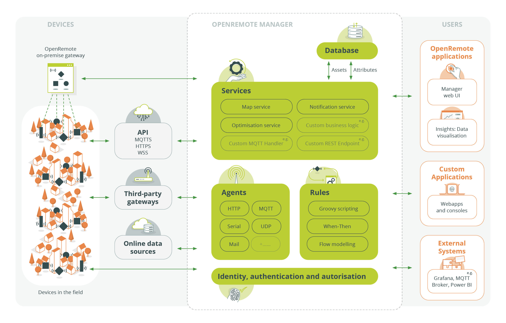

# Quick Start

Welcome to OpenRemote; an intuitive user-friendly 100% open source IoT platform. You can build a complete IoT device management solution including: device management and auto provisioning, customisation of asset types, automation via when-then, flow, javascript and groovy rules, data analytics, connectivity via several protocol agents and manager APIs (e.g. MQTT broker, HTTP/REST, WS), Multi-tenancy (realms), Users and roles management, Edge gateway, Front-end UI web components and consoles, and an Insights dashboard builder. 

As the code base is 100% open source, applications are limitless. Here's an architecture overview:



You can quickly try the online demo with restricted access, login credentials are `smartcity:smartcity`:

[Online demo](https://demo.openremote.app/manager/?realm=smartcity)

The quickest way to get your own environment with full access is to make use of our Docker images (both `amd64` and `arm64` are supported). 
1. Make sure you have [Docker Desktop](https://www.docker.com/products/docker-desktop) installed (v18+). 
2. Download the Docker Compose file:
[OpenRemote Stack](https://raw.githubusercontent.com/openremote/openremote/master/docker-compose.yml) (Right click 'Save link as...')
3. In a terminal `cd` to where you just saved the compose file and then run:
```shell
docker-compose pull
docker-compose -p openremote up
```
If all goes well then you should now be able to access the OpenRemote Manager UI at [https://localhost](https://localhost). You will need to accept the self-signed 
certificate, see [here](https://www.technipages.com/google-chrome-bypass-your-connection-is-not-private-message) for details how to do this in Chrome (similar for other browsers).


### Login credentials
Username: admin
Password: secret

### Changing host and/or port
The URL you use to access the system is important, the default is configured as `https://localhost` if you are using a VM then you will need to set the `OR_HOSTNAME` environment variable, so if for example you will be accessing using `https://192.168.1.1` then use the following startup command:

BASH: 
```shell
OR_HOSTNAME=192.168.1.1 docker-compose -p openremote up -d
```
or

CMD:
```shell
cmd /C "set OR_HOSTNAME=192.168.1.1 && docker-compose -p openremote up -d"
```

## What next
Try creating assets, agents, rules, users, realms, etc. using the Manager UI, some things to try:

- [Manager UI Guide](user-guide/manager-ui/manager-ui.md) - Learn more about the User Interface
- [Creating an HTTP Agent tutorial](tutorials/open-weather-api-using-http-agent.md) - Connect to an online weather service
- [Custom Deployment](user-guide/deploying/custom-deployment.md) - Style the Manager to your brand
- [Setting up an IDE](developer-guide/setting-up-an-ide.md) - Set up your development environment
- [Working on the UI](developer-guide/working-on-ui-and-apps.md) - Create a web application compatible with OpenRemote
- [Creating a custom project](developer-guide/creating-a-custom-project.md) - Create a project with custom protocols, asset types and setup code

## Where's the data stored?
Persistent data is stored in a PostgreSQL DB which is stored in the `openremote_postgresql-data` Docker volume which is durably stored independently of the running containers (see all with `docker volume ls`).
Note that historical attribute data is purged daily based on value of `OR_DATA_POINTS_MAX_AGE_DAYS`; this value can also be overridden for individual attributes by using the `dataPointsMaxAgeDays` configuration item.
See the [Developer Guide](developer-guide/useful-commands-and-queries.md#backuprestore-openremote-db) for details on making backups of the database.


## Contributing to OpenRemote

For information and how to set up a development environment, see the [Developer Guide](developer-guide/preparing-the-environment.md).

We work with Java, Groovy, TypeScript, Gradle, Docker, and a wide range of APIs and protocol implementations.

We follow the [GitHub Flow](https://docs.github.com/en/get-started/quickstart/github-flow) workflow with tags and releases for published versions of our components; when working on the codebase create descriptive branch names (e.g. `feature/cool_feature_x`, `hotfix/flux_capacitor`, `issue/123`, etc.).

When your changes are complete then create a Pull Request ensuring that your branch is up-to-date with the source branch and that code changes are covered by tests and that the full test suite passes.

## Discuss OpenRemote

Join us on the [community forum](https://forum.openremote.io/).
