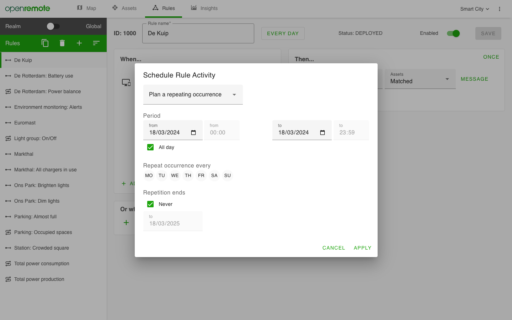

# Create Rules

OpenRemote has its own rules engine that can be utilized for a broad spectrum of tasks, ranging from simple attribute linking to complex algorithms, such as predictive models. There are three different types of rules you can choose from: When-Then Rules, Flow Rules and Groovy Rules. On this page you will find a brief description of each type, along with references to their dedicated pages for more details and examples.

You can create global or realm rules. Global rules can access asset attributes across different realms, while realm rules can only access asset attributes within the realm they are created in.

Rules include a scheduler that allows rules to be scheduled and events to be repeated. Rules can also be enabled or disabled manually.

## When-Then Rules

When-Then Rules are intended for application users to create event-based workflow rules, using a user-friendly UI. Users can select any (allowed) attribute for the left-hand side 'When' condition and right-hand side 'Then' action. Additionally, users can send notifications, utilize timers, and employ webhooks for actions. For more details, see [When-Then Rules](when-then-rules.md).

## Flow Rules

Flow Rules are intended for application users to perform attribute value conversions. The main purpose is to enable the linking of attributes (e.g. a KNX switch with a Velbus light), or to process attributes to generate new 'virtual' attributes (e.g. calculating energy consumption as the sum of three individual sub-meters). For more details, see [Flow Rules](flow-rules.md).

## Groovy Rules

The Groovy Rules scripting editor is available within the (Technical) manager and can be used for complex rules. They have the most flexibility, but also need a clear understanding of the Groovy language, especially to avoid mistakes. For more details, see [Groovy Rules](groovy-rules.md).

## See Also

- [When-Then Rules](when-then-rules.md)
- [Flow Rules](flow-rules.md)
- [Groovy Rules](groovy-rules.md)
- [Manager UI](../manager-ui/manager-ui.md)
