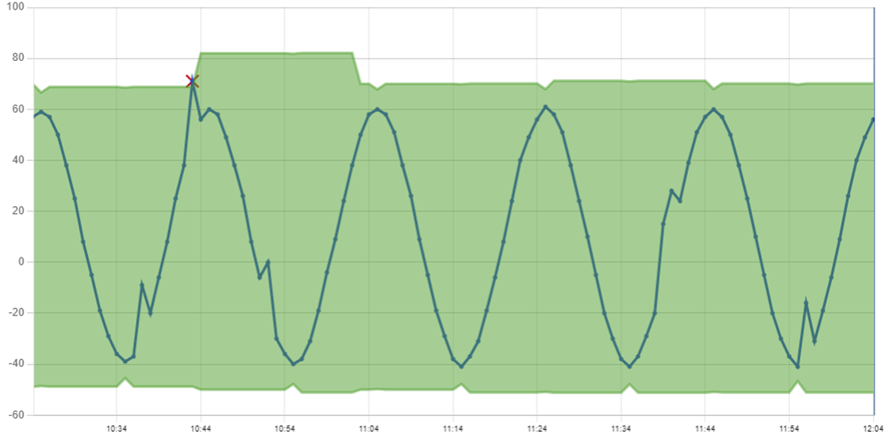

# Anomaly Detection

:::warning

**This Feature is currently still in development and not yet implemented in the main codebase**

:::

OpenRemote includes the functionality to set up anomaly detection on all numeric attributes. This can be useful when you want to keep track of all the times a sensor sends an abnormal datapoint or if you want to be notified when such a datapoint is received.

_Image of history chart with anomaly marked here_

## Detection methods
Currently there are 3 different types of detection methods you can use when configuring the anomaly detection on an attribute. All of these have their strengths and weaknesses based on the different types of data they receive.

## Range
This is the simples method to detect an outlier. To validate a datapoint it will look at a period of time before that datapoint, find the highest and lowest value and add an error margin on top of those values. These new minimum and maximum values will be the limit in which a point will be valid and any value outside these boundaries will be marked as an anomaly. The error margin and period of time the detection method uses can both be changed when configuring the method.

_Visualization of the limits generated by the Range method_

The advantage of this method is that it's easy to understand but can still detect the larger outliers. However it falls short when detecting a big increase during a time when the data is already far below the maximum value.

## Change
The change method works in a similar way to the Range method. It also looks at a previous period of data but instead of checking the value of the datapoints it calculates the difference between all points to get the largest increase and decrease in that period. Using these largest changes in the data it will calculate the limits for the next incoming datapoint using the last known value as a starting point.

_Visualization of the limits generated by the Change method_

This method will follow the data more closely as seen in the visualization above but needs more careful configuration to ensure it won't detect too many false anomalies.

## Forecast
If the attribute you are configuring already has predicted datapoints, this will be the easiest method to set up. When new data is received it is compared to predicted datapoints from that time and if the difference is larger as a limit you can configure yourself it will be marked as an anomaly.

_Visualization of the limits generated by the Forecast method_

This accuracy of this method is dependent on the quality of the predicted data. This can come from different sources like OpenRemote's build in [Forecasting service](rules-and-forecasting/forecasting.md)

# Setup
To get started with anomaly detection add the 'anomaly detection' configuration item to the attribute you want to monitor. This will add a panel where you can add different methods.

## Alarm
